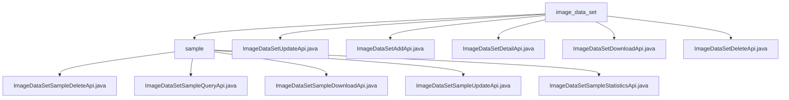

# Basic Information

|      |      |
|------|------|
| Name | image_data_set |
| Language | .java |
| Code Path | WeFe/board/board-service/src/main/java/com/welab/wefe/board/service/api/data_resource/image_data_set |
| Package Name | docs.board.board-service.src.main.java.com.welab.wefe.board.service.api.data_resource.image_data_set |
| Brief Description | This module provides CRUD management functions for image datasets, including creation, deletion, modification, query, download, and label statistics. The APIs follow the RESTful style, with paths uniformly prefixed by `image_data_set`. Core functionalities encompass data operations and statistical analysis, relying on the service layer and database to implement business logic. |

# Description

## Overview  
This module manages the complete lifecycle of image datasets, with core functionalities including data CRUD operations, file downloads, and metadata statistics. All APIs adhere to RESTful standards, with paths uniformly prefixed by `image_data_set`, such as UpdateApi for annotation updates and DownloadApi for file stream transmission. Key data structures encompass the Input base class (with ID validation), pagination parameters, and tag statistics models, while dependencies are centralized in the ImageDataSetService and database repository. For example, DeleteApi enforces ID validity checks, and DetailApi maps data entities via Repository.  

## Key Business Scenarios  
Typical workflows include dataset maintenance (e.g., AddApi for resource creation) and in-depth analysis (e.g., StatisticsApi for generating tag heatmaps). The interaction model resembles resource pool management, supporting precise retrieval (DetailApi) and batch operations (DeleteApi). For instance, users can upload datasets and trigger tag statistics or filter samples via paginated queries. API types cover CRUD operations and extended functionalities, with integration examples including frontend calls to DetailApi for metadata display or system-triggered backups via DownloadApi in scheduled tasks. All interfaces feature built-in parameter validation, such as AddApi verifying input model integrity.

### Package Internal Structure View

This flowchart illustrates the hierarchical structure of the image dataset APIs, with the top-level being the `image_data_set` directory containing API files for direct dataset operations and a `sample` subdirectory. The `sample` subdirectory includes various API files for handling dataset samples, such as deletion, querying, downloading, updating, and statistical functions. The overall structure clearly reflects the functional categorization and organization of the APIs.

# File List

| Name   | Type  | Description |
|-------|------|-------------|
| [ImageDataSetUpdateApi.java](ImageDataSetUpdateApi.md) | file | This is an API class designed for updating image dataset information, which invokes the update method of ImageDataSetService to process the input and return a successful result. |
| [ImageDataSetAddApi.java](ImageDataSetAddApi.md) | file | This is an API class for adding image datasets, inheriting from AbstractApi, using ImageDataSetAddInputModel as input and DataResourceAddOutputModel as output. It processes the addition operation through ImageDataSetAddService and returns successful results. |
| [ImageDataSetDetailApi.java](ImageDataSetDetailApi.md) | file | The code defines an API interface for retrieving image dataset details, which queries the database by ID and returns the mapped output model. It returns an empty result if no data is found. The input parameter is an ID string. |
| [ImageDataSetDownloadApi.java](ImageDataSetDownloadApi.md) | file | This is an API class designed for downloading image datasets, with the path "image_data_set/download", allowing signed access. By inputting the dataset ID, task ID, and version number, it invokes the service layer to download files and returns the results. |
| [ImageDataSetDeleteApi.java](ImageDataSetDeleteApi.md) | file | This is an API class for deleting datasets, which takes the dataset ID as a required parameter, calls the service layer to delete the data, and returns a success result. |
| [sample](sample/_module.md) | package | ImageDataSetSampleDeleteApi: Delete image samples, requires ID, returns empty.  ImageDataSetSampleQueryApi: Query samples, supports pagination and conditional filtering.  ImageDataSetSampleDownloadApi: Download samples, requires ID, returns file.  ImageDataSetSampleUpdateApi: Update sample annotation information, requires ID and labelInfo.  ImageDataSetSampleStatisticsApi: Count sample label distribution, returns two counting methods. |

