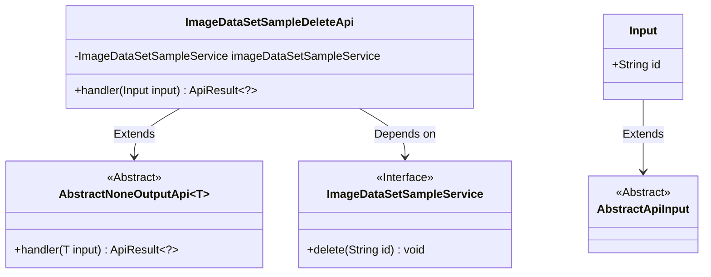

# Basic Information

|      |      |
|------|------|
| Name | ImageDataSetSampleDeleteApi |
| Language | .java |
| Code Path | WeFe/board/board-service/src/main/java/com/welab/wefe/board/service/api/data_resource/image_data_set/sample/ImageDataSetSampleDeleteApi.java |
| Package Name | com.welab.wefe.board.service.api.data_resource.image_data_set.sample |
| Dependencies | ['com.welab.wefe.board.service.service.data_resource.image_data_set.ImageDataSetSampleService', 'com.welab.wefe.common.exception.StatusCodeWithException', 'com.welab.wefe.common.fieldvalidate.annotation.Check', 'com.welab.wefe.common.web.api.base.AbstractNoneOutputApi', 'com.welab.wefe.common.web.api.base.Api', 'com.welab.wefe.common.web.dto.AbstractApiInput', 'com.welab.wefe.common.web.dto.ApiResult', 'org.springframework.beans.factory.annotation.Autowired'] |
| Brief Description | This is an API class for deleting image dataset samples, which implements the deletion function by calling the delete method of ImageDataSetSampleService, with the required id field as the input parameter. |

# Description

This is an API class named ImageDataSetSampleDeleteApi, designed for deleting image dataset samples. It inherits from AbstractNoneOutputApi, with its input type defined as an internal Input class. The API path is image_data_set_sample/delete, and it performs the deletion operation by invoking the delete method of the injected ImageDataSetSampleService. The Input class includes a mandatory string-type id field to specify the sample to be deleted. Upon successful processing, it returns an empty result. The entire API design is concise and focused on the deletion functionality.

# Class Summary

| Name   | Type  | Description |
|-------|------|-------------|
| ImageDataSetSampleDeleteApi | class | This is an API class for deleting samples from an image dataset. It calls a service layer method to remove the corresponding sample based on the input ID, returning an empty result upon success. The input parameter is a mandatory ID string. |

## Class ImageDataSetSampleDeleteApi

|      |      |
|------|------|
| Access Modifier | @Api(path = "image_data_set_sample/delete", name = "delete image data set sample");public |
| Type | class |
| Name | ImageDataSetSampleDeleteApi |
| Description | This is an API class for deleting samples from an image dataset. It calls a service layer method to remove the corresponding sample based on the input ID, returning an empty result upon success. The input parameter is a mandatory ID string. |

### UML Class Diagram

This code illustrates the implementation structure of an image dataset sample deletion API. The ImageDataSetSampleDeleteApi extends the generic class AbstractNoneOutputApi with Input specified as the input type, and relies on the ImageDataSetSampleService interface to perform deletion operations. The Input class inherits from AbstractApiInput and contains a mandatory id field. The overall design follows dependency injection and the template method pattern, where abstract base classes standardize API behavior while concrete implementations delegate core business logic to service interfaces.

### Internal Method Call Graph

```mermaid
graph TD
    A["Class ImageDataSetSampleDeleteApi"]
    B["Annotation: @Api"]
    C["Inheritance: AbstractNoneOutputApi<Input>"]
    D["Dependency Injection: @Autowired ImageDataSetSampleService"]
    E["Overridden Method: handler(Input input)"]
    F["Invocation: imageDataSetSampleService.delete(input.id)"]
    G["Return: success()"]
    H["Nested Class Input"]
    I["Inheritance: AbstractApiInput"]
    J["Field: @Check String id"]

    A --> B
    A --> C
    A --> D
    A --> E
    E --> F
    E --> G
    A --> H
    H --> I
    H --> J
```

This flowchart illustrates the structure and workflow of the ImageDataSetSampleDeleteApi class. The class defines an API endpoint through the @Api annotation, inherits from AbstractNoneOutputApi, and implements the handler method to process input. The handler method invokes a service-layer delete operation and returns a success result. The nested Input class extends AbstractApiInput and contains a mandatory id field. The entire process clearly demonstrates the complete call chain from API reception to business processing, reflecting a typical controller-layer structure in Spring Boot projects.

### Field List

| Name  | Type  | Description |
|-------|-------|------|
| imageDataSetSampleService | ImageDataSetSampleService | Using @Autowired to automatically inject an instance of the ImageDataSetSampleService. |

### Method List

| Name  | Type  | Description |
|-------|-------|------|
| handler | ApiResult<?> | This method handles delete requests by calling a service to remove the image dataset sample with the specified ID, returning an empty result upon successful completion. |

