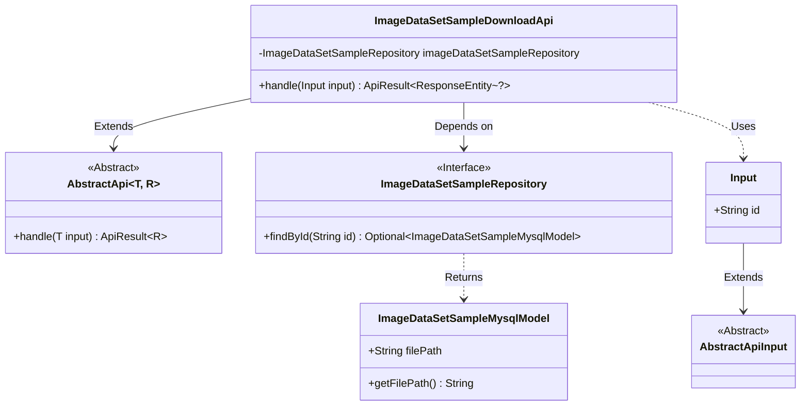

# Basic Information

|      |      |
|------|------|
| Name | ImageDataSetSampleDownloadApi |
| Language | .java |
| Code Path | WeFe/board/board-service/src/main/java/com/welab/wefe/board/service/api/data_resource/image_data_set/sample/ImageDataSetSampleDownloadApi.java |
| Package Name | com.welab.wefe.board.service.api.data_resource.image_data_set.sample |
| Dependencies | ['com.welab.wefe.board.service.database.entity.data_set.ImageDataSetSampleMysqlModel', 'com.welab.wefe.board.service.database.repository.ImageDataSetSampleRepository', 'com.welab.wefe.common.exception.StatusCodeWithException', 'com.welab.wefe.common.fieldvalidate.annotation.Check', 'com.welab.wefe.common.web.api.base.AbstractApi', 'com.welab.wefe.common.web.api.base.Api', 'com.welab.wefe.common.web.dto.AbstractApiInput', 'com.welab.wefe.common.web.dto.ApiResult', 'org.springframework.beans.factory.annotation.Autowired', 'org.springframework.http.ResponseEntity', 'java.io.File', 'java.io.IOException'] |
| Brief Description | This is an API class designed for downloading image dataset samples, which locates sample files by ID and returns the file content. The input parameter is a mandatory ID field. |

# Description

This is an API class designed for downloading image dataset samples, with the path "image_data_set_sample/download". The class inherits from an abstract API base class and accepts input parameters containing a mandatory ID field. It retrieves the sample file path from the database via an auto-injected repository class and ultimately returns the file content. During processing, it may throw status code exceptions or IO exceptions. The input parameter class inherits from an abstract API input base class and includes non-null validation for the ID field.

# Class Summary

| Name   | Type  | Description |
|-------|------|-------------|
| ImageDataSetSampleDownloadApi | class | This is an API class for downloading image dataset samples, which retrieves sample files by ID and returns the file content. The input parameter is a mandatory ID field. |

## Class ImageDataSetSampleDownloadApi

|      |      |
|------|------|
| Access Modifier | @Api(path = "image_data_set_sample/download", name = "download image data set sample");public |
| Type | class |
| Name | ImageDataSetSampleDownloadApi |
| Description | This is an API class for downloading image dataset samples, which retrieves sample files by ID and returns the file content. The input parameter is a mandatory ID field. |

### UML Class Diagram

This code implements an image dataset sample download API. The core class `ImageDataSetSampleDownloadApi` inherits from the generic abstract class `AbstractApi` and queries the database through the `ImageDataSetSampleRepository` interface to obtain file paths. The input parameter `Input` inherits from `AbstractApiInput` and contains a mandatory id field. The class diagram clearly illustrates inheritance, dependency, and interface implementation relationships, demonstrating the application of Spring dependency injection and the template method pattern.

### Internal Method Call Graph

```mermaid
graph TD
    A["Class ImageDataSetSampleDownloadApi"]
    B["Annotation: @Api"]
    C["Inheritance: AbstractApi<Input, ResponseEntity<?>>"]
    D["Dependency Injection: @Autowired ImageDataSetSampleRepository"]
    E["Overridden Method: handle(Input input)"]
    F["Inner Class: Input extends AbstractApiInput"]
    G["Field Validation: @Check String id"]
    H["Process: imageDataSetSampleRepository.findById"]
    I["Process: new File(sample.getFilePath())"]
    J["Return: file(file)"]

    A --> B
    A --> C
    A --> D
    A --> E
    E --> H
    H --> I
    I --> J
    A --> F
    F --> G
```

This flowchart illustrates the core structure and processing flow of the ImageDataSetSampleDownloadApi class. The class implements basic API functionality by inheriting from AbstractApi, injects the data repository using @Autowired, and handles file download requests by overriding the handle method. The inner class Input defines mandatory ID parameter validation. The main process consists of three key steps: querying sample data, constructing a file object, and returning a file response, forming a complete file download processing chain.

### Field List

| Name  | Type  | Description |
|-------|-------|------|
| imageDataSetSampleRepository | ImageDataSetSampleRepository | Using @Autowired to automatically inject an instance of ImageDataSetSampleRepository. |

### Method List

| Name  | Type  | Description |
|-------|-------|------|
| handle | ApiResult<ResponseEntity<?>> | This method queries the database using the input ID to retrieve the sample, reads the file path, and returns the file content. Exceptions or IO errors may be thrown during processing. |

