# Basic Information

|      |      |
|------|------|
| Name | ImageDataSetSampleQueryApi |
| Language | .java |
| Code Path | WeFe/board/board-service/src/main/java/com/welab/wefe/board/service/api/data_resource/image_data_set/sample/ImageDataSetSampleQueryApi.java |
| Package Name | com.welab.wefe.board.service.api.data_resource.image_data_set.sample |
| Dependencies | ['com.welab.wefe.board.service.dto.base.PagingInput', 'com.welab.wefe.board.service.dto.base.PagingOutput', 'com.welab.wefe.board.service.dto.entity.data_set.ImageDataSetSampleOutputModel', 'com.welab.wefe.board.service.service.data_resource.image_data_set.ImageDataSetSampleService', 'com.welab.wefe.common.exception.StatusCodeWithException', 'com.welab.wefe.common.fieldvalidate.annotation.Check', 'com.welab.wefe.common.web.api.base.AbstractApi', 'com.welab.wefe.common.web.api.base.Api', 'com.welab.wefe.common.web.dto.ApiResult', 'org.springframework.beans.factory.annotation.Autowired'] |
| Brief Description | Image Dataset Sample Query API, supporting pagination, dataset ID, label name fuzzy matching, and annotation status filtering, which invokes the ImageDataSetSampleService to process query requests. |

# Description

This is a Java class named ImageDataSetSampleQueryApi, designed for querying image dataset samples. It extends AbstractApi, processing input of type Input and outputting paginated ImageDataSetSampleOutputModel. The class injects the ImageDataSetSampleService and invokes the service's query method via the handle method to process query requests. The Input inner class inherits from PagingInput, containing query conditions such as dataset ID, label name, whether to use fuzzy label matching, and whether samples are labeled, along with corresponding getter and setter methods.

# Class Summary

| Name   | Type  | Description |
|-------|------|-------------|
| ImageDataSetSampleQueryApi | class | Image dataset query API, supports pagination, filtering by dataset ID, fuzzy matching by tag name, and annotation status, returning paginated results. |


## Class ImageDataSetSampleQueryApi

|      |      |
|------|------|
| Access Modifier | @Api(path = "image_data_set_sample/query", name = "query image data set samples");public |
| Type | class |
| Name | ImageDataSetSampleQueryApi |
| Description | Image dataset query API, supports pagination, filtering by dataset ID, fuzzy matching by tag name, and annotation status, returning paginated results. |


### UML Class Diagram

```mermaid
classDiagram
    class ImageDataSetSampleQueryApi {
        -ImageDataSetSampleService imageDataSetSampleService
        +handle(Input input) ApiResult~PagingOutput~ImageDataSetSampleOutputModel~~
    }

    class PagingInput {
        <<abstract>>
    }

    class Input {
        -String dataSetId
        -String label
        -boolean labelMatchWithContains
        -Boolean labeled
        +getDataSetId() String
        +setDataSetId(String dataSetId)
        +getLabel() String
        +setLabel(String label)
        +getLabeled() Boolean
        +setLabeled(Boolean labeled)
    }

    class ImageDataSetSampleService {
        <<Interface>>
        +query(Input input) PagingOutput~ImageDataSetSampleOutputModel~
    }

    class PagingOutput~T~ {
        +T data
    }

    class ImageDataSetSampleOutputModel {
        // Model fields not fully displayed
    }

    class ApiResult~T~ {
        +T data
    }

    ImageDataSetSampleQueryApi --> ImageDataSetSampleService : Dependency
    ImageDataSetSampleQueryApi --> Input : Uses
    Input --|> PagingInput : Inheritance
    ImageDataSetSampleService ..> PagingOutput~ImageDataSetSampleOutputModel~ : Returns
    ImageDataSetSampleService ..> Input : Parameter
    PagingOutput~ImageDataSetSampleOutputModel~ --> ImageDataSetSampleOutputModel : Contains
    ImageDataSetSampleQueryApi ..> ApiResult~PagingOutput~ImageDataSetSampleOutputModel~~ : Returns
```

This code illustrates the implementation structure of an image dataset sample query API. The ImageDataSetSampleQueryApi inherits from AbstractApi, processes query requests through ImageDataSetSampleService, uses the Input class to encapsulate pagination query parameters, and returns paginated results containing ImageDataSetSampleOutputModel. The Input class inherits from PagingInput and adds query conditions such as dataset ID and labels. After data querying through the service layer, it returns paginated results wrapped in PagingOutput. The overall design reflects a layered architecture and generic application, making it suitable for handling paginated query scenarios.


### Internal Method Call Graph

```mermaid
graph TD
    A["Class ImageDataSetSampleQueryApi"]
    B["Inheritance: AbstractApi<Input, PagingOutput<ImageDataSetSampleOutputModel>>"]
    C["Annotation: @Api(path='image_data_set_sample/query', name='query image data set samples')"]
    D["Dependency Injection: @Autowired ImageDataSetSampleService"]
    E["Overridden Method: handle(Input input)"]
    F["Inner Class: Input"]
    G["Inheritance: PagingInput"]
    H["Property: String dataSetId"]
    I["Property: String label"]
    J["Property: boolean labelMatchWithContains"]
    K["Property: Boolean labeled"]
    L["getter/setter methods"]

    A --> B
    A --> C
    A --> D
    A --> E
    A --> F
    F --> G
    F --> H
    F --> I
    F --> J
    F --> K
    F --> L
    E --> D
```



This code represents an API class for querying image dataset samples, inheriting from the AbstractApi base class. Its primary function is to process paginated query requests through ImageDataSetSampleService, including input parameter validation and result return. The inner class Input defines the query parameter structure, containing fields such as dataset ID, label name, fuzzy match flag, and annotation status, along with corresponding getter/setter methods. The flowchart clearly illustrates the class inheritance relationship, dependency injection, method overriding, and inner class structure.

### Field List

| Name  | Type  | Description |
|-------|-------|------|
| imageDataSetSampleService | ImageDataSetSampleService | Using @Autowired to automatically inject an instance of ImageDataSetSampleService. |

### Method List

| Name  | Type  | Description |
|-------|-------|------|
| handle | ApiResult<PagingOutput<ImageDataSetSampleOutputModel>> | Rewrite the method to handle input, invoke the service query, and return paginated results. |


