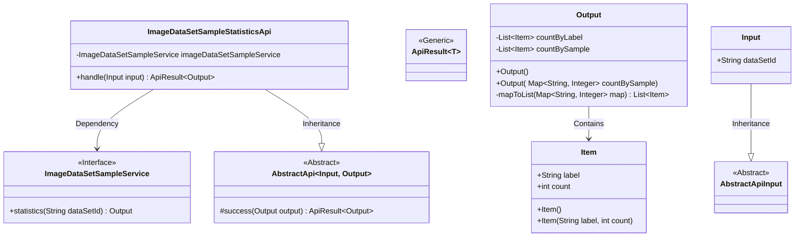
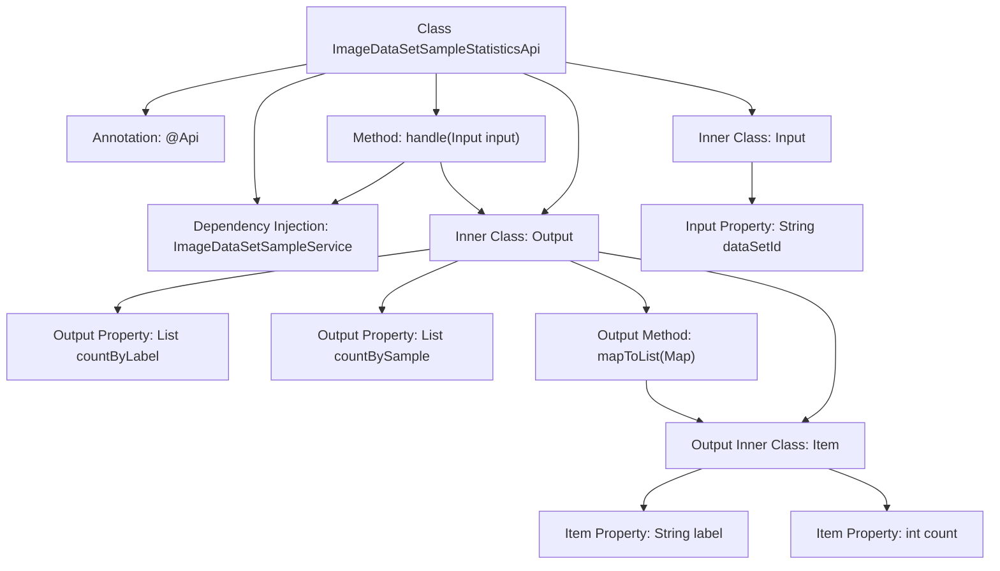
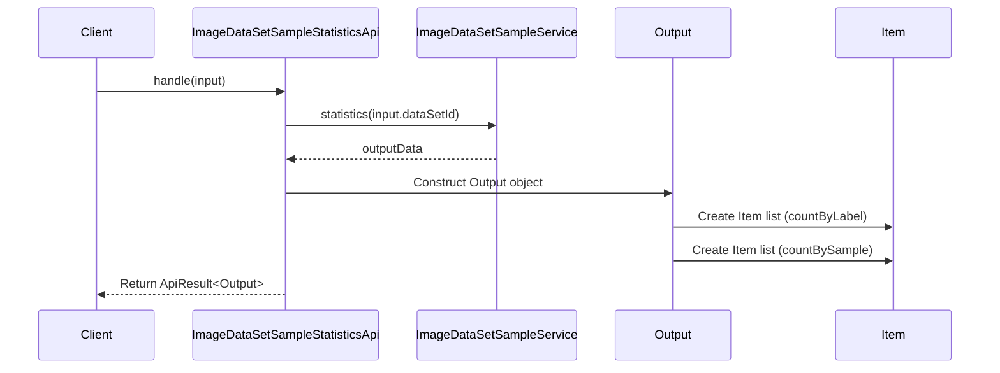

# Basic Information

|      |      |
|------|------|
| Name | ImageDataSetSampleStatisticsApi |
| Language | .java |
| Code Path | WeFe/board/board-service/src/main/java/com/welab/wefe/board/service/api/data_resource/image_data_set/sample/ImageDataSetSampleStatisticsApi.java |
| Package Name | com.welab.wefe.board.service.api.data_resource.image_data_set.sample |
| Dependencies | ['com.welab.wefe.board.service.service.data_resource.image_data_set.ImageDataSetSampleService', 'com.welab.wefe.common.exception.StatusCodeWithException', 'com.welab.wefe.common.fieldvalidate.annotation.Check', 'com.welab.wefe.common.web.api.base.AbstractApi', 'com.welab.wefe.common.web.api.base.Api', 'com.welab.wefe.common.web.dto.AbstractApiInput', 'com.welab.wefe.common.web.dto.ApiResult', 'org.springframework.beans.factory.annotation.Autowired', 'java.io.IOException', 'java.util.List', 'java.util.Map', 'java.util.stream.Collectors'] |
| Brief Description | ImageDataSetSampleStatisticsApi is used to count the label distribution of a dataset. The input is the dataset ID, and the output includes a list of label counts categorized by labels and samples. |

# Description

The code defines an API class named `ImageDataSetSampleStatisticsApi`, which is used to analyze the label distribution of an image dataset. The API path is `image_data_set_sample/statistics`, and it accepts the dataset ID as an input parameter. The output includes two statistical methods: counting by label (multiple occurrences of the same label in a sample are counted multiple times) and counting by sample (only one occurrence of the same label in a sample is counted). The results are returned as a list of `Item` objects, each containing the label name and its corresponding count. The API implements its functionality by calling the `statistics` method of `ImageDataSetSampleService` and returns the processed results.

# Class Summary

| Name   | Type  | Description |
|-------|------|-------------|
| ImageDataSetSampleStatisticsApi | class | Image Dataset Sample Statistics API: Input the dataset ID, output the label counts categorized by labels and sample statistics. |

## Class ImageDataSetSampleStatisticsApi

|      |      |
|------|------|
| Access Modifier | @Api(path = "image_data_set_sample/statistics", name = "statistics the data set labels distribute");public |
| Type | class |
| Name | ImageDataSetSampleStatisticsApi |
| Description | Image Dataset Sample Statistics API: Input the dataset ID, output the label counts categorized by labels and sample statistics. |

### UML Class Diagram

This code implements an image dataset sample statistics API, with the core functionality of counting label distribution in a dataset through ImageDataSetSampleService. The class diagram illustrates the main structure: ImageDataSetSampleStatisticsApi inherits from the generic AbstractApi, depends on the ImageDataSetSampleService interface, uses the nested class Input as input parameters, and Output as the result. Output contains two statistical dimensions (count by label and count by sample), storing specific labels and their quantities via the Item class. The entire design adopts a layered structure, complying with Spring's dependency injection specifications while improving code reusability through generics.

### Internal Method Call Graph

This code implements an image dataset sample statistics API, primarily functioning to analyze label distribution by dataset ID. The flowchart illustrates class structure relationships, including the main class, nested Output/Input classes with their properties and methods. The sequence diagram depicts the API call flow: client requests trigger the handle method, invoking the service layer to retrieve statistical data, constructing an Output object containing two statistical approaches (count by label and count by sample), and ultimately returning the encapsulated result. The Output class utilizes an inner Item class to store labels and corresponding counts, with the mapToList method converting Map to List.

### Field List

| Name  | Type  | Description |
|-------|-------|------|
| imageDataSetSampleService | ImageDataSetSampleService | Using @Autowired to automatically inject an instance of ImageDataSetSampleService. |

### Method List

| Name  | Type  | Description |
|-------|-------|------|
| handle | ApiResult<Output> | Java Method: Processes input and invokes service to perform dataset statistics, returning either a successful result or an exception. |

