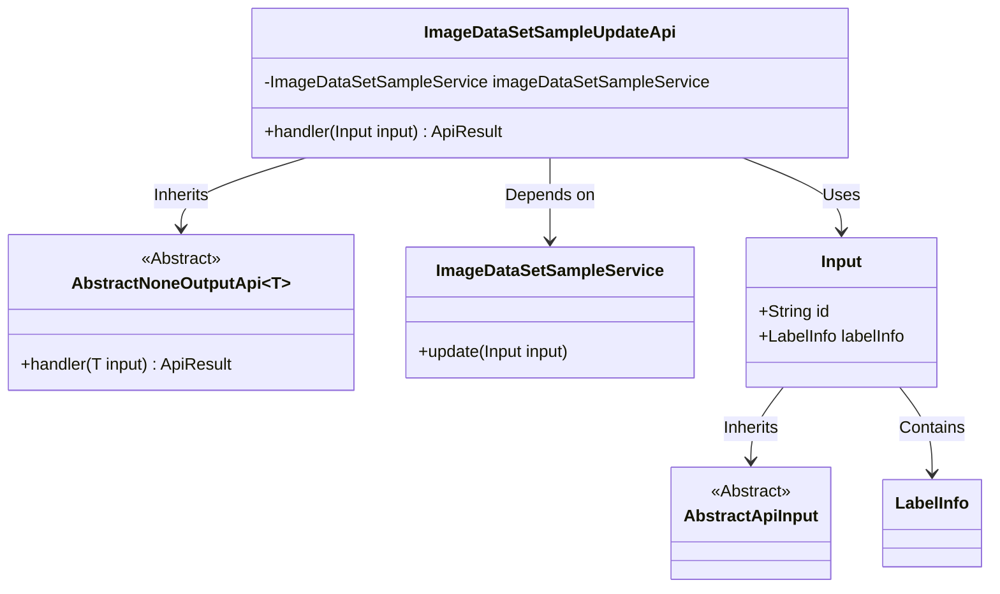

# Basic Information

|      |      |
|------|------|
| Name | ImageDataSetSampleUpdateApi |
| Language | .java |
| Code Path | WeFe/board/board-service/src/main/java/com/welab/wefe/board/service/api/data_resource/image_data_set/sample/ImageDataSetSampleUpdateApi.java |
| Package Name | com.welab.wefe.board.service.api.data_resource.image_data_set.sample |
| Dependencies | ['com.welab.wefe.board.service.dto.vo.data_set.image_data_set.LabelInfo', 'com.welab.wefe.board.service.service.data_resource.image_data_set.ImageDataSetSampleService', 'com.welab.wefe.common.exception.StatusCodeWithException', 'com.welab.wefe.common.fieldvalidate.annotation.Check', 'com.welab.wefe.common.web.api.base.AbstractNoneOutputApi', 'com.welab.wefe.common.web.api.base.Api', 'com.welab.wefe.common.web.dto.AbstractApiInput', 'com.welab.wefe.common.web.dto.ApiResult', 'org.springframework.beans.factory.annotation.Autowired'] |
| Brief Description | This is an API class designed for updating sample information in an image dataset. It processes the input parameters `id` and `labelInfo` by invoking the `update` method of `ImageDataSetSampleService`, and returns an empty result upon successful execution. |

# Description

This is an API class designed for updating sample information in an image dataset, with the path "image_data_set_sample/update". It inherits from AbstractNoneOutputApi and uses the internal class Input as its input type. The update request is processed by calling the update method through the auto-injected ImageDataSetSampleService. The Input class includes two mandatory fields: id and labelInfo (annotation information). An empty result is returned upon successful processing. The entire API implements basic parameter validation and encapsulates business logic.

# Class Summary

| Name   | Type  | Description |
|-------|------|-------------|
| ImageDataSetSampleUpdateApi | class | This is an API class designed for updating sample information in an image dataset, which includes input parameters such as ID and annotation details, and invokes service-layer methods to perform the update operation. |

## Class ImageDataSetSampleUpdateApi

|      |      |
|------|------|
| Access Modifier | @Api(path = "image_data_set_sample/update", name = "update image data set sample info");public |
| Type | class |
| Name | ImageDataSetSampleUpdateApi |
| Description | This is an API class designed for updating sample information in an image dataset, which includes input parameters such as ID and annotation details, and invokes service-layer methods to perform the update operation. |

### UML Class Diagram

This code demonstrates the implementation structure of an image dataset sample update API. The ImageDataSetSampleUpdateApi inherits from the generic abstract class AbstractNoneOutputApi and implements its handler method, utilizing the dependency-injected ImageDataSetSampleService to perform update operations. The Input class, as an internal static class, inherits from AbstractApiInput and contains two mandatory fields (id and LabelInfo) for receiving API request parameters. The overall design reflects a clear hierarchical structure and separation of responsibilities: the API class focuses on request handling, the service class manages business logic, and the input class handles data validation.

### Internal Method Call Graph

```mermaid
graph TD
    A["Class ImageDataSetSampleUpdateApi"]
    B["Parent Class: AbstractNoneOutputApi<Input>"]
    C["Dependency Injection: ImageDataSetSampleService"]
    D["Overridden Method: handler(Input input)"]
    E["Invokes: imageDataSetSampleService.update(input)"]
    F["Returns: success()"]
    G["Nested Class Input"]
    H["Parent Class: AbstractApiInput"]
    I["Field: String id"]
    J["Field: LabelInfo labelInfo"]
    K["Annotation: @Check(require=true)"]
    L["Annotation: @Check(require=true, name='Label Information')"]

    A --> B
    A --> C
    A --> D
    D --> E
    D --> F
    A --> G
    G --> H
    G --> I
    G --> J
    I --> K
    J --> L
```

The flowchart describes the structure and workflow of the ImageDataSetSampleUpdateApi class. This class inherits from AbstractNoneOutputApi, processes input parameters by overriding the handler method, invokes the service layer to update data samples, and ultimately returns a success result. The nested Input class defines mandatory id and labelInfo fields with parameter validation annotations. The entire flow demonstrates the complete processing chain from API entry to service invocation.

### Field List

| Name  | Type  | Description |
|-------|-------|------|
| imageDataSetSampleService | ImageDataSetSampleService | Automatically inject the ImageDataSetSampleService service instance. |

### Method List

| Name  | Type  | Description |
|-------|-------|------|
| handler | ApiResult | Rewrite the handler method to call the service for updating the input data and return a successful result. |

