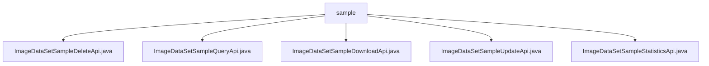

# Basic Information

|      |      |
|------|------|
| Name | sample |
| Language | .java |
| Code Path | WeFe/board/board-service/src/main/java/com/welab/wefe/board/service/api/data_resource/image_data_set/sample |
| Package Name | docs.board.board-service.src.main.java.com.welab.wefe.board.service.api.data_resource.image_data_set.sample |
| Brief Description | ImageDataSetSampleDeleteApi: Delete image samples, requires ID, returns empty.  ImageDataSetSampleQueryApi: Query samples, supports pagination and conditional filtering.  ImageDataSetSampleDownloadApi: Download samples, requires ID, returns file.  ImageDataSetSampleUpdateApi: Update sample annotation information, requires ID and labelInfo.  ImageDataSetSampleStatisticsApi: Count sample label distribution, returns two counting methods. |

# Description

## Overview  
This module provides CRUD management functions for image dataset samples, with core responsibilities including sample deletion, querying, downloading, updating, and label statistics. All APIs follow the RESTful style, with paths uniformly prefixed by `image_data_set_sample`. For example, the DeleteApi removes samples by ID, the QueryApi supports pagination and conditional filtering, and the StatisticsApi offers label distribution analysis.  

Key data structures include the Input base class (with an ID field), pagination query parameters, and label statistics Items. External dependencies are limited to the ImageDataSetSampleService and database repository classes. For instance, the UpdateApi requires the Service to handle annotation updates, while the DownloadApi relies on the repository to retrieve file paths.  

## Main Business Scenarios  
Typical applications include dataset maintenance (e.g., modifying labels via the UpdateApi) and data analysis (e.g., generating label reports using the StatisticsApi). The interaction model resembles a file explorer, supporting exact/fuzzy queries (QueryApi) and batch operations (DeleteApi). For example, users can download sample files, update annotations, and then analyze label distributions.  

API types cover data operations (CRUD) and statistical analysis. Integration examples include frontends calling the QueryApi to display paginated lists or systems scheduling the StatisticsApi to generate dataset reports. All interfaces implement parameter validation, such as the DownloadApi enforcing non-empty ID checks to ensure business integrity.

### Package Internal Structure View

This flowchart illustrates the hierarchical structure of the image dataset sample APIs in the WeFe project. The root node is the sample folder, which contains five Java API files implementing sample deletion, query, download, update, and statistics functionalities respectively. All API files reside in the same directory as peer-level components, collectively forming a complete functional module for image dataset sample management.

# File List

| Name   | Type  | Description |
|-------|------|-------------|
| [ImageDataSetSampleDeleteApi.java](ImageDataSetSampleDeleteApi.md) | file | This is an API class for deleting image dataset samples, which implements the deletion function by calling the delete method of ImageDataSetSampleService. The input parameter is the mandatory id field. |
| [ImageDataSetSampleQueryApi.java](ImageDataSetSampleQueryApi.md) | file | Image dataset sample query API, supporting pagination, dataset ID, label name fuzzy matching, and annotation status filtering, which invokes the ImageDataSetSampleService to process query requests. |
| [ImageDataSetSampleDownloadApi.java](ImageDataSetSampleDownloadApi.md) | file | This is an API class designed for downloading samples from an image dataset. It retrieves sample files by ID and returns the file content. The input parameter requires a mandatory ID field. |
| [ImageDataSetSampleUpdateApi.java](ImageDataSetSampleUpdateApi.md) | file | This is an API class designed for updating sample information in an image dataset. It processes the input parameters `id` and `labelInfo` by invoking the `update` method of `ImageDataSetSampleService`, and returns an empty result upon successful execution. |
| [ImageDataSetSampleStatisticsApi.java](ImageDataSetSampleStatisticsApi.md) | file | ImageDataSetSampleStatisticsApi is used to count the label distribution of a dataset. The input is the dataset ID, and the output includes a list of label counts categorized by labels and samples. |

