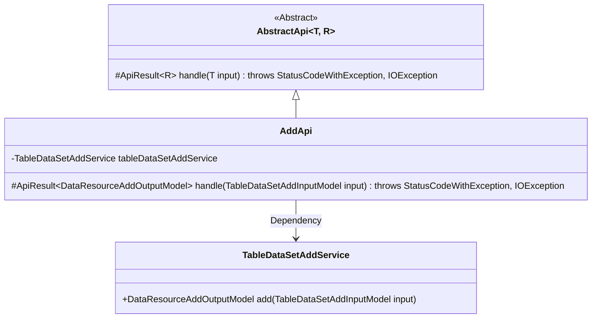
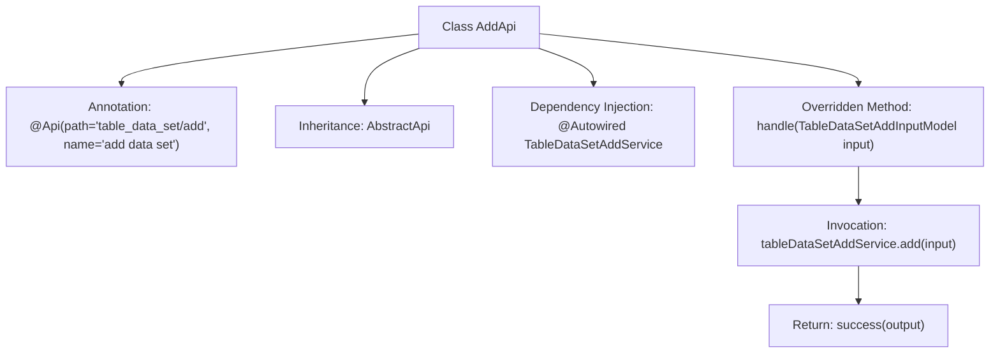

# Basic Information

|      |      |
|------|------|
| Name | AddApi |
| Language | .java |
| Code Path | WeFe/board/board-service/src/main/java/com/welab/wefe/board/service/api/data_resource/table_data_set/AddApi.java |
| Package Name | com.welab.wefe.board.service.api.data_resource.table_data_set |
| Dependencies | ['com.welab.wefe.board.service.dto.vo.data_resource.DataResourceAddOutputModel', 'com.welab.wefe.board.service.dto.vo.data_resource.TableDataSetAddInputModel', 'com.welab.wefe.board.service.service.data_resource.add.TableDataSetAddService', 'com.welab.wefe.common.exception.StatusCodeWithException', 'com.welab.wefe.common.web.api.base.AbstractApi', 'com.welab.wefe.common.web.api.base.Api', 'com.welab.wefe.common.web.dto.ApiResult', 'org.springframework.beans.factory.annotation.Autowired', 'java.io.IOException'] |
| Brief Description | This is a Java class that defines an API interface named AddApi with the path "table_data_set/add", used for adding datasets. It inherits from AbstractApi, processes TableDataSetAddInputModel as input and DataResourceAddOutputModel as output. The functionality is implemented through the add method of tableDataSetAddService, returning an ApiResult containing the output upon success. |

# Description

This is a Java class named AddApi, designed to implement the API functionality for adding datasets. The class inherits from the base class AbstractApi, with generic parameters specifying the input model TableDataSetAddInputModel and the output model DataResourceAddOutputModel. The @Api annotation defines the API path as "table_data_set/add" and the name as "add data set". The class injects the TableDataSetAddService and overrides the handle method to invoke the service's add method for processing requests, ultimately returning a successful result containing the output model. The method may throw StatusCodeWithException and IOException exceptions.

# Class Summary

| Name   | Type  | Description |
|-------|------|-------------|
| AddApi | class | The Java class AddApi provides an API for adding datasets, with the path "table_data_set/add". It uses TableDataSetAddService to process the input TableDataSetAddInputModel and returns a DataResourceAddOutputModel. |

## Class AddApi

|      |      |
|------|------|
| Access Modifier | @Api(path = "table_data_set/add", name = "add data set");public |
| Type | class |
| Name | AddApi |
| Description | The Java class AddApi provides an API for adding datasets, with the path "table_data_set/add". It uses TableDataSetAddService to process the input TableDataSetAddInputModel and returns a DataResourceAddOutputModel. |

### UML Class Diagram

Class Diagram Description: The diagram illustrates that AddApi inherits from the generic abstract class AbstractApi and implements its handle method. AddApi utilizes TableDataSetAddService through dependency injection to perform data addition operations, with TableDataSetAddInputModel as the input parameter and DataResourceAddOutputModel as the output result. The overall structure demonstrates the application of the Template Method pattern, where the parent class defines the processing framework and the child class implements specific business logic.

### Internal Method Call Graph

This flowchart illustrates the core structure of the AddApi class, which is a RESTful-annotated API implementation class inheriting from the generic abstract class AbstractApi. The main workflow includes: injecting the service class TableDataSetAddService via @Autowired, overriding the handle method to process the input model, invoking the service layer's add method, and returning an encapsulated success result. The entire design demonstrates the application of Spring Boot's dependency injection and the template method pattern.

### Field List

| Name  | Type  | Description |
|-------|-------|------|
| tableDataSetAddService | TableDataSetAddService | The code snippet uses the @Autowired annotation to automatically inject an instance of TableDataSetAddService. |

### Method List

| Name  | Type  | Description |
|-------|-------|------|
| handle | ApiResult<DataResourceAddOutputModel> | The method processes the dataset addition request in the table, invokes the service to generate the output model, and returns a successful result. |

