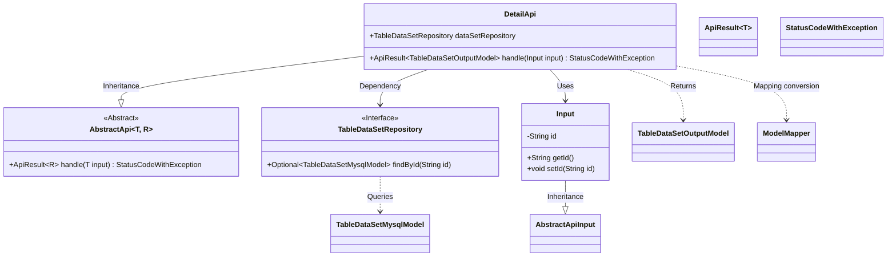
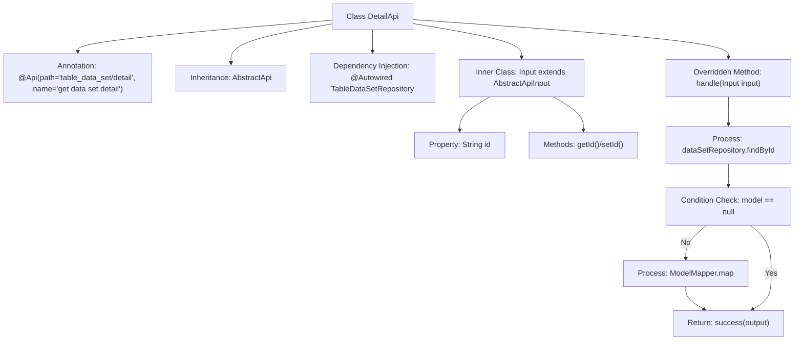

# Basic Information

|      |      |
|------|------|
| Name | DetailApi |
| Language | .java |
| Code Path | WeFe/board/board-service/src/main/java/com/welab/wefe/board/service/api/data_resource/table_data_set/DetailApi.java |
| Package Name | com.welab.wefe.board.service.api.data_resource.table_data_set |
| Dependencies | ['com.welab.wefe.board.service.database.entity.data_resource.TableDataSetMysqlModel', 'com.welab.wefe.board.service.database.repository.data_resource.TableDataSetRepository', 'com.welab.wefe.board.service.dto.entity.data_resource.output.TableDataSetOutputModel', 'com.welab.wefe.common.exception.StatusCodeWithException', 'com.welab.wefe.common.web.api.base.AbstractApi', 'com.welab.wefe.common.web.api.base.Api', 'com.welab.wefe.common.web.dto.AbstractApiInput', 'com.welab.wefe.common.web.dto.ApiResult', 'com.welab.wefe.common.web.util.ModelMapper', 'org.springframework.beans.factory.annotation.Autowired'] |
| Brief Description | The DetailApi class retrieves dataset details by ID and returns a TableDataSetOutputModel. If the data does not exist, it returns an empty result. It uses Autowired to inject TableDataSetRepository for database operations. |

# Description

The code defines an API class named `DetailApi`, which is used to retrieve dataset details. It inherits from `AbstractApi`, accepts an `Input` parameter, and returns a `TableDataSetOutputModel`. The class injects `TableDataSetRepository` for data querying. The `handle` method searches for data by ID, returning an empty result if not found, or mapping it to the output model and returning it if found. The `Input` inner class includes an `id` field and its getter/setter methods. The API path is `"table_data_set/detail"`, and its name is `"get data set detail"`.

# Class Summary

| Name   | Type  | Description |
|-------|------|-------------|
| DetailApi | class | This is an API class for retrieving dataset details, which queries the database by ID and returns the mapped output model. It returns an empty result if no data is found. |

## Class DetailApi

|      |      |
|------|------|
| Access Modifier | @Api(path = "table_data_set/detail", name = "get data set detail");public |
| Type | class |
| Name | DetailApi |
| Description | This is an API class for retrieving dataset details, which queries the database by ID and returns the mapped output model. It returns an empty result if no data is found. |

### UML Class Diagram

Class diagram description: This diagram illustrates that the DetailApi class inherits from the generic class AbstractApi<Input, TableDataSetOutputModel> and depends on the TableDataSetRepository interface for data access. Input, as an inner class, inherits from AbstractApiInput and contains an id attribute with getter/setter methods. DetailApi utilizes ModelMapper to map TableDataSetMysqlModel to TableDataSetOutputModel, ultimately returning the result wrapped in ApiResult. The overall structure demonstrates a typical API layer implementation pattern, encompassing core elements such as input parameter processing, data access, and output model conversion.

### Internal Method Call Graph

This flowchart illustrates the structure and core processing logic of the DetailApi class. The class implements interface functionality by inheriting AbstractApi and injects Repository dependency via @Autowired. The main processing flow is: query data by ID, if exists then map to output model and return success result, otherwise directly return empty success. The inner class Input encapsulates the request parameter id and its access methods. The overall flow clearly reflects the business chain of data query-conversion-return.

### Field List

| Name  | Type  | Description |
|-------|-------|------|
| dataSetRepository | TableDataSetRepository | Automatically inject the TableDataSetRepository instance into the dataSetRepository variable. |

### Method List

| Name  | Type  | Description |
|-------|-------|------|
| handle | ApiResult<TableDataSetOutputModel> | Rewrite the method to query data based on the input ID. If the data exists, map it to the output model and return a successful response; otherwise, return an empty success. |

