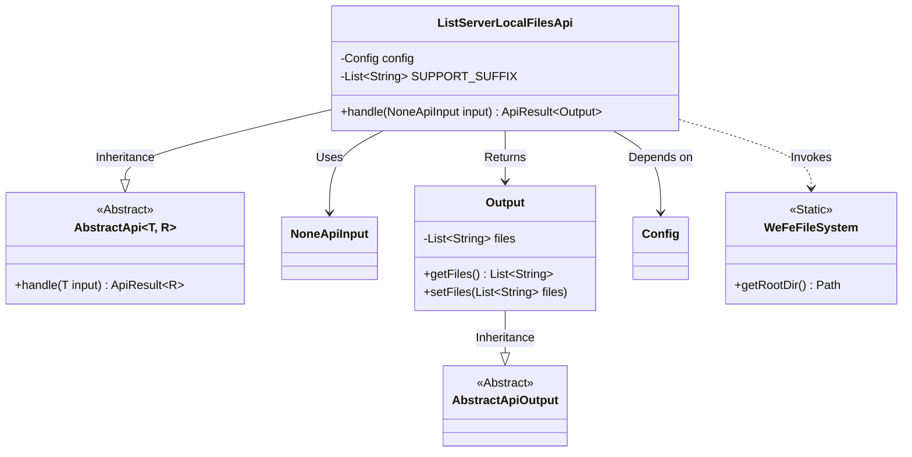
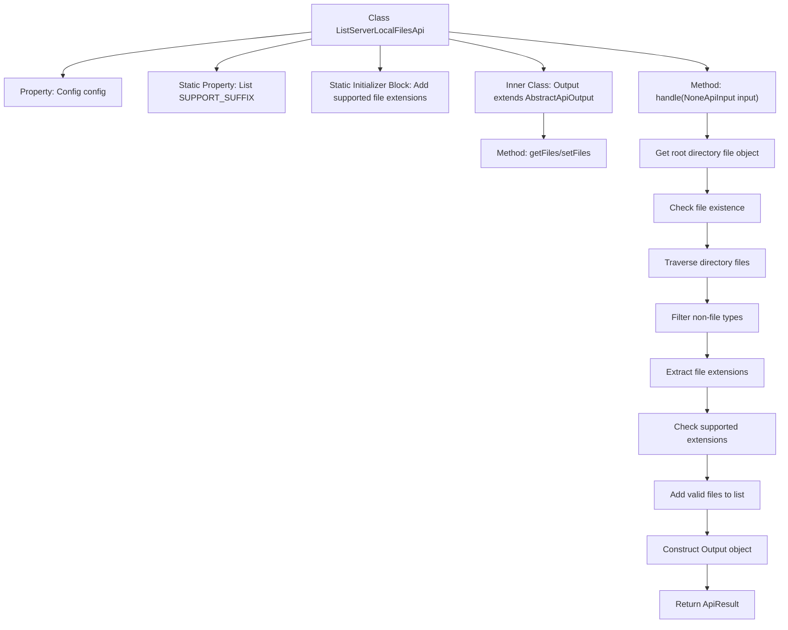

# Basic Information

|      |      |
|------|------|
| Name | ListServerLocalFilesApi |
| Language | .java |
| Code Path | WeFe/board/board-service/src/main/java/com/welab/wefe/board/service/api/data_resource/table_data_set/ListServerLocalFilesApi.java |
| Package Name | com.welab.wefe.board.service.api.data_resource.table_data_set |
| Dependencies | ['com.welab.wefe.board.service.base.file_system.WeFeFileSystem', 'com.welab.wefe.board.service.constant.Config', 'com.welab.wefe.common.exception.StatusCodeWithException', 'com.welab.wefe.common.web.api.base.AbstractApi', 'com.welab.wefe.common.web.api.base.Api', 'com.welab.wefe.common.web.dto.AbstractApiOutput', 'com.welab.wefe.common.web.dto.ApiResult', 'com.welab.wefe.common.web.dto.NoneApiInput', 'org.springframework.beans.factory.annotation.Autowired', 'java.io.File', 'java.util.ArrayList', 'java.util.List'] |
| Brief Description | Query the files in the specified directory of the server and return only the file list in xls, xlsx, and csv formats. |

# Description

The code defines an API class named `ListServerLocalFilesApi`, which is used to query files in a specified directory on the server. The API path is `"data_set/list_local_data_set_files"`, accepts no input parameters, and returns an output containing a list of files. This API only supports displaying files with extensions `.xls`, `.xlsx`, and `.csv`. The processing logic includes obtaining the root directory file list, filtering out non-target file types, and storing the qualified filenames in the output object. The output class `Output` inherits from `AbstractApiOutput` and includes a file list property along with its getter and setter methods.

# Class Summary

| Name   | Type  | Description |
|-------|------|-------------|
| ListServerLocalFilesApi | class | This API is used to query files in a specified directory on the server, returning only the file list in xls, xlsx, and csv formats. |

## Class ListServerLocalFilesApi

|      |      |
|------|------|
| Access Modifier | @Api(path = "data_set/list_local_data_set_files", name = "query the files in the specified directory on the server");public |
| Type | class |
| Name | ListServerLocalFilesApi |
| Description | This API is used to query files in a specified directory on the server, returning only the file list in xls, xlsx, and csv formats. |

### UML Class Diagram

This code demonstrates an API implementation for querying files in a specified server directory. ListServerLocalFilesApi inherits from AbstractApi, processes NoneApiInput and returns an Output object containing the file list. The class retrieves the root directory via WeFeFileSystem, filters xls/xlsx/csv format files, and uses Config for configuration management. Output as an inner class inherits AbstractApiOutput to encapsulate file list data. The overall design reflects clear hierarchical structure and separation of responsibilities.

### Internal Method Call Graph

This code implements an API for querying local file lists on a server, primarily scanning specified directories and filtering out files in .xls/.xlsx/.csv formats. The flowchart illustrates the complete process from class structure to core processing logic, including key steps such as static initialization, directory traversal, file filtering, and result encapsulation. The inner class Output is used to encapsulate returned file list data, with the entire processing strictly adhering to an extension whitelist mechanism.

### Field List

| Name  | Type  | Description |
|-------|-------|------|
| config | Config | Using @Autowired to automatically inject a private instance of the Config configuration class. |
| SUPPORT_SUFFIX = new ArrayList() | List<String> | Define a private static immutable list SUPPORT_SUFFIX, initialized as an empty ArrayList, for storing string-type elements. |

### Method List

| Name  | Type  | Description |
|-------|-------|------|
| handle | ApiResult<Output> | The method processes the input NoneApiInput, retrieves the file list from the root directory, filters out filenames in XLS, xlsx, and CSV formats, and returns an Output result containing these filenames. |

