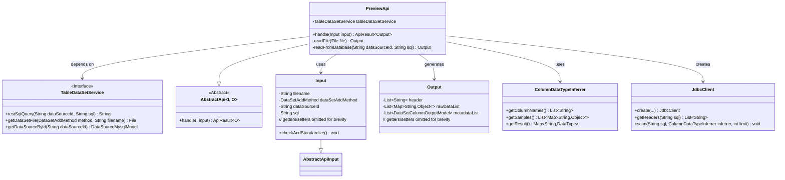
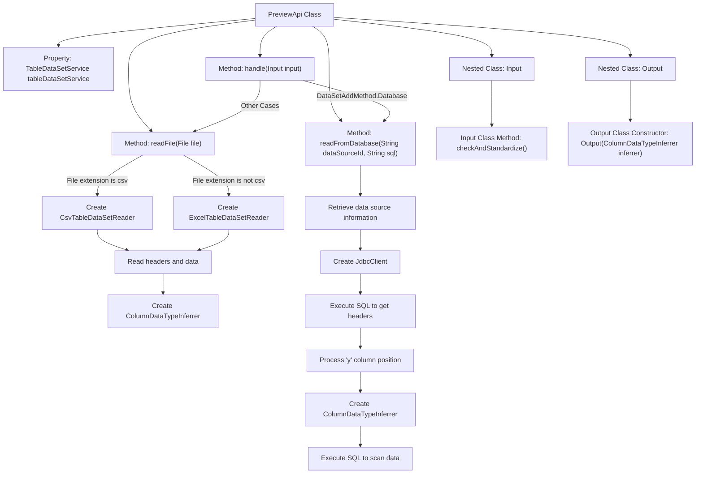

# Basic Information

|      |      |
|------|------|
| Name | PreviewApi |
| Language | .java |
| Code Path | WeFe/board/board-service/src/main/java/com/welab/wefe/board/service/api/data_resource/table_data_set/PreviewApi.java |
| Package Name | com.welab.wefe.board.service.api.data_resource.table_data_set |
| Dependencies | ['com.welab.wefe.board.service.constant.DataSetAddMethod', 'com.welab.wefe.board.service.database.entity.DataSourceMysqlModel', 'com.welab.wefe.board.service.dto.entity.data_set.DataSetColumnOutputModel', 'com.welab.wefe.board.service.service.data_resource.table_data_set.TableDataSetService', 'com.welab.wefe.board.service.util.AbstractTableDataSetReader', 'com.welab.wefe.board.service.util.CsvTableDataSetReader', 'com.welab.wefe.board.service.util.ExcelTableDataSetReader', 'com.welab.wefe.common.StatusCode', 'com.welab.wefe.common.exception.StatusCodeWithException', 'com.welab.wefe.common.fieldvalidate.annotation.Check', 'com.welab.wefe.common.jdbc.JdbcClient', 'com.welab.wefe.common.util.ListUtil', 'com.welab.wefe.common.web.api.base.AbstractApi', 'com.welab.wefe.common.web.api.base.Api', 'com.welab.wefe.common.web.dto.AbstractApiInput', 'com.welab.wefe.common.web.dto.ApiResult', 'com.welab.wefe.common.wefe.ColumnDataTypeInferrer', 'org.apache.commons.lang3.StringUtils', 'org.springframework.beans.factory.annotation.Autowired', 'java.io.File', 'java.io.IOException', 'java.util.ArrayList', 'java.util.List', 'java.util.Map', 'java.util.stream.Collectors'] |
| Brief Description | The PreviewApi class is used to preview dataset rows, supporting data retrieval from databases or files. For database mode, it validates SQL and fetches data; for file mode, it parses CSV or Excel files. The output includes field lists, raw data, and metadata information. |

# Description

The PreviewApi class is an API designed for previewing dataset rows, inheriting from AbstractApi, and handling Input and Output. Based on the dataset addition method specified in the input, it reads data from either a database or a file. For database sources, it tests SQL queries and retrieves data, while for file sources, it supports CSV and Excel formats, parsing file contents and inferring data types. The output includes a field list, raw data, and metadata information. The input class Input validates the data source ID and SQL statements, while the output class Output contains the dataset's structure and data samples.

# Class Summary

| Name   | Type  | Description |
|-------|------|-------------|
| PreviewApi | class | The PreviewApi class is used to preview dataset rows, supporting data reading from databases or files. The database method requires SQL query validation, while the file method supports CSV and Excel formats. After processing the data, it returns field lists, raw data, and metadata information. |

## Class PreviewApi

|      |      |
|------|------|
| Access Modifier | @Api(path = "table_data_set/preview", name = "preview data set rows");public |
| Type | class |
| Name | PreviewApi |
| Description | The PreviewApi class is used to preview dataset rows, supporting data reading from databases or files. The database method requires SQL query validation, while the file method supports CSV and Excel formats. After processing the data, it returns field lists, raw data, and metadata information. |

### UML Class Diagram

This code implements a dataset preview API, whose primary function is to read data from different sources (database or file) and infer column data types. The class diagram illustrates core class relationships: PreviewApi inherits from the generic AbstractApi, depends on TableDataSetService for data operations, uses Input as parameters, and generates Output results containing metadata. The processing flow consists of two paths - database query and file reading, which leverage JdbcClient and ColumnDataTypeInferrer respectively for data parsing and type inference, ultimately returning standardized data structures.

### Internal Method Call Graph

This code implements the PreviewApi class, primarily used for previewing dataset contents. It provides two data source processing methods: database query and file reading. When data comes from a database, it validates SQL and retrieves results; when data comes from a file, it creates corresponding readers based on file type (CSV/Excel). The core processing flow includes data source validation, data reading, header processing, and data type inference, ultimately returning an output object containing headers, raw data, and metadata. The Input class handles parameter validation, while the Output class encapsulates result data.

### Field List

| Name  | Type  | Description |
|-------|-------|------|
| tableDataSetService | TableDataSetService | Automatically inject table dataset service instance. |

### Method List

| Name  | Type  | Description |
|-------|-------|------|
| handle | ApiResult<Output> | Process input data and return output results. If the data source is a database, read the data after validating the SQL query; if it is a file, read the file contents. Throw an error in case of exceptions, otherwise return the output. |
| readFile | Output | This method reads CSV or Excel files, retrieves the headers, and infers column data types, returning an Output object containing the inference results. It supports up to 100,000 rows of data and handles exceptions including IO and status code errors. |
| readFromDatabase | Output | Read data from the database, check if the data source exists, verify no duplicate fields, adjust field order (move column y to the second column), infer column data types, and return the result. |

