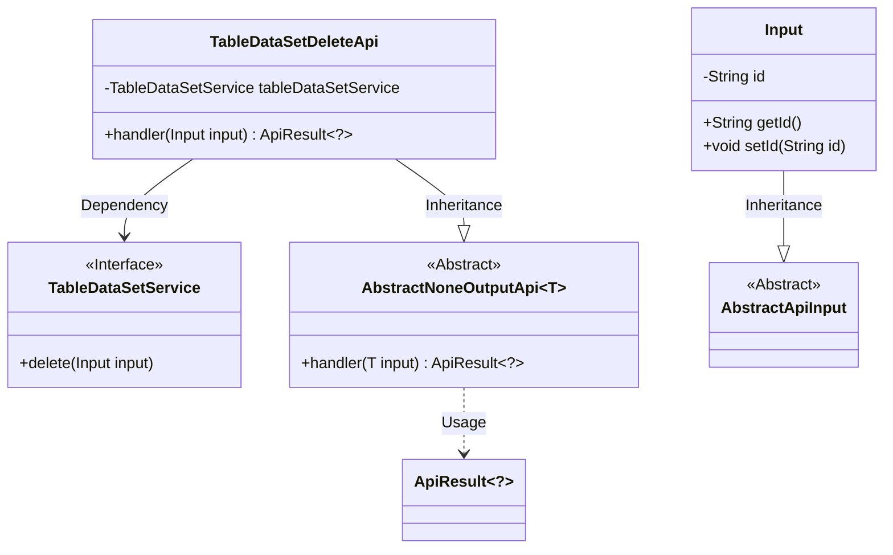

# Basic Information

|      |      |
|------|------|
| Name | TableDataSetDeleteApi |
| Language | .java |
| Code Path | WeFe/board/board-service/src/main/java/com/welab/wefe/board/service/api/data_resource/table_data_set/TableDataSetDeleteApi.java |
| Package Name | com.welab.wefe.board.service.api.data_resource.table_data_set |
| Dependencies | ['com.welab.wefe.board.service.service.data_resource.table_data_set.TableDataSetService', 'com.welab.wefe.common.fieldvalidate.annotation.Check', 'com.welab.wefe.common.web.api.base.AbstractNoneOutputApi', 'com.welab.wefe.common.web.api.base.Api', 'com.welab.wefe.common.web.dto.AbstractApiInput', 'com.welab.wefe.common.web.dto.ApiResult', 'org.springframework.beans.factory.annotation.Autowired'] |
| Brief Description | This is an API class for deleting datasets, with the path "table_data_set/delete". It invokes the service to delete data by passing in the dataset ID. |

# Description

This is an API class for deleting datasets, with the path "table_data_set/delete". It inherits from `AbstractNoneOutputApi`, takes an input parameter of the inner class `Input`, which includes the required field "datasetId". The deletion operation is performed via the injected `TableDataSetService`, returning an empty result upon success. The input class `Input` inherits from `AbstractApiInput` and contains the `id` field along with its getter/setter methods.

# Class Summary

| Name   | Type  | Description |
|-------|------|-------------|
| TableDataSetDeleteApi | class | The API class for deleting datasets takes the dataset ID as a required parameter, invokes the service layer to delete the data, and returns a success result. |

## Class TableDataSetDeleteApi

|      |      |
|------|------|
| Access Modifier | @Api(path = "table_data_set/delete", name = "delete data set");public |
| Type | class |
| Name | TableDataSetDeleteApi |
| Description | The API class for deleting datasets takes the dataset ID as a required parameter, invokes the service layer to delete the data, and returns a success result. |

### UML Class Diagram

This code demonstrates the implementation structure of a dataset deletion API. TableDataSetDeleteApi inherits from AbstractNoneOutputApi, processes parameters of type Input, and performs deletion operations through the dependency-injected TableDataSetService. The Input class contains the dataset ID field and its accessor methods, inheriting from AbstractApiInput. The overall design adopts a layered architecture, achieving code reuse through generics and abstract classes, reflecting clear separation of responsibilities and dependency management.

### Internal Method Call Graph

```mermaid
graph TD
    A["Class TableDataSetDeleteApi"]
    B["Inheritance: AbstractNoneOutputApi<Input>"]
    C["Annotation: @Api(path='table_data_set/delete', name='delete data set')"]
    D["Dependency Injection: @Autowired TableDataSetService"]
    E["Overridden Method: handler(Input input)"]
    F["Invocation: tableDataSetService.delete(input)"]
    G["Return: success()"]
    H["Static Inner Class Input"]
    I["Inheritance: AbstractApiInput"]
    J["Property: String id"]
    K["Validation Annotation: @Check(name='Dataset Id', require=true)"]
    L["getter/setter Methods"]

    A --> B
    A --> C
    A --> D
    A --> E
    E --> F
    E --> G
    A --> H
    H --> I
    H --> J
    J --> K
    H --> L
```

This code demonstrates a Spring framework-based API class TableDataSetDeleteApi, primarily used for deleting datasets. The class inherits from AbstractNoneOutputApi and implements the handler method, executing deletion operations through the injected TableDataSetService. The inner class Input defines the required id field and its validation rules, with the overall structure reflecting clear hierarchical relationships and responsibility division.

### Field List

| Name  | Type  | Description |
|-------|-------|------|
| tableDataSetService | TableDataSetService | Use @Autowired to automatically inject an instance of TableDataSetService. |

### Method List

| Name  | Type  | Description |
|-------|-------|------|
| handler | ApiResult<?> | Rewrite the parent class handler method to call tableDataSetService for deleting input data, and return a success result upon successful completion. |

