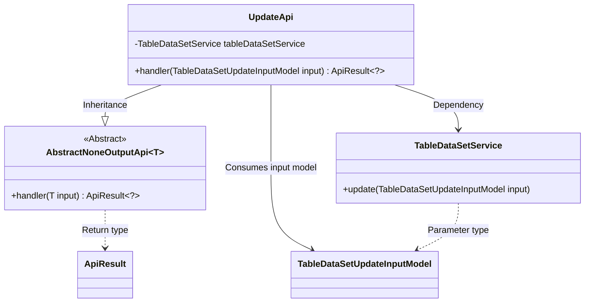
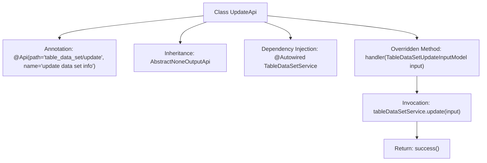

# Basic Information

|      |      |
|------|------|
| Name | UpdateApi |
| Language | .java |
| Code Path | WeFe/board/board-service/src/main/java/com/welab/wefe/board/service/api/data_resource/table_data_set/UpdateApi.java |
| Package Name | com.welab.wefe.board.service.api.data_resource.table_data_set |
| Dependencies | ['com.welab.wefe.board.service.dto.vo.data_resource.TableDataSetUpdateInputModel', 'com.welab.wefe.board.service.service.data_resource.table_data_set.TableDataSetService', 'com.welab.wefe.common.exception.StatusCodeWithException', 'com.welab.wefe.common.web.api.base.AbstractNoneOutputApi', 'com.welab.wefe.common.web.api.base.Api', 'com.welab.wefe.common.web.dto.ApiResult', 'org.springframework.beans.factory.annotation.Autowired'] |
| Brief Description | API class for updating dataset information, inherits from an outputless abstract class, calls service layer methods to process the input model, and returns an empty result upon success. |

# Description

This is a Java class named UpdateApi, designed for updating dataset information. The class extends AbstractNoneOutputApi with a generic parameter of TableDataSetUpdateInputModel. It is annotated with @Api to define the API path as "table_data_set/update" and the name as "update data set info". The class injects the TableDataSetService and overrides the handler method, which takes TableDataSetUpdateInputModel as input, invokes the tableDataSetService.update method to perform data updates, and finally returns a successful ApiResult. The entire class implements an API functionality for updates with no output.

# Class Summary

| Name   | Type  | Description |
|-------|------|-------------|
| UpdateApi | class | This is a Java API class designed for updating dataset information. It accepts a TableDataSetUpdateInputModel as input, invokes the update method of tableDataSetService for processing, and returns an empty result upon successful execution. |

## Class UpdateApi

|      |      |
|------|------|
| Access Modifier | @Api(path = "table_data_set/update", name = "update data set info");public |
| Type | class |
| Name | UpdateApi |
| Description | This is a Java API class designed for updating dataset information. It accepts a TableDataSetUpdateInputModel as input, invokes the update method of tableDataSetService for processing, and returns an empty result upon successful execution. |

### UML Class Diagram

This code demonstrates a Spring framework-based API update implementation class UpdateApi, which inherits from the generic abstract class AbstractNoneOutputApi and specializes in handling data update requests of type TableDataSetUpdateInputModel. The class utilizes dependency injection of TableDataSetService to perform actual data updates, with the handler method receiving the input model and returning a properly encapsulated ApiResult. The overall design reflects a clear hierarchical structure and the Single Responsibility Principle, with UpdateApi focusing solely on the process control of update requests.

### Internal Method Call Graph

This flowchart describes the structure and workflow of the UpdateApi class. The class is an API interface annotated with a specific path and name, inheriting from an abstract parent class, and performing data update operations through an auto-injected service class. The main process includes: receiving input model parameters, invoking the service layer update method, and finally returning a success result. The entire flow clearly and concisely demonstrates the complete chain from request processing to result return.

### Field List

| Name  | Type  | Description |
|-------|-------|------|
| tableDataSetService | TableDataSetService | Using @Autowired to automatically inject an instance of TableDataSetService. |

### Method List

| Name  | Type  | Description |
|-------|-------|------|
| handler | ApiResult<?> | Java method override, calling service to update table data, returns result upon success. |

