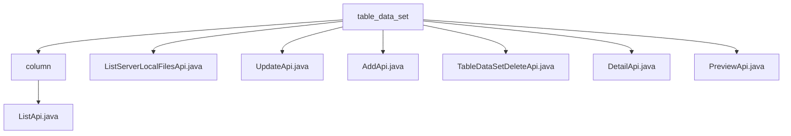

# Basic Information

|      |      |
|------|------|
| Name | table_data_set |
| Language | .java |
| Code Path | WeFe/board/board-service/src/main/java/com/welab/wefe/board/service/api/data_resource/table_data_set |
| Package Name | docs.board.board-service.src.main.java.com.welab.wefe.board.service.api.data_resource.table_data_set |
| Brief Description | The ListApi class is used to retrieve the list of dataset fields, with the path `table_data_set/column/list`. The ListServerLocalFilesApi class queries server files, displaying only xls, xlsx, and csv files. The UpdateApi class updates dataset information, with the path `table_data_set/update`. The AddApi class adds a dataset, with the path `table_data_set/add`. The DeleteApi class deletes a dataset, with the path `table_data_set/delete`. The DetailApi class retrieves dataset details, with the path `table_data_set/detail`. The PreviewApi class previews dataset rows, supporting both database and file data sources. |

# Description

## Overview  
The core responsibility of this module is to manage the complete lifecycle of datasets (TableDataSet), including field list queries, local file retrieval, CRUD operations, and data preview functionality, akin to a data steward in CRUD mode. Interface specifications uniformly inherit from the AbstractApi base class, with paths prefixed by "table_data_set," such as "table_data_set/add" for the add operation. Key data structures include TableDataSetUpdateInputModel (update input), DataResourceAddOutputModel (add output), and others. External dependencies include DataSetColumnService (field service), TableDataSetRepository (storage repository), etc. For example, ListApi implements paginated queries via DataSetColumnService.query.  

## Primary Business Scenarios  
Typical applications encompass end-to-end dataset management: data addition, modification, and deletion via AddApi/UpdateApi/DeleteApi; detail retrieval via DetailApi; and field list queries via ListApi, resembling metadata operations in a database management system. Interaction patterns follow RESTful conventions, such as PreviewApi supporting raw data previews from either database or file (CSV/Excel) sources. Full functionality covers dataset upload (filtering xls/csv files via ListServerLocalFilesApi), structured storage, metadata maintenance, and sample viewing. For instance, in a file upload scenario, ListServerLocalFilesApi is first invoked to fetch available files, followed by data import via AddApi.

### Package Internal Structure View

This flowchart illustrates the file structure relationships within the table_data_set directory. With table_data_set as the root node, it contains a subdirectory named column and 6 API files. The column directory further includes the ListApi.java file. The overall structure clearly reflects the hierarchical organization of data resource table-related APIs, comprising a total of 8 nodes that precisely correspond to the number of input paths.

# File List

| Name   | Type  | Description |
|-------|------|-------------|
| [ListServerLocalFilesApi.java](ListServerLocalFilesApi.md) | file | Query the files in the specified directory of the server, and return only the file list in xls, xlsx, and csv formats. |
| [UpdateApi.java](UpdateApi.md) | file | API class for updating dataset information, inherits from an output-less abstract class, calls service layer methods to process the input model, and returns an empty result upon success. |
| [AddApi.java](AddApi.md) | file | This is a Java class that defines an API interface named AddApi with the path "table_data_set/add", used for adding datasets. It inherits from AbstractApi, processes TableDataSetAddInputModel as input and DataResourceAddOutputModel as output. The functionality is implemented through the add method of tableDataSetAddService, returning an ApiResult containing the output upon success. |
| [TableDataSetDeleteApi.java](TableDataSetDeleteApi.md) | file | This is an API class for deleting datasets, with the path "table_data_set/delete". It invokes the service to delete data by passing in the dataset ID. |
| [DetailApi.java](DetailApi.md) | file | The DetailApi class queries dataset details by ID and returns a TableDataSetOutputModel. If the data does not exist, it returns an empty result. It uses Autowired to inject TableDataSetRepository for database operations. |
| [PreviewApi.java](PreviewApi.md) | file | The PreviewApi class is used to preview dataset rows, supporting data retrieval from databases or files. For database mode, it validates SQL and fetches data; for file mode, it parses CSV or Excel files. The output includes field lists, raw data, and metadata information. |
| [column](column/_module.md) | package | This is an API class for retrieving the field list of a dataset, with the path "table_data_set/column/list". It inherits from AbstractApi, accepts input containing the dataset ID, and returns paginated DataSetColumnOutputModel results. The query request is processed via DataSetColumnService. |

