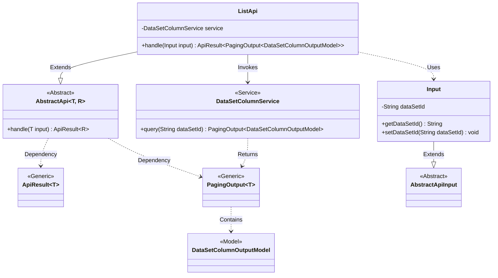

# Basic Information

|      |      |
|------|------|
| Name | ListApi |
| Language | .java |
| Code Path | WeFe/board/board-service/src/main/java/com/welab/wefe/board/service/api/data_resource/table_data_set/column/ListApi.java |
| Package Name | com.welab.wefe.board.service.api.data_resource.table_data_set.column |
| Dependencies | ['com.welab.wefe.board.service.dto.base.PagingOutput', 'com.welab.wefe.board.service.dto.entity.data_set.DataSetColumnOutputModel', 'com.welab.wefe.board.service.service.DataSetColumnService', 'com.welab.wefe.common.exception.StatusCodeWithException', 'com.welab.wefe.common.fieldvalidate.annotation.Check', 'com.welab.wefe.common.web.api.base.AbstractApi', 'com.welab.wefe.common.web.api.base.Api', 'com.welab.wefe.common.web.dto.AbstractApiInput', 'com.welab.wefe.common.web.dto.ApiResult', 'org.springframework.beans.factory.annotation.Autowired'] |
| Brief Description | This is an API class designed to retrieve the field list of a dataset, with the path "table_data_set/column/list". It inherits from AbstractApi, accepts input containing the dataset ID, and returns paginated DataSetColumnOutputModel results. The query request is processed via DataSetColumnService. |

# Description

This is a Java class named ListApi, designed to retrieve a list of dataset fields. It extends AbstractApi, accepts an Input parameter, and returns a paginated result of DataSetColumnOutputModel. The class annotation specifies the API path as "table_data_set/column/list" and the name as "list of data set fields". The inner class Input includes a mandatory field dataSetId, along with corresponding getter and setter methods. The handle method invokes the query method of DataSetColumnService to process the request and returns the paginated query result. The entire class implements the functionality for querying a list of dataset fields.

# Class Summary

| Name   | Type  | Description |
|-------|------|-------------|
| ListApi | class | This is an API class with the path "table_data_set/column/list", used to retrieve the dataset field list. The input parameter is the dataset ID, and it returns paginated field data. The data is queried through the DataSetColumnService. |

## Class ListApi

|      |      |
|------|------|
| Access Modifier | @Api(path = "table_data_set/column/list", name = "list of data set fields");public |
| Type | class |
| Name | ListApi |
| Description | This is an API class with the path "table_data_set/column/list", used to retrieve the dataset field list. The input parameter is the dataset ID, and it returns paginated field data. The data is queried through the DataSetColumnService. |

### UML Class Diagram

This class diagram illustrates the API implementation structure based on the Spring framework. ListApi inherits from AbstractApi and relies on DataSetColumnService for data queries, using Input as a parameter encapsulation class. The core workflow is: ListApi.handle() invokes service.query() to retrieve paginated data, where the PagingOutput generic class wraps DataSetColumnOutputModel model data. The input parameter Input inherits from AbstractApiInput and contains necessary dataset ID validation logic. The overall design reflects layered architecture and dependency injection principles.

### Internal Method Call Graph

```mermaid
graph TD
    A["Class ListApi"]
    B["Annotation: @Api"]
    C["Inheritance: AbstractApi<Input, PagingOutput<DataSetColumnOutputModel>>"]
    D["Dependency Injection: @Autowired DataSetColumnService"]
    E["Overridden Method: handle(Input input)"]
    F["Inner Class: Input"]
    G["Field: String dataSetId"]
    H["Validation Annotation: @Check"]
    I["getter/setter Methods"]
    J["Method Invocation: service.query(input.getDataSetId())"]
    K["Result Wrapping: success()"]

    A --> B
    A --> C
    A --> D
    A --> E
    E --> J
    J --> K
    A --> F
    F --> G
    F --> H
    F --> I
```

This flowchart illustrates the core structure of the ListApi class, including API annotations, parent class inheritance, service injection, and request processing flow. The inner class Input defines the dataset ID field and its validation rules. The handle method retrieves paginated data by calling service.query, then wraps the result with the success method. The diagram presents a complete chain from request parameter validation to business processing.

### Field List

| Name  | Type  | Description |
|-------|-------|------|
| service | DataSetColumnService | Automatically inject the DataSetColumnService service instance. |

### Method List

| Name  | Type  | Description |
|-------|-------|------|
| handle | ApiResult<PagingOutput<DataSetColumnOutputModel>> | Rewrite the handle method to call service.query for querying dataset columns and return paginated results. |

