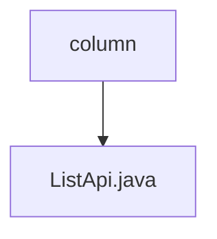

# Basic Information

|      |      |
|------|------|
| Name | column |
| Language | .java |
| Code Path | WeFe/board/board-service/src/main/java/com/welab/wefe/board/service/api/data_resource/table_data_set/column |
| Package Name | docs.board.board-service.src.main.java.com.welab.wefe.board.service.api.data_resource.table_data_set.column |
| Brief Description | This is an API class for retrieving the field list of a dataset, with the path "table_data_set/column/list". It inherits from AbstractApi, accepts input containing the dataset ID, and returns paginated DataSetColumnOutputModel results. The query request is processed via DataSetColumnService. |

# Description

This is a Java class named ListApi, designed for retrieving a list of dataset fields. It extends AbstractApi, accepts an Input parameter, and returns a paginated result of DataSetColumnOutputModel. The class annotation specifies the API path as "table_data_set/column/list" and the name as "list of data set fields." The inner class Input includes a mandatory field dataSetId, along with corresponding getter and setter methods. The handle method invokes the query method of DataSetColumnService to process the request and returns the paginated query result. The entire class implements the functionality for querying a list of dataset fields.

### Package Internal Structure View

This flowchart illustrates the API file structure related to dataset columns of data resources in the WeFe project. The root node is the "column" directory, which contains a specific API implementation file "ListApi.java". This concise hierarchical relationship reflects modular design principles, enabling developers to quickly locate interface code for column data operations.

# File List

| Name   | Type  | Description |
|-------|------|-------------|
| [ListApi.java](ListApi.md) | file | This is an API class for retrieving the field list of a dataset, with the path "table_data_set/column/list". It inherits from AbstractApi, accepts input containing the dataset ID, and returns paginated DataSetColumnOutputModel results. The query request is processed via DataSetColumnService. |

