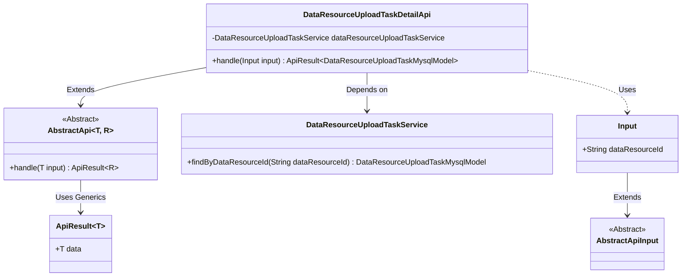

# Basic Information

|      |      |
|------|------|
| Name | DataResourceUploadTaskDetailApi |
| Language | .java |
| Code Path | WeFe/board/board-service/src/main/java/com/welab/wefe/board/service/api/data_resource/upload_task/DataResourceUploadTaskDetailApi.java |
| Package Name | com.welab.wefe.board.service.api.data_resource.upload_task |
| Dependencies | ['com.welab.wefe.board.service.database.entity.data_resource.DataResourceUploadTaskMysqlModel', 'com.welab.wefe.board.service.service.data_resource.DataResourceUploadTaskService', 'com.welab.wefe.common.exception.StatusCodeWithException', 'com.welab.wefe.common.fieldvalidate.annotation.Check', 'com.welab.wefe.common.web.api.base.AbstractApi', 'com.welab.wefe.common.web.api.base.Api', 'com.welab.wefe.common.web.dto.AbstractApiInput', 'com.welab.wefe.common.web.dto.ApiResult', 'org.springframework.beans.factory.annotation.Autowired'] |
| Brief Description | API class for retrieving dataset upload task details, which queries task information by dataResourceId and returns the results. |

# Description

The code defines an API class named DataResourceUploadTaskDetailApi, which is used to retrieve dataset upload task information. It inherits from AbstractApi, accepts an Input parameter, and returns a DataResourceUploadTaskMysqlModel result. The Input class includes a required field dataResourceId. The API path is data_resource/upload_task/detail, and it queries data by calling the findByDataResourceId method through the auto-injected DataResourceUploadTaskService. The processing logic is encapsulated in the handle method, which returns the query result upon success.

# Class Summary

| Name   | Type  | Description |
|-------|------|-------------|
| DataResourceUploadTaskDetailApi | class | API class for retrieving dataset upload task details, which queries and returns task information based on the dataResourceId. |

## Class DataResourceUploadTaskDetailApi

|      |      |
|------|------|
| Access Modifier | @Api(path = "data_resource/upload_task/detail", name = "get a data set upload task info");public |
| Type | class |
| Name | DataResourceUploadTaskDetailApi |
| Description | API class for retrieving dataset upload task details, which queries and returns task information based on the dataResourceId. |

### UML Class Diagram

This code describes the implementation structure of a data resource upload task detail API. The DataResourceUploadTaskDetailApi inherits from the generic abstract class AbstractApi, processes Input parameters, and returns an ApiResult containing DataResourceUploadTaskMysqlModel. It relies on DataResourceUploadTaskService for data queries, while the Input class inherits from AbstractApiInput and includes the mandatory dataResourceId field. The overall design follows a layered approach, achieving type safety through generics, and exemplifies typical usage of Spring dependency injection and parameter validation.

### Internal Method Call Graph

```mermaid
graph TD
    A["Class DataResourceUploadTaskDetailApi"]
    B["Annotation: @Api"]
    C["Inheritance: AbstractApi<Input, DataResourceUploadTaskMysqlModel>"]
    D["Dependency Injection: DataResourceUploadTaskService"]
    E["Overridden Method: handle(Input input)"]
    F["Inner Class: Input"]
    G["Validation Annotation: @Check(require = true)"]
    H["Field: String dataResourceId"]
    I["Method Call: dataResourceUploadTaskService.findByDataResourceId"]
    J["Return: ApiResult.success()"]

    A --> B
    A --> C
    A --> D
    A --> E
    E --> I
    I --> J
    A --> F
    F --> G
    F --> H
```

This flowchart illustrates the structure and key components of the DataResourceUploadTaskDetailApi class. The class defines an API path via the @Api annotation, inherits from AbstractApi, and injects the DataResourceUploadTaskService. The core method handle invokes the service-layer findByDataResourceId query method and returns encapsulated results. The inner class Input contains a mandatory dataResourceId field with parameter validation implemented through the @Check annotation. The overall flow clearly demonstrates the complete call chain from the API entry point to data query.

### Field List

| Name  | Type  | Description |
|-------|-------|------|
| dataResourceUploadTaskService | DataResourceUploadTaskService | Use @Autowired to automatically inject an instance of the DataResourceUploadTaskService. |

### Method List

| Name  | Type  | Description |
|-------|-------|------|
| handle | ApiResult<DataResourceUploadTaskMysqlModel> | This method overrides the parent class logic, invokes the service layer to query the upload task based on the input data resource ID, and returns the successfully encapsulated API result. |

