# Basic Information

|      |      |
|------|------|
| Name | DataResourceUploadTaskQueryApi |
| Language | .java |
| Code Path | WeFe/board/board-service/src/main/java/com/welab/wefe/board/service/api/data_resource/upload_task/DataResourceUploadTaskQueryApi.java |
| Package Name | com.welab.wefe.board.service.api.data_resource.upload_task |
| Dependencies | ['com.welab.wefe.board.service.dto.base.PagingInput', 'com.welab.wefe.board.service.dto.base.PagingOutput', 'com.welab.wefe.board.service.dto.entity.data_resource.output.DataResourceUploadTaskOutputModel', 'com.welab.wefe.board.service.service.data_resource.DataResourceUploadTaskService', 'com.welab.wefe.common.exception.StatusCodeWithException', 'com.welab.wefe.common.web.api.base.AbstractApi', 'com.welab.wefe.common.web.api.base.Api', 'com.welab.wefe.common.web.dto.ApiResult', 'org.springframework.beans.factory.annotation.Autowired'] |
| Brief Description | This is an API class for querying the list of dataset upload tasks, which inherits from AbstractApi, utilizes paginated input and output, and invokes DataResourceUploadTaskService to process the query requests. |

# Description

This is a Java class named DataResourceUploadTaskQueryApi, designed for querying a list of dataset upload tasks. It inherits from the AbstractApi base class, with generic parameters specifying the input type as the inner class Input and the output type as the paginated DataResourceUploadTaskOutputModel. The class is annotated with API path and name. It processes query requests through the auto-injected DataResourceUploadTaskService and returns paginated results. The inner class Input extends PagingInput and is used to receive pagination query parameters. The handle method invokes the service-layer query functionality and returns a successful result.

# Class Summary

| Name   | Type  | Description |
|-------|------|-------------|
| DataResourceUploadTaskQueryApi | class | This is an API class for querying the list of dataset upload tasks, which inherits from AbstractApi and uses DataResourceUploadTaskService to process query requests, returning paginated results. The input consists of pagination parameters, and the output is a task list. |


## Class DataResourceUploadTaskQueryApi

|      |      |
|------|------|
| Access Modifier | @Api(path = "data_resource/upload_task/query", name = "query data set upload task list");public |
| Type | class |
| Name | DataResourceUploadTaskQueryApi |
| Description | This is an API class for querying the list of dataset upload tasks, which inherits from AbstractApi and uses DataResourceUploadTaskService to process query requests, returning paginated results. The input consists of pagination parameters, and the output is a task list. |


### UML Class Diagram

```mermaid
classDiagram
    class DataResourceUploadTaskQueryApi {
        -DataResourceUploadTaskService dataResourceUploadTaskService
        +handle(Input input) ApiResult~PagingOutput~DataResourceUploadTaskOutputModel~~
    }
    class AbstractApi~T, R~ {
        <<Abstract>>
    }
    class PagingInput {
    }
    class Input {
    }
    class DataResourceUploadTaskService {
        <<Interface>>
        +query(Input input) PagingOutput~DataResourceUploadTaskOutputModel~
    }
    class PagingOutput~T~ {
    }
    class DataResourceUploadTaskOutputModel {
    }
    class ApiResult~T~ {
    }

    DataResourceUploadTaskQueryApi --> AbstractApi~Input, PagingOutput~DataResourceUploadTaskOutputModel~~ : Extends
    DataResourceUploadTaskQueryApi --> DataResourceUploadTaskService : Depends on
    Input --> PagingInput : Extends
    DataResourceUploadTaskService ..> PagingOutput~DataResourceUploadTaskOutputModel~ : Returns
    DataResourceUploadTaskService ..> Input : Parameter
```

This class diagram describes the structure of a data resource upload task query API. The DataResourceUploadTaskQueryApi inherits from the generic abstract class AbstractApi and relies on the DataResourceUploadTaskService interface for business processing. The internal Input class extends PagingInput for pagination parameters, and the service interface returns paginated results containing DataResourceUploadTaskOutputModel. The overall design reflects a layered architecture, achieving flexible extension of input/output types through generics while maintaining consistency in core pagination query functionality.


### Internal Method Call Graph

```mermaid
graph TD
    A["Class DataResourceUploadTaskQueryApi"]
    B["Annotation: @Api"]
    C["Inheritance: AbstractApi<Input, PagingOutput<DataResourceUploadTaskOutputModel>>"]
    D["Dependency Injection: @Autowired DataResourceUploadTaskService"]
    E["Overridden Method: handle(Input input)"]
    F["Inner Class: Input extends PagingInput"]
    G["Service Call: dataResourceUploadTaskService.query(input)"]
    H["Return Result: success(...)"]

    A --> B
    A --> C
    A --> D
    A --> E
    E --> G
    G --> H
    A --> F
```



This flowchart illustrates the core structure and workflow of the DataResourceUploadTaskQueryApi class. The class defines API paths through the @Api annotation, inherits from the AbstractApi abstract class with specified input/output generic types. The main processing logic resides in the overridden handle method, which executes query operations via the auto-injected Service component and ultimately returns paginated results. The inner class Input extends the base pagination parameter class, demonstrating clear hierarchical relationships and responsibility division. The entire process showcases a complete chain from request handling to service invocation.

### Field List

| Name  | Type  | Description |
|-------|-------|------|
| dataResourceUploadTaskService | DataResourceUploadTaskService | Using @Autowired to automatically inject an instance of the DataResourceUploadTaskService. |

### Method List

| Name  | Type  | Description |
|-------|-------|------|
| handle | ApiResult<PagingOutput<DataResourceUploadTaskOutputModel>> | This method overrides the parent class logic, invokes the service to query data resource upload tasks, and returns paginated results. The input parameter is Input, and the output is encapsulated as ApiResult. It throws StatusCodeWithException in case of exceptions. |


