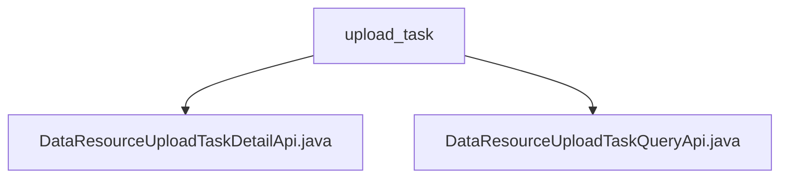

# Basic Information

|      |      |
|------|------|
| Name | upload_task |
| Language | .java |
| Code Path | WeFe/board/board-service/src/main/java/com/welab/wefe/board/service/api/data_resource/upload_task |
| Package Name | docs.board.board-service.src.main.java.com.welab.wefe.board.service.api.data_resource.upload_task |
| Brief Description | The `DataResourceUploadTaskDetailApi` class is used to retrieve details of a dataset upload task, inheriting from `AbstractApi` and querying via `dataResourceId`. The `DataResourceUploadTaskQueryApi` class is designed for paginated querying of task lists, inheriting from `AbstractApi` and returning paginated results using the `PagingInput` parameter. Both classes handle queries through the `DataResourceUploadTaskService`. |

# Description

## Overview  
The core responsibility of this module is to provide management interfaces for dataset upload tasks, including task detail queries and paginated list retrieval. The interface specifications adhere to the RESTful style, implementing unified processing logic by inheriting AbstractApi, with the path prefix as `data_resource/upload_task`. Key data structures include `DataResourceUploadTaskMysqlModel` (detail model) and `DataResourceUploadTaskOutputModel` (pagination output model). External dependencies are limited to the `DataResourceUploadTaskService` service layer. For example, the detail interface performs precise queries via `dataResourceId`, while the list interface supports pagination parameters.  

## Main Business Scenarios  
The module supports two typical interaction modes: precise queries (similar to database primary key queries) and conditional pagination (similar to table data filtering). Business processes are proxied through the Service layer, such as detail queries calling `findByDataResourceId` and list queries returning paginated wrapped results. Full functionality covers read scenarios for dataset upload tasks, with API types including GET-class query interfaces. A typical application, such as a task monitoring dashboard, requires simultaneous calls to detail and list interfaces to achieve synchronized data display.

### Package Internal Structure View

This flowchart illustrates the API file structure of the data resource upload task module, which includes two main interface files: DataResourceUploadTaskDetailApi and DataResourceUploadTaskQueryApi, both located under the upload_task directory. This structure clearly reflects the functional division between task query and detail viewing.

# File List

| Name   | Type  | Description |
|-------|------|-------------|
| [DataResourceUploadTaskDetailApi.java](DataResourceUploadTaskDetailApi.md) | file | API class for retrieving dataset upload task details, which queries task information by dataResourceId and returns the results. |
| [DataResourceUploadTaskQueryApi.java](DataResourceUploadTaskQueryApi.md) | file | This is an API class for querying the dataset upload task list, which inherits from AbstractApi. It uses paginated input and output, and calls DataResourceUploadTaskService to process the query request. |

