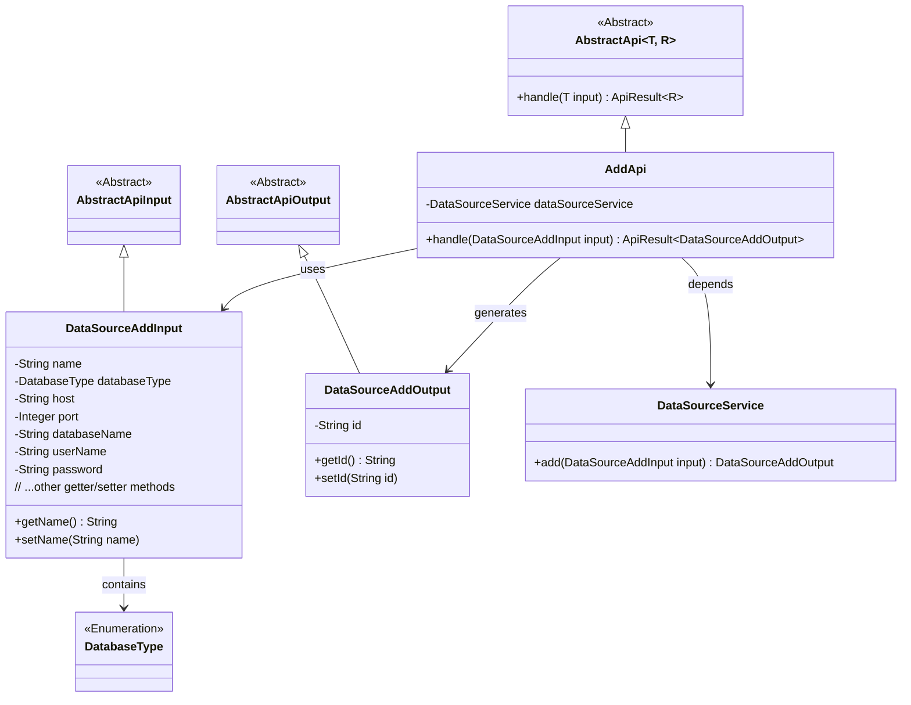
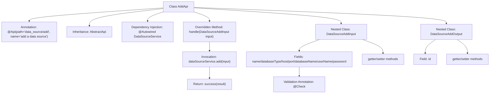

# Basic Information

|      |      |
|------|------|
| Name | AddApi |
| Language | .java |
| Code Path | WeFe/board/board-service/src/main/java/com/welab/wefe/board/service/api/datasource/AddApi.java |
| Package Name | com.welab.wefe.board.service.api.datasource |
| Dependencies | ['com.welab.wefe.board.service.service.DataSourceService', 'com.welab.wefe.common.exception.StatusCodeWithException', 'com.welab.wefe.common.fieldvalidate.annotation.Check', 'com.welab.wefe.common.jdbc.base.DatabaseType', 'com.welab.wefe.common.web.api.base.AbstractApi', 'com.welab.wefe.common.web.api.base.Api', 'com.welab.wefe.common.web.dto.AbstractApiInput', 'com.welab.wefe.common.web.dto.AbstractApiOutput', 'com.welab.wefe.common.web.dto.ApiResult', 'org.springframework.beans.factory.annotation.Autowired'] |
| Brief Description | The AddApi class is used to add data sources, including input parameter validation and output results. The input includes required fields such as name, type, host, and port, while the output returns the data source ID. |

# Description

The code defines a class named `AddApi`, which is used to add a data source. The class inherits from `AbstractApi`, processes the `DataSourceAddInput` input, and returns a `DataSourceAddOutput` output. The input includes fields such as the data source name, database type, host, port, database name, username, and password, all of which undergo non-null validation, with the name length restricted to 4 to 30 characters. The output includes the generated ID field. The input is processed and the result is returned via the `add` method of `DataSourceService`.

# Class Summary

| Name   | Type  | Description |
|-------|------|-------------|
| AddApi | class | The `AddApi` class is used to add data sources, including input parameters such as name, type, host, port, etc., and outputs the returned data source ID. The input parameters have validation rules, such as name length between 4-30 characters, mandatory fields, etc. |

## Class AddApi

|      |      |
|------|------|
| Access Modifier | @Api(path = "data_source/add", name = "add a data source");public |
| Type | class |
| Name | AddApi |
| Description | The `AddApi` class is used to add data sources, including input parameters such as name, type, host, port, etc., and outputs the returned data source ID. The input parameters have validation rules, such as name length between 4-30 characters, mandatory fields, etc. |

### UML Class Diagram

This class diagram illustrates the structure of a data source addition API. The AddApi inherits from the generic abstract class AbstractApi, processes DataSourceAddInput and produces DataSourceAddOutput. The input class contains multiple fields with validation annotations, while the output class includes a generated ID field. AddApi relies on DataSourceService to implement core business logic, following a layered design pattern where both input and output classes extend abstract base classes.

### Internal Method Call Graph

This code demonstrates the implementation of a data source addition API using a layered architecture design. The AddApi class inherits from an abstract template class and implements core processing logic, including nested class definitions for input and output parameters. The flowchart clearly presents class inheritance relationships, dependency injection, method invocation chains, and nested class structures, particularly showcasing validation annotation configurations for input parameters and encapsulation methods for output results. The entire design reflects standard API development patterns, encompassing key aspects such as parameter validation, service invocation, and result encapsulation.

### Field List

| Name  | Type  | Description |
|-------|-------|------|
| dataSourceService | DataSourceService | Using @Autowired to automatically inject a DataSourceService instance. |

### Method List

| Name  | Type  | Description |
|-------|-------|------|
| handle | ApiResult<DataSourceAddOutput> | This method overrides the parent class logic, receives the DataSourceAddInput parameter, invokes dataSourceService.add for processing, and returns the result, encapsulating it as ApiResult upon success. |

