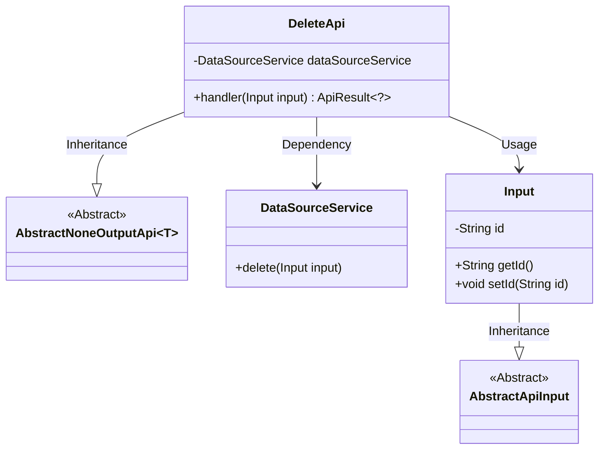

# Basic Information

|      |      |
|------|------|
| Name | DeleteApi |
| Language | .java |
| Code Path | WeFe/board/board-service/src/main/java/com/welab/wefe/board/service/api/datasource/DeleteApi.java |
| Package Name | com.welab.wefe.board.service.api.datasource |
| Dependencies | ['com.welab.wefe.board.service.service.DataSourceService', 'com.welab.wefe.common.exception.StatusCodeWithException', 'com.welab.wefe.common.fieldvalidate.annotation.Check', 'com.welab.wefe.common.web.api.base.AbstractNoneOutputApi', 'com.welab.wefe.common.web.api.base.Api', 'com.welab.wefe.common.web.dto.AbstractApiInput', 'com.welab.wefe.common.web.dto.ApiResult', 'org.springframework.beans.factory.annotation.Autowired'] |
| Brief Description | This is an API class for deleting a data source, which takes the data source ID as input, calls the service layer to delete the data, and returns a success result. |

# Description

This is a Java class named DeleteApi, designed for deleting data sources. The class extends AbstractNoneOutputApi with a generic parameter of the inner class Input. The DataSourceService is injected via the Autowired annotation. The handler method processes input parameters, invokes the delete method of dataSourceService to perform the deletion, and returns an ApiResult upon success. The Input inner class extends AbstractApiInput, containing a mandatory field id to identify the data source to be deleted, validated by the Check annotation. The entire class is annotated with Api, defining the path as "data_source/delete" and the name as "delete a data source".

# Class Summary

| Name   | Type  | Description |
|-------|------|-------------|
| DeleteApi | class | API class for deleting a data source, which accepts the data source ID as a required parameter, invokes the DataSourceService to perform the deletion operation, and returns an empty result upon successful completion. |

## Class DeleteApi

|      |      |
|------|------|
| Access Modifier | @Api(path = "data_source/delete", name = "delete a data source");public |
| Type | class |
| Name | DeleteApi |
| Description | API class for deleting a data source, which accepts the data source ID as a required parameter, invokes the DataSourceService to perform the deletion operation, and returns an empty result upon successful completion. |

### UML Class Diagram

This code demonstrates the implementation of a data source deletion API. The core class DeleteApi inherits from the generic abstract class AbstractNoneOutputApi and relies on DataSourceService to perform deletion operations. Input parameters are encapsulated in the static nested class Input, which inherits from AbstractApiInput and contains a data source ID field. The class diagram clearly presents the inheritance and dependency relationships, reflecting principles of layered design and separation of responsibilities.

### Internal Method Call Graph

```mermaid
graph TD
    A["Class DeleteApi"]
    B["Parent Class: AbstractNoneOutputApi<Input>"]
    C["Dependency Injection: DataSourceService"]
    D["Overridden Method: handler(Input input)"]
    E["Inner Class: Input"]
    F["Field: String id"]
    G["Method: String getId()"]
    H["Method: void setId(String id)"]
    I["Validation Annotation: @Check(name='Data source ID', require=true)"]
    J["Business Call: dataSourceService.delete(input)"]
    K["Return Result: success()"]

    A --> B
    A --> C
    A --> D
    A --> E
    E --> F
    E --> G
    E --> H
    E --> I
    D --> J
    D --> K
```

This code demonstrates the implementation of an API deletion feature based on the Spring framework. DeleteApi inherits from an abstract parent class and overrides the handler method, executing the deletion operation via DataSourceService. The inner class Input defines the request parameter id field with validation annotations and provides standard getter/setter methods. The flowchart clearly presents the class inheritance relationship, dependency injection, method call chain, and parameter validation logic, reflecting a typical API layer processing flow.

### Field List

| Name  | Type  | Description |
|-------|-------|------|
| dataSourceService | DataSourceService | Automatically inject the DataSourceService instance. |

### Method List

| Name  | Type  | Description |
|-------|-------|------|
| handler | ApiResult<?> | This is a Java method that overrides the parent class's handler method, invokes the dataSourceService to delete the input data, returns an empty result upon success, and may throw a StatusCodeWithException. |

