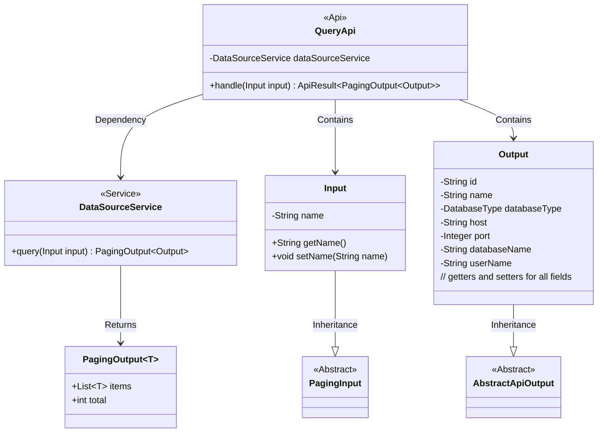

# Basic Information

|      |      |
|------|------|
| Name | QueryApi |
| Language | .java |
| Code Path | WeFe/board/board-service/src/main/java/com/welab/wefe/board/service/api/datasource/QueryApi.java |
| Package Name | com.welab.wefe.board.service.api.datasource |
| Dependencies | ['com.welab.wefe.board.service.dto.base.PagingInput', 'com.welab.wefe.board.service.dto.base.PagingOutput', 'com.welab.wefe.board.service.service.DataSourceService', 'com.welab.wefe.common.exception.StatusCodeWithException', 'com.welab.wefe.common.fieldvalidate.annotation.Check', 'com.welab.wefe.common.jdbc.base.DatabaseType', 'com.welab.wefe.common.web.api.base.AbstractApi', 'com.welab.wefe.common.web.api.base.Api', 'com.welab.wefe.common.web.dto.AbstractApiOutput', 'com.welab.wefe.common.web.dto.ApiResult', 'org.springframework.beans.factory.annotation.Autowired'] |
| Brief Description | API class for paginated querying of data sources, including input parameters (name) and output results (ID, name, database type, host, port, database name, username). Calls DataSourceService to handle query requests. |

# Description

This is an API class named QueryApi, designed for paginated querying of data sources. It inherits from AbstractApi, with Input as its input type and PagingOutput<Output> as its output type. The input parameter Input includes a verifiable data source name field called name and inherits from PagingInput to implement pagination functionality. The output parameter Output contains detailed information about the data source, such as id, name, databaseType, host, port, databaseName, and userName. The API processes query requests through the injected DataSourceService and returns paginated results.

# Class Summary

| Name   | Type  | Description |
|-------|------|-------------|
| QueryApi | class | API class for paginated querying of data sources, including input parameters (name) and output results (ID, name, database type, host, port, database name, username). The query request is processed via DataSourceService. |

## Class QueryApi

|      |      |
|------|------|
| Access Modifier | @Api(path = "data_source/query", name = "query data source by pagination");public |
| Type | class |
| Name | QueryApi |
| Description | API class for paginated querying of data sources, including input parameters (name) and output results (ID, name, database type, host, port, database name, username). The query request is processed via DataSourceService. |

### UML Class Diagram

This code demonstrates a paged query API implementation for data sources. QueryApi inherits from AbstractApi, uses Input as the request parameter type, and PagingOutput<Output> as the response type. Input inherits PagingInput and includes pagination parameters and name filtering conditions, while Output inherits AbstractApiOutput and contains detailed data source information. DataSourceService provides query functionality and returns paginated results. The class diagram clearly illustrates the inheritance, containment, and dependency relationships among these classes.

### Internal Method Call Graph

```mermaid
graph TD
    A["Class QueryApi"]
    B["Annotation: @Api"]
    C["Inheritance: AbstractApi<Input, PagingOutput<Output>>"]
    D["Dependency Injection: DataSourceService"]
    E["Overridden Method: handle(Input input)"]
    F["Inner Class: Input"]
    G["Inner Class: Output"]
    H["Input Property: String name"]
    I["Input Methods: getName/setName"]
    J["Output Properties: id,name,databaseType etc."]
    K["Output Methods: getter/setter"]

    A --> B
    A --> C
    A --> D
    A --> E
    A --> F
    A --> G
    F --> H
    F --> I
    G --> J
    G --> K
    E --> D
```

The flowchart depicts the structure and relationships of the QueryApi class. This API implementation class is annotated with @Api, inherits from the AbstractApi generic class, and includes DataSourceService dependency injection. Its core functionality involves overriding the handle method to invoke dataSourceService.query for paginated queries. The inner class Input extends PagingInput with name property and accessor methods, while Output inherits AbstractApiOutput containing database connection-related properties with corresponding getter/setter methods. The diagram comprehensively illustrates the data flow architecture of API request processing.

### Field List

| Name  | Type  | Description |
|-------|-------|------|
| dataSourceService | DataSourceService | Using @Autowired to automatically inject an instance of DataSourceService. |

### Method List

| Name  | Type  | Description |
|-------|-------|------|
| handle | ApiResult<PagingOutput<Output>> | Rewrite the method to call the data source service for querying input and return paginated results. It returns encapsulated data upon success and throws a status code exception in case of errors. |

