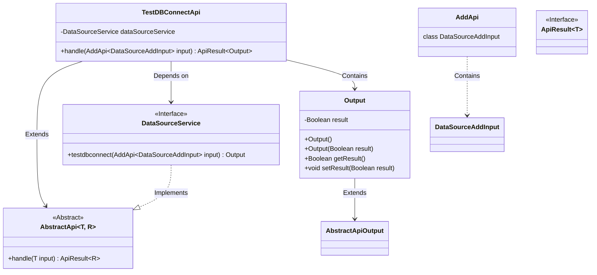
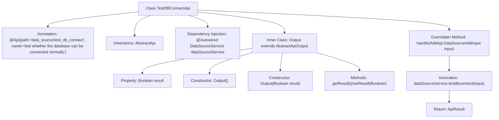

# Basic Information

|      |      |
|------|------|
| Name | TestDBConnectApi |
| Language | .java |
| Code Path | WeFe/board/board-service/src/main/java/com/welab/wefe/board/service/api/datasource/TestDBConnectApi.java |
| Package Name | com.welab.wefe.board.service.api.datasource |
| Dependencies | ['com.welab.wefe.board.service.service.DataSourceService', 'com.welab.wefe.common.exception.StatusCodeWithException', 'com.welab.wefe.common.web.api.base.AbstractApi', 'com.welab.wefe.common.web.api.base.Api', 'com.welab.wefe.common.web.dto.AbstractApiOutput', 'com.welab.wefe.common.web.dto.ApiResult', 'org.springframework.beans.factory.annotation.Autowired'] |
| Brief Description | This is an API class for testing database connections, which accepts data source input and returns connection test results. |

# Description

The code defines an API class named `TestDBConnectApi`, designed to test whether a database connection is functioning properly. It inherits from the `AbstractApi` class, with generic parameters specifying the input type as `AddApi.DataSourceAddInput` and the output type as the inner class `Output`. The API path is set to `"data_source/test_db_connect"`. By injecting the `DataSourceService`, it calls the `testdbconnect` method to perform the connection test and returns an `ApiResult` containing a boolean result.  

The inner class `Output` extends `AbstractApiOutput` and encapsulates a `result` property representing the connection status, along with its getter and setter methods. The entire API processing flow is concise, focusing solely on the database connection testing functionality.

# Class Summary

| Name   | Type  | Description |
|-------|------|-------------|
| TestDBConnectApi | class | This API is used to test database connections, accepting data source inputs and returning connection test results. |

## Class TestDBConnectApi

|      |      |
|------|------|
| Access Modifier | @Api(path = "data_source/test_db_connect", name = "test whether the database can be connected normally");public |
| Type | class |
| Name | TestDBConnectApi |
| Description | This API is used to test database connections, accepting data source inputs and returning connection test results. |

### UML Class Diagram

This code demonstrates the implementation of a test database connection API, where TestDBConnectApi inherits from the generic abstract class AbstractApi and relies on DataSourceService for database connection testing. The Output class encapsulates test results as an inner class, inheriting from AbstractApiOutput. The class diagram clearly illustrates inheritance, dependency, and containment relationships, as well as interface-implementation relationships, reflecting modular design and clear responsibility division.

### Internal Method Call Graph

This code represents an API class designed to test whether a database connection is functioning normally. It inherits from the AbstractApi base class, injects the DataSourceService via @Autowired, and overrides the handle method to invoke dataSourceService.testdbconnect for database connection testing. The inner class Output encapsulates the test result with a Boolean property named result and corresponding getter/setter methods. The workflow starts with an API request, proceeds through service layer invocation, and ultimately returns an ApiResult object containing the test outcome.

### Field List

| Name  | Type  | Description |
|-------|-------|------|
| dataSourceService | DataSourceService | Using @Autowired to automatically inject an instance of DataSourceService. |

### Method List

| Name  | Type  | Description |
|-------|-------|------|
| handle | ApiResult<Output> | This method overrides the parent class logic, invokes the data source service to test the database connection, and returns an ApiResult object containing the test results. |

