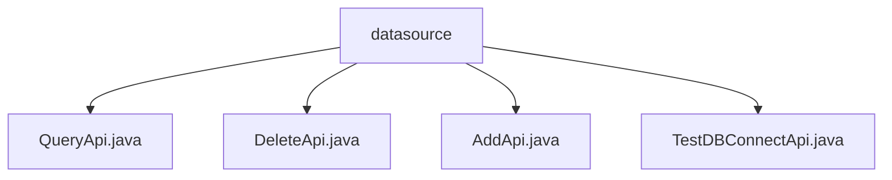

# Basic Information

|      |      |
|------|------|
| Name | datasource |
| Language | .java |
| Code Path | WeFe/board/board-service/src/main/java/com/welab/wefe/board/service/api/datasource |
| Package Name | docs.board.board-service.src.main.java.com.welab.wefe.board.service.api.datasource |
| Brief Description | QueryApi is used for paginated querying of data sources, with inputs including names and pagination parameters, and outputs being data source details. DeleteApi deletes a data source by ID. AddApi adds a data source and validates input fields. TestDBConnectApi tests database connections and returns a boolean result. All inherit from the base API class and process requests via DataSourceService. |

# Description

## Overview  
The core responsibility of this module is to provide CRUD operations for data sources and connection testing functionality, similar to the backend service of a resource management system. The interface specifications uniformly inherit from the AbstractApi base class, with both input and output using strongly typed parameters, such as the PagingOutput<Output> structure returned for paginated queries. Key data structures include DataSourceAddInput (containing connection information like host/port) and PagingInput (pagination parameters). The only external dependency is DataSourceService, which implements business logic through dependency injection. For example, AddApi strictly validates name length (4-30 characters), and TestDBConnectApi returns a boolean connection result.

## Main Business Scenarios  
The complete business process covers the lifecycle management of data sources: creation via AddApi (e.g., storing MySQL connection information in the database), paginated queries via QueryApi (supporting databaseType filtering), and deletion by ID via DeleteApi. The interaction mode is exclusively synchronous HTTP calls, resembling RESTful style. Typical applications include integration with data source configuration interfaces, such as a frontend first calling TestDBConnectApi to verify the connection before submitting AddApi. API types include write operations (Add/Delete) and read operations (Query/Test). Integration examples include admin backends using PagingOutput to render paginated tables.

### Package Internal Structure View

This flowchart illustrates the hierarchical structure of the data source APIs in the WeFe project. The root node "datasource" contains four child nodes, corresponding to the API interface files for querying, deleting, adding, and testing database connections respectively. All Java files are directly subordinate to the datasource directory without deeper nesting, forming a clear flat structure. Each API file represents an independent functional module.

# File List

| Name   | Type  | Description |
|-------|------|-------------|
| [QueryApi.java](QueryApi.md) | file | API class for paginated querying of data sources, including input parameters (name) and output results (ID, name, database type, host, port, database name, username). Calls DataSourceService to process the query request. |
| [DeleteApi.java](DeleteApi.md) | file | This is an API class for deleting a data source, which takes the data source ID as input, invokes the service layer to delete the data, and returns a successful result. |
| [AddApi.java](AddApi.md) | file | The AddApi class is used to add data sources, including input parameter validation and output results. The input includes required fields such as name, type, host, and port, while the output returns the data source ID. |
| [TestDBConnectApi.java](TestDBConnectApi.md) | file | This is an API class for testing database connections, which accepts data source input and returns connection test results. |

