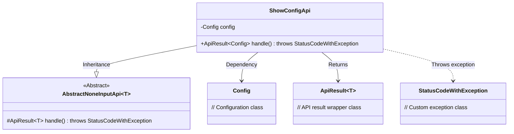
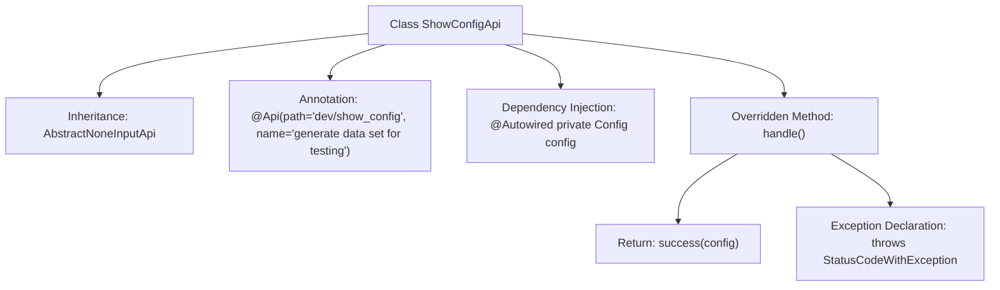

# Basic Information

|      |      |
|------|------|
| Name | ShowConfigApi |
| Language | .java |
| Code Path | WeFe/board/board-service/src/main/java/com/welab/wefe/board/service/api/dev/ShowConfigApi.java |
| Package Name | com.welab.wefe.board.service.api.dev |
| Dependencies | ['com.welab.wefe.board.service.constant.Config', 'com.welab.wefe.common.exception.StatusCodeWithException', 'com.welab.wefe.common.web.api.base.AbstractNoneInputApi', 'com.welab.wefe.common.web.api.base.Api', 'com.welab.wefe.common.web.dto.ApiResult', 'org.springframework.beans.factory.annotation.Autowired'] |
| Brief Description | This is an API class named ShowConfigApi, with the path dev/show_config, used to generate test datasets. It inherits from AbstractNoneInputApi and returns a Config object. The handle method retrieves the configuration and returns a successful result. |

# Description

This is a Java class named ShowConfigApi, used for generating test datasets. It inherits from the AbstractNoneInputApi class with a generic type of Config. The class is annotated with the Api annotation, with the path "dev/show_config" and the name "generate data set for testing". The class automatically injects a Config object via Autowired. It overrides the handle method, directly returning a successful result containing the config object. This class does not accept input parameters and may throw a StatusCodeWithException.

# Class Summary

| Name   | Type  | Description |
|-------|------|-------------|
| ShowConfigApi | class | This is an API class named ShowConfigApi, with the path dev/show_config, used to generate test datasets. It inherits from AbstractNoneInputApi and returns Config configuration information. |

## Class ShowConfigApi

|      |      |
|------|------|
| Access Modifier | @Api(path = "dev/show_config", name = "generate data set for testing");public |
| Type | class |
| Name | ShowConfigApi |
| Description | This is an API class named ShowConfigApi, with the path dev/show_config, used to generate test datasets. It inherits from AbstractNoneInputApi and returns Config configuration information. |

### UML Class Diagram

This code demonstrates a Spring framework-based API implementation class ShowConfigApi, which inherits from the generic abstract class AbstractNoneInputApi and is used to return system configuration information. The class diagram clearly illustrates the inheritance relationship (ShowConfigApi→AbstractNoneInputApi), dependency injection (Config member variable), return type (ApiResult), and exception handling (StatusCodeWithException). The API processes requests through the handle() method, returning a successful result containing a Config object, typically applied in test data generation scenarios.

### Internal Method Call Graph

This code demonstrates a Spring-style API class ShowConfigApi, which inherits from the generic base class AbstractNoneInputApi. The interface path and description are defined via the @Api annotation. The core functionality involves automatically injecting a Config configuration object through @Autowired and directly returning this configuration in the overridden handle() method. The flowchart clearly presents the class inheritance relationship, annotation declarations, dependency injection, and the logical chain of method implementation, reflecting a typical Spring Boot controller implementation pattern.

### Field List

| Name  | Type  | Description |
|-------|-------|------|
| config | Config | Use @Autowired to automatically inject an instance of the Config configuration class. |

### Method List

| Name  | Type  | Description |
|-------|-------|------|
| handle | ApiResult<Config> | Rewrite the method to return the configuration result, returning the configuration object upon success. |

