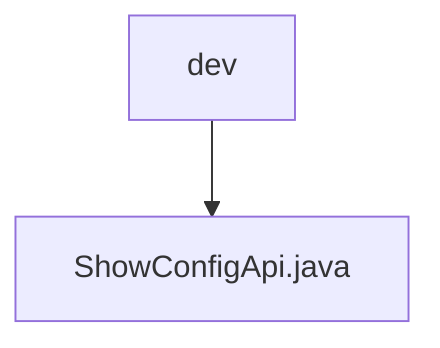

# Basic Information

|      |      |
|------|------|
| Name | dev |
| Language | .java |
| Code Path | WeFe/board/board-service/src/main/java/com/welab/wefe/board/service/api/dev |
| Package Name | docs.board.board-service.src.main.java.com.welab.wefe.board.service.api.dev |
| Brief Description | This is an API class named ShowConfigApi, with the path dev/show_config, used to generate test datasets. It inherits from AbstractNoneInputApi and returns a Config object. The handle method retrieves the configuration and returns a successful result. |

# Description

This is a Java class named ShowConfigApi, used for generating test datasets. It extends the AbstractNoneInputApi class with a generic type of Config. The class is annotated with @Api, with the path set to "dev/show_config" and the name as "generate data set for testing". Inside the class, a Config object is autowired via @Autowired. The handle method is overridden to directly return a successful result containing the config object. This class does not accept input parameters and may throw a StatusCodeWithException.

### Package Internal Structure View

This flowchart illustrates the API development directory structure of the board-service module in the WeFe project. The root node "dev" represents the API directory in the development environment, and its child node "ShowConfigApi.java" is the specific API implementation file under this directory. This concise hierarchical relationship clearly presents the single-file structure of the development API, adhering to the convention in microservice architecture where API files are typically categorized by functionality or environment.

# File List

| Name   | Type  | Description |
|-------|------|-------------|
| [ShowConfigApi.java](ShowConfigApi.md) | file | This is an API class named ShowConfigApi, with the path dev/show_config, used to generate test datasets. It inherits from AbstractNoneInputApi and returns a Config object. The handle method retrieves the configuration and returns a successful result. |

