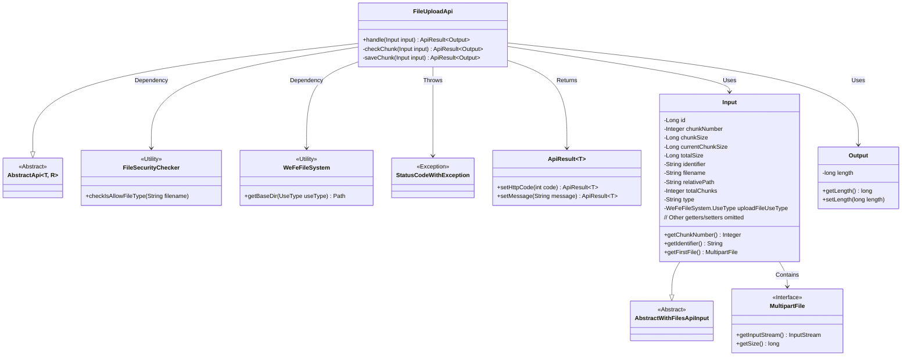

# Basic Information

|      |      |
|------|------|
| Name | FileUploadApi |
| Language | .java |
| Code Path | WeFe/board/board-service/src/main/java/com/welab/wefe/board/service/api/file/FileUploadApi.java |
| Package Name | com.welab.wefe.board.service.api.file |
| Dependencies | ['com.welab.wefe.board.service.api.file.security.FileSecurityChecker', 'com.welab.wefe.board.service.base.file_system.WeFeFileSystem', 'com.welab.wefe.common.StatusCode', 'com.welab.wefe.common.exception.StatusCodeWithException', 'com.welab.wefe.common.fieldvalidate.annotation.Check', 'com.welab.wefe.common.util.FileUtil', 'com.welab.wefe.common.web.api.base.AbstractApi', 'com.welab.wefe.common.web.api.base.Api', 'com.welab.wefe.common.web.dto.AbstractWithFilesApiInput', 'com.welab.wefe.common.web.dto.ApiResult', 'org.apache.commons.io.FileUtils', 'org.springframework.web.multipart.MultipartFile', 'java.io.File', 'java.io.IOException', 'java.io.InputStream', 'java.nio.file.Path'] |
| Brief Description | File upload API, supporting chunk verification and saving, validating file types, handling POST and GET requests, and returning chunk status or save results. |

# Description

FileUploadApi is an API class for handling file uploads, inherited from AbstractApi. It supports both POST and GET methods: POST is used to save file chunks, while GET is used to check whether a chunk exists. Input parameters include file identifiers, chunk information, file types, etc. During the processing flow, it first verifies if the file type is valid, then executes the corresponding operation based on the request method. When saving a chunk, it creates a directory and writes the chunk to a file; when checking a chunk, it verifies the existence of the chunk file. The output includes file length information. Exception handling involves returning error status codes and messages.

# Class Summary

| Name   | Type  | Description |
|-------|------|-------------|
| FileUploadApi | class | File upload API class supporting chunk verification and saving. Checks file types, verifies chunk existence via GET, and saves chunks via POST. Input includes chunk information, file identifiers, etc.; output returns file length. |

## Class FileUploadApi

|      |      |
|------|------|
| Access Modifier | @Api(path = "file/upload", name = "upload file");public |
| Type | class |
| Name | FileUploadApi |
| Description | File upload API class supporting chunk verification and saving. Checks file types, verifies chunk existence via GET, and saves chunks via POST. Input includes chunk information, file identifiers, etc.; output returns file length. |

### UML Class Diagram

This code demonstrates the implementation of a file upload API. The core class FileUploadApi inherits from AbstractApi and handles chunk verification and saving for file uploads. The Input class encapsulates upload parameters, while the Output class returns file length. The workflow includes file type checking, chunk existence validation, and chunk saving, relying on file system utilities and security check tools. Exception handling and result encapsulation are achieved through StatusCodeWithException and ApiResult, reflecting a complete chunked upload processing flow.

### Internal Method Call Graph

```mermaid
graph TD
    A["FileUploadApi Class"]
    B["Inheritance: AbstractApi<Input, Output>"]
    C["Method: handle(Input input)"]
    D["Method: checkChunk(Input input)"]
    E["Method: saveChunk(Input input)"]
    F["Nested Class: Output"]
    G["Nested Class: Input"]
    H["File Type Check: FileSecurityChecker.checkIsAllowFileType"]
    I["Branch Condition: input.method"]
    J["POST Request Handling: saveChunk"]
    K["GET Request Handling: checkChunk"]
    L["Exception Handling: StatusCodeWithException"]
    M["Chunk Validation Logic"]
    N["Chunk Storage Logic"]

    A --> B
    A --> C
    A --> D
    A --> E
    A --> F
    A --> G
    C --> H
    C --> I
    I -->|"POST"| J
    I -->|"GET"| K
    I -->|default| L
    D --> M
    E --> N
```

This flowchart illustrates the core processing flow of a file upload API. It first verifies file type validity, then routes requests to either chunk storage or validation logic based on HTTP methods (POST/GET). POST method creates directories and saves file chunks, while GET method checks chunk existence. It includes complete exception handling paths and nested class relationships, demonstrating the end-to-end control flow from request processing to result return.

### Field List

| Name  | Type  | Description |
|-------|-------|------|

### Method List

| Name  | Type  | Description |
|-------|-------|------|
| checkChunk | ApiResult<Output> | Check if the file fragment exists. If the fragment number is empty, set it to 0. After generating the file path, check its existence. Return a success message if it exists, or a 299 status code with a prompt if it does not. |
| handle | ApiResult<Output> | Handle file upload requests, check file types, support POST for saving chunks and GET for checking chunks, return status code 599 for exceptions. |
| saveChunk | ApiResult<Output> | The method `saveChunk` takes an `Input` parameter to handle chunked file uploads. It checks the chunk sequence number, creates the target directory, and writes the input stream to the chunk file. Upon success, it returns the file size; if an exception occurs, it logs the error and throws a system exception. |

