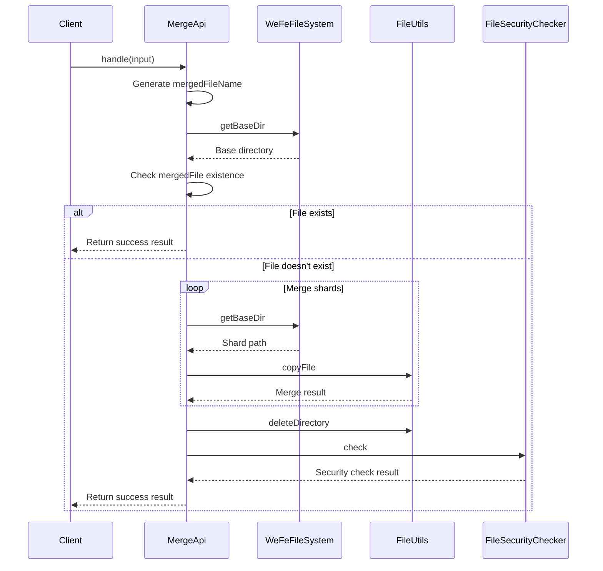

# Basic Information

|      |      |
|------|------|
| Name | MergeApi |
| Language | .java |
| Code Path | WeFe/board/board-service/src/main/java/com/welab/wefe/board/service/api/file/MergeApi.java |
| Package Name | com.welab.wefe.board.service.api.file |
| Dependencies | ['com.welab.wefe.board.service.api.file.security.FileSecurityChecker', 'com.welab.wefe.board.service.base.file_system.WeFeFileSystem', 'com.welab.wefe.common.StatusCode', 'com.welab.wefe.common.exception.StatusCodeWithException', 'com.welab.wefe.common.fieldvalidate.annotation.Check', 'com.welab.wefe.common.web.api.base.AbstractApi', 'com.welab.wefe.common.web.api.base.Api', 'com.welab.wefe.common.web.dto.AbstractApiInput', 'com.welab.wefe.common.web.dto.ApiResult', 'org.apache.commons.io.FileUtils', 'java.io.File', 'java.io.FileOutputStream', 'java.io.IOException', 'java.util.UUID'] |
| Brief Description | This API is used to merge uploaded file chunks, generate a unique filename, delete the chunks after merging, and check file security. The input includes the filename, unique identifier, and purpose, while the output is the merged filename. |

# Description

The code defines a file merging API class named `MergeApi`, which inherits from `AbstractApi` and is used to handle the merging of uploaded file chunks. The input class `Input` includes the filename, unique identifier, and file usage type; the output class `Output` contains the merged filename. The main logic is as follows: locate the chunk file directory based on input parameters, generate a random merged filename, sequentially merge chunk files into the target file, delete the chunk directory upon completion, and perform file security checks. If the merged file already exists, it directly returns success. In case of exceptions, it throws a system error status code.

# Class Summary

| Name   | Type  | Description |
|-------|------|-------------|
| MergeApi | class | This API is used to merge uploaded file chunks, generate a unique filename, check security after merging the chunks, and return the result. |


## Class MergeApi

|      |      |
|------|------|
| Access Modifier | @Api(path = "file/merge", name = "Merge the chunks after the file is uploaded");public |
| Type | class |
| Name | MergeApi |
| Description | This API is used to merge uploaded file chunks, generate a unique filename, check security after merging the chunks, and return the result. |


### UML Class Diagram

```mermaid
classDiagram
    class MergeApi {
        <<Api>> 
        +handle(Input input) ApiResult~Output~
    }
    
    class AbstractApi~T, R~ {
        <<Abstract>> 
        #handle(T input) ApiResult~R~
    }
    
    class ApiResult~T~ {
        <<Generic>> 
    }
    
    class WeFeFileSystem {
        <<Utility>> 
        +getBaseDir(UseType useType) Path
    }
    
    class UseType {
        <<Enum>> 
    }
    
    class FileSecurityChecker {
        <<Utility>> 
        +check(File file) void
    }
    
    class StatusCodeWithException {
        <<Exception>> 
    }
    
    class MergeApi$Output {
        -String filename
        +Output(String filename)
        +getFilename() String
        +setFilename(String filename) void
    }
    
    class MergeApi$Input {
        -String filename
        -String uniqueIdentifier
        -WeFeFileSystem.UseType uploadFileUseType
        +getFilename() String
        +setFilename(String filename) void
        +getUniqueIdentifier() String
        +setUniqueIdentifier(String uniqueIdentifier) void
        +getUploadFileUseType() WeFeFileSystem.UseType
        +setUploadFileUseType(WeFeFileSystem.UseType uploadFileUseType) void
    }
    
    class AbstractApiInput {
        <<Abstract>> 
    }
    
    MergeApi --|> AbstractApi : Extends
    MergeApi$Input --|> AbstractApiInput : Extends
    MergeApi --> MergeApi$Input : Uses
    MergeApi --> MergeApi$Output : Uses
    MergeApi --> WeFeFileSystem : Depends
    MergeApi --> FileSecurityChecker : Depends
    MergeApi ..> StatusCodeWithException : Throws
    MergeApi$Input --> WeFeFileSystem.UseType : Contains
```

This code implements a file chunk merging API service. MergeApi inherits from AbstractApi and handles file chunk merging requests, containing two static inner classes Input and Output. It retrieves file storage paths via WeFeFileSystem, performs security checks after merging chunk files, and utilizes FileUtils for file operations. The class diagram illustrates core class relationships including inheritance, dependency, and containment, reflecting the business flow of file merging and exception handling mechanisms.


### Internal Method Call Graph

```mermaid
graph TD
    A["MergeApi Class"]
    B["Inheritance: AbstractApi<Input, Output>"]
    C["Inner Class: Output"]
    D["Inner Class: Input"]
    E["Method: handle(Input input)"]
    F["Generate mergedFileName"]
    G["Get shard directory dir"]
    H["Get shard file list parts"]
    I["Create target file mergedFile"]
    J["Check mergedFile existence"]
    K["Loop to merge shards"]
    L["Delete shard directory"]
    M["File security check"]
    N["Return success result"]

    A --> B
    A --> C
    A --> D
    A --> E
    E --> F
    E --> G
    E --> H
    E --> I
    E --> J
    J -->|Exists| N
    J -->|Not exists| K
    K --> L
    L --> M
    M --> N
```





This code implements a file shard merging API, with main functionalities including: generating a unique merged filename, obtaining the shard directory, checking target file existence, iteratively merging shard files, deleting temporary shard directories, and performing file security checks. The flowchart illustrates the class structure and core processing logic, while the sequence diagram details the complete interaction process from client invocation to final response. The code handles edge cases like file existence checks and shard merging exceptions, ensuring file security through safety checks.

### Field List

| Name  | Type  | Description |
|-------|-------|------|

### Method List

| Name  | Type  | Description |
|-------|-------|------|
| handle | ApiResult<Output> | This method handles file merging, generates unique filenames, checks security after merging fragmented files, and returns results or exceptions. |


