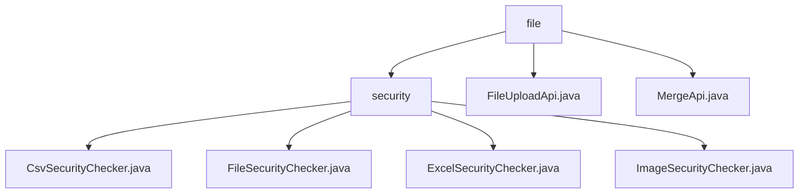

# Basic Information

|      |      |
|------|------|
| Name | file |
| Language | .java |
| Code Path | WeFe/board/board-service/src/main/java/com/welab/wefe/board/service/api/file |
| Package Name | docs.board.board-service.src.main.java.com.welab.wefe.board.service.api.file |
| Brief Description | This module provides multi-format file security checks, supporting 10 types including CSV/Excel/images, following a process of format validation first and then content scanning. It includes file upload chunking and merging functionalities, involving security checks, exception handling, and directory operations. Key classes include FileUploadApi and MergeApi. |

# Description

## Overview  
The core responsibility of this module is to achieve integrated processing of file uploads, chunk merging, and multi-format security checks, resembling a file processing pipeline. The interface specifications include POST/GET chunk operations for FileUploadApi, merge logic for MergeApi, and the doCheck inspection method of FileSecurityChecker. Key data structures involve chunk directory management, random merge filename generators, and various file parsers (e.g., CsvParser). External dependencies include Apache POI, OpenCSV, and Java Image IO libraries. For example, merged Excel files trigger worksheet traversal checks, while image chunks require validation through redrawn buffers.  

## Primary Business Scenarios  
The module supports the complete workflow of chunked uploads, merging, and security checks for 10 file types, adopting a "chunk processing-merging-format validation-content scanning" chained logic. The interaction mode resembles a distributed file gateway, with automatic chunk cleanup and process blocking upon failure. Typical applications include chunked transmission and security scanning for large user-uploaded files, such as post-merge row-by-row keyword detection in Excel or redraw-based purification for image chunks. API integration covers file type validation, chunk status queries, and merge operations, with unified exception handling returning standardized error codes.

### Package Internal Structure View

This flowchart illustrates the hierarchical structure of the file service API. The root node "file" contains two direct child nodes: the security check directory "security" and two API files. Under the security directory, there are four specific security checker implementation classes, designed for handling security checks on CSV files, generic files, Excel files, and images respectively. This structure clearly reflects the modular design of the file upload and security check functionality.

# File List

| Name   | Type  | Description |
|-------|------|-------------|
| [FileUploadApi.java](FileUploadApi.md) | file | File upload API, supporting chunk verification and storage, validating file types, handling POST and GET requests, and returning chunk status or storage results. |
| [MergeApi.java](MergeApi.md) | file | This API is used to merge uploaded file chunks, generate a unique filename, delete the chunks after merging, and check the file's security. The input includes the filename, unique identifier, and purpose, while the output is the merged filename. |
| [security](security/_module.md) | package | The CsvSecurityChecker examines the security of CSV file contents by scanning for keywords line by line. The FileSecurityChecker serves as an abstract base class, defining permitted file types and inspection procedures. The ExcelSecurityChecker verifies the content of Excel files, validating worksheet data. The ImageSecurityChecker checks image formats and removes potentially malicious content. |

