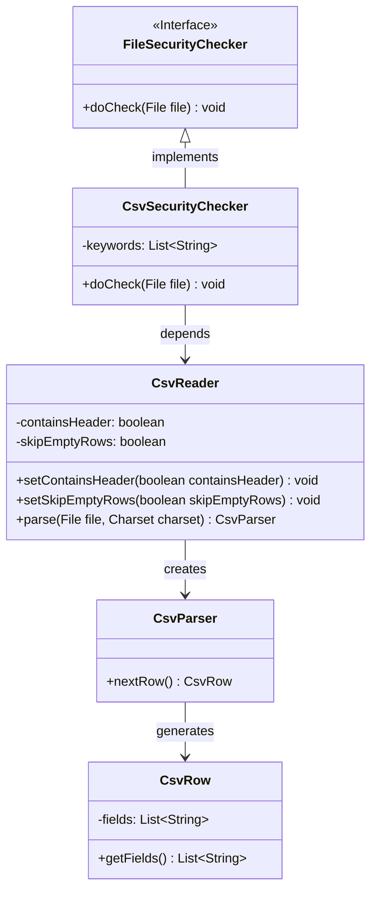
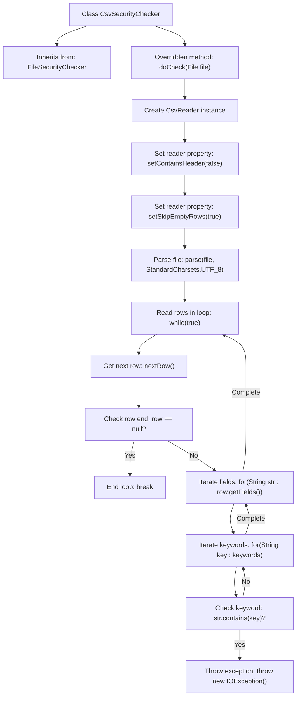

# Basic Information

|      |      |
|------|------|
| Name | CsvSecurityChecker |
| Language | .java |
| Code Path | WeFe/board/board-service/src/main/java/com/welab/wefe/board/service/api/file/security/CsvSecurityChecker.java |
| Package Name | com.welab.wefe.board.service.api.file.security |
| Dependencies | ['de.siegmar.fastcsv.reader.CsvParser', 'de.siegmar.fastcsv.reader.CsvReader', 'de.siegmar.fastcsv.reader.CsvRow', 'java.io.File', 'java.io.IOException', 'java.nio.charset.StandardCharsets'] |
| Brief Description | The CsvSecurityChecker class checks the content of CSV files and throws an exception if any keywords from the keywords list are detected. |

# Description

The `CsvSecurityChecker` class inherits from `FileSecurityChecker` and is used to check the security of CSV files. It overrides the `doCheck` method, which takes a file parameter and may throw an `IOException`. Inside the method, a `CsvReader` instance is created with settings to exclude headers and skip empty lines. The file is parsed as a `CsvParser` object using UTF-8 encoding. Through a loop, the CSV data is read line by line, and each field in every row is checked for the presence of predefined keywords. If a keyword is found, an exception is thrown, indicating that the file contains unsafe characters. The method concludes after processing all rows.

# Class Summary

| Name   | Type  | Description |
|-------|------|-------------|
| CsvSecurityChecker | class | The CsvSecurityChecker examines the contents of a CSV file and raises an error if any keywords are detected. |

## Class CsvSecurityChecker

|      |      |
|------|------|
| Access Modifier | public |
| Type | class |
| Name | CsvSecurityChecker |
| Description | The CsvSecurityChecker examines the contents of a CSV file and raises an error if any keywords are detected. |

### UML Class Diagram

This class diagram illustrates the structure of a CSV file security checker. The CsvSecurityChecker implements the FileSecurityChecker interface, utilizes CsvReader to parse files and generate CsvParser, then iterates through CsvRow objects to check each field for sensitive keywords. The workflow involves 5 core classes, forming a complete processing chain from file reading to security validation. CsvReader handles parsing configurations, CsvParser processes data row by row, and CsvRow provides field-level access.

### Internal Method Call Graph

This code demonstrates the implementation flow of a CSV file security checker. The checker inherits from a base file checker, reads CSV file content and scans each field line by line to check for predefined keywords. When sensitive words are detected, it immediately throws an exception to terminate the check; otherwise, it continues scanning until the end of the file. The complete process shows the entire security check procedure from file parsing, row iteration to keyword matching.

### Field List

| Name  | Type  | Description |
|-------|-------|------|

### Method List

| Name  | Type  | Description |
|-------|-------|------|
| doCheck | void | This method checks whether the CSV file contains unsafe characters. It reads the file without processing headers or empty lines, inspecting each field row by row, and throws an exception if any keywords are detected. |

