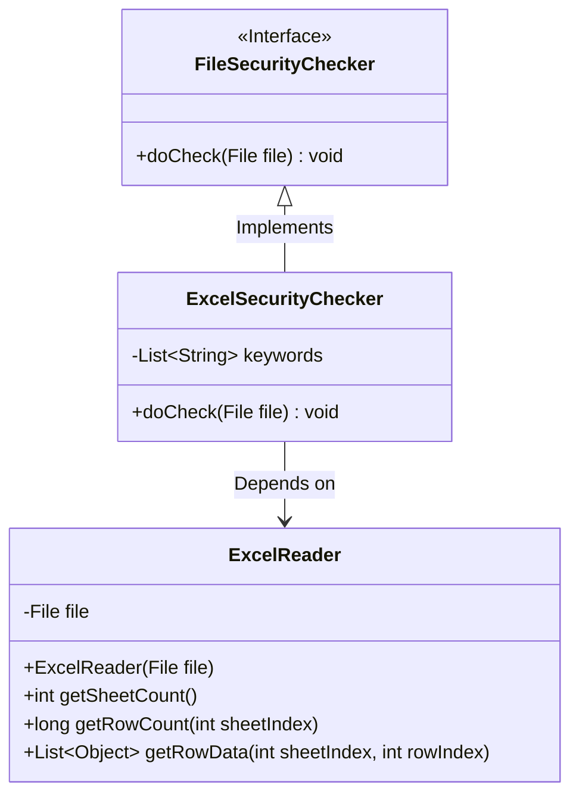
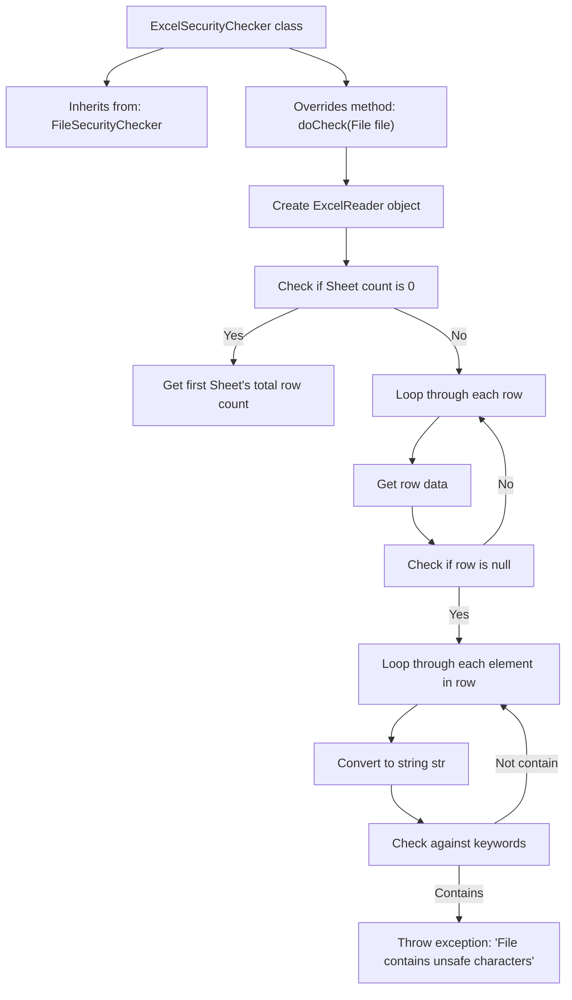

# Basic Information

|      |      |
|------|------|
| Name | ExcelSecurityChecker |
| Language | .java |
| Code Path | WeFe/board/board-service/src/main/java/com/welab/wefe/board/service/api/file/security/ExcelSecurityChecker.java |
| Package Name | com.welab.wefe.board.service.api.file.security |
| Dependencies | ['com.welab.wefe.common.io.excel.ExcelReader', 'java.io.File', 'java.io.IOException', 'java.util.List'] |
| Brief Description | Excel Security Check Class, inherits from File Security Checker, checks whether an Excel file contains unsafe keywords, and throws an exception if found. |

# Description

The `ExcelSecurityChecker` class inherits from `FileSecurityChecker` and is used to examine the security of Excel files. It reads the file via `ExcelReader`, first checking the number of worksheets—if empty, it returns immediately. It then reads all row data from the first worksheet and inspects each cell's content row by row. If any cell content contains a string from a predefined keyword list, it throws an `IO` exception indicating unsafe characters. The keyword check employs a string containment matching approach.

# Class Summary

| Name   | Type  | Description |
|-------|------|-------------|
| ExcelSecurityChecker | class | Excel security check class, inherits from file inspector. Reads Excel files, checks each row of data for the presence of keywords, and throws an exception to alert about unsafe characters if found. |

## Class ExcelSecurityChecker

|      |      |
|------|------|
| Access Modifier | public |
| Type | class |
| Name | ExcelSecurityChecker |
| Description | Excel security check class, inherits from file inspector. Reads Excel files, checks each row of data for the presence of keywords, and throws an exception to alert about unsafe characters if found. |

### UML Class Diagram

Class Diagram Description:
This diagram illustrates the class structure of an Excel security checker, where ExcelSecurityChecker implements the FileSecurityChecker interface and relies on ExcelReader for Excel file operations. The primary functionality involves checking whether an Excel file contains sensitive keywords, featuring three core classes: the FileSecurityChecker interface defines the check method, ExcelSecurityChecker implements the specific inspection logic, and ExcelReader provides Excel file reading capabilities. The security check process involves reading worksheets, row data, and matching each item against a keyword list.

### Internal Method Call Graph

This flowchart illustrates the workflow of the ExcelSecurityChecker class, which inherits from FileSecurityChecker and overrides the doCheck method. The process begins with creating an ExcelReader, first checking the Sheet count, then scanning each row of the Excel file. After converting each cell's data to a string, it compares against a predefined keyword list. If any keyword is detected, a security exception is immediately thrown. The entire process implements security checks for Excel file content, effectively identifying and blocking files containing sensitive keywords.

### Field List

| Name  | Type  | Description |
|-------|-------|------|

### Method List

| Name  | Type  | Description |
|-------|-------|------|
| doCheck | void | Check if the Excel file contains unsafe characters, and throw an exception if found. |

