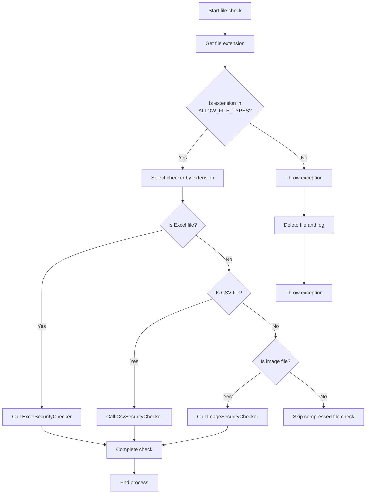
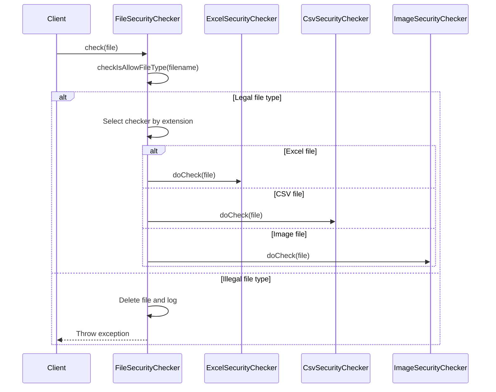
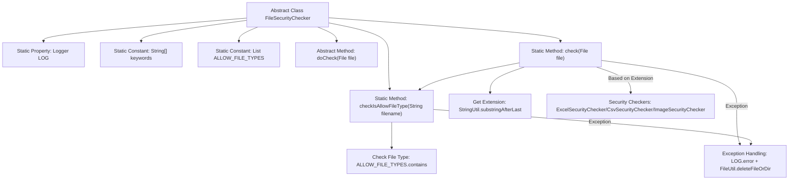

# Basic Information

|      |      |
|------|------|
| Name | FileSecurityChecker |
| Language | .java |
| Code Path | WeFe/board/board-service/src/main/java/com/welab/wefe/board/service/api/file/security/FileSecurityChecker.java |
| Package Name | com.welab.wefe.board.service.api.file.security |
| Dependencies | ['com.welab.wefe.common.StatusCode', 'com.welab.wefe.common.exception.StatusCodeWithException', 'com.welab.wefe.common.util.FileUtil', 'com.welab.wefe.common.util.StringUtil', 'org.slf4j.Logger', 'org.slf4j.LoggerFactory', 'java.io.File', 'java.util.Arrays', 'java.util.List'] |
| Brief Description | The abstract class FileSecurityChecker is used to check file security, supporting formats such as xls and csv. If the check fails, it deletes the file and throws an exception. |

# Description

FileSecurityChecker is an abstract class designed for checking file security. It defines a list of permitted file types, including xls, xlsx, csv, zip, gz, tgz, 7z, jpg, jpeg, and png. The class contains a static method `check` to verify the file type and invoke the corresponding security checker, such as ExcelSecurityChecker, CsvSecurityChecker, and ImageSecurityChecker. The method `checkIsAllowFileType` is used to validate whether the file extension is within the allowed list. If the check fails, the file will be deleted, and an exception will be thrown.

# Class Summary

| Name   | Type  | Description |
|-------|------|-------------|
| FileSecurityChecker | class | The abstract class `FileSecurityChecker` is used to check file security, supporting formats such as xls and csv. If the check fails, it deletes the file and throws an exception. |


## Class FileSecurityChecker

|      |      |
|------|------|
| Access Modifier | public abstract |
| Type | class |
| Name | FileSecurityChecker |
| Description | The abstract class `FileSecurityChecker` is used to check file security, supporting formats such as xls and csv. If the check fails, it deletes the file and throws an exception. |


### UML Class Diagram

```mermaid
classDiagram
    class FileSecurityChecker {
        <<abstract>>
        #static final Logger LOG
        #static final String[] keywords
        -static final List~String~ ALLOW_FILE_TYPES
        #abstract doCheck(File file) void
        +static check(File file) void
        +static checkIsAllowFileType(String filename) void
    }

    class ExcelSecurityChecker {
        +doCheck(File file) void
    }
    // ExcelSecurityChecker implements abstract method of FileSecurityChecker
    FileSecurityChecker <|-- ExcelSecurityChecker

    class CsvSecurityChecker {
        +doCheck(File file) void
    }
    // CsvSecurityChecker implements abstract method of FileSecurityChecker
    FileSecurityChecker <|-- CsvSecurityChecker

    class ImageSecurityChecker {
        +doCheck(File file) void
    }
    // ImageSecurityChecker implements abstract method of FileSecurityChecker
    FileSecurityChecker <|-- ImageSecurityChecker
```





This code implements an abstract file security checking framework, with the core being the FileSecurityChecker abstract class and its three concrete implementations. The class diagram shows the inheritance relationship between parent and child classes, where the parent class defines common constants, file type whitelist, and core checking methods, while child classes handle security checks for Excel, CSV, and image files respectively. The flowchart details the complete logical branching from file type validation to specific checker invocation, while the sequence diagram illustrates the interaction process between the client and checkers. The design adopts the Template Method pattern, implementing differentiated checks for different file types through the abstract doCheck method, while uniformly handling exceptions and logging.


### Internal Method Call Graph



This flowchart illustrates the core logic of the file security checker. The abstract class contains static configurations and two core methods: check() executes the main process (including extension extraction, type validation, and specific security checks), while checkIsAllowFileType() specifically verifies file type legitimacy. The exception handling module uniformly logs errors and deletes problematic files, with concrete security checks implemented by different subclasses through polymorphism. The process strictly follows the "validate before process" principle, performing early interception for empty filenames, extensionless files, and illegal types.

### Field List

| Name  | Type  | Description |
|-------|-------|------|
| LOG = LoggerFactory.getLogger(FileSecurityChecker.class) | Logger | The FileSecurityChecker class defines a protected static log object named LOG. |
| keywords = {"<", ">", "\\"} | String[] | Define a protected static constant string array named keywords, containing three special characters: <, >, and \. |
| ALLOW_FILE_TYPES = Arrays.asList(            "xls", "xlsx", "csv",            "zip", "gz", "tgz", "7z",            "jpg", "jpeg", "png"    ) | List<String> | List of allowed file types: xls, xlsx, csv, zip, gz, tgz, 7z, jpg, jpeg, png. |

### Method List

| Name  | Type  | Description |
|-------|-------|------|
| doCheck | void | Abstract method doCheck, which takes a File parameter and may throw an exception. |
| check | void | Check the security of uploaded files, supporting formats such as xls, xlsx, csv, images, etc. Delete and report an error if invalid. |
| checkIsAllowFileType | void | Check if the file type is allowed: the filename must not be empty, must have an extension, and the extension must be in the allowed list; otherwise, throw an exception. |


