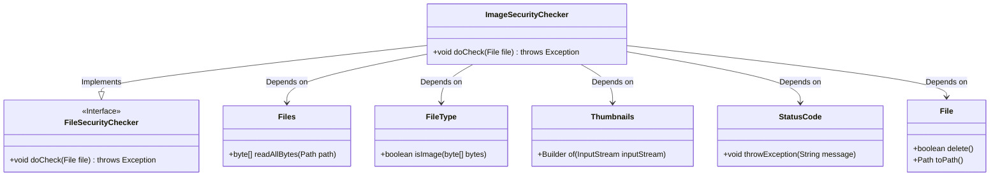
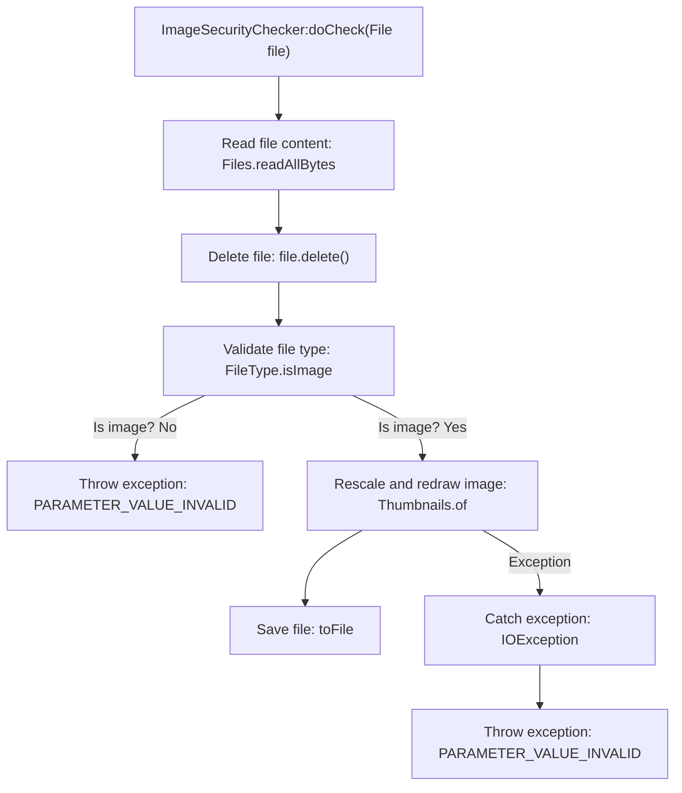

# Basic Information

|      |      |
|------|------|
| Name | ImageSecurityChecker |
| Language | .java |
| Code Path | WeFe/board/board-service/src/main/java/com/welab/wefe/board/service/api/file/security/ImageSecurityChecker.java |
| Package Name | com.welab.wefe.board.service.api.file.security |
| Dependencies | ['com.welab.wefe.common.StatusCode', 'com.welab.wefe.common.util.FileType', 'net.coobird.thumbnailator.Thumbnails', 'java.io.ByteArrayInputStream', 'java.io.File', 'java.io.IOException', 'java.nio.file.Files'] |
| Brief Description | The ImageSecurityChecker class examines image files, verifies their formats, deletes the original files, and redraws them through scaling to remove potential Trojan content, while displaying error messages in case of exceptions. |

# Description

The `ImageSecurityChecker` class inherits from `FileSecurityChecker` and is used to check the security of image files. It first reads the file bytes and deletes the original file, then verifies whether the format is an image; otherwise, it throws an exception. Next, it processes the image by scaling and redrawing to remove potential malicious content. If the processing fails, it prompts that the image is corrupted. The entire process ensures file security and correct format.

# Class Summary

| Name   | Type  | Description |
|-------|------|-------------|
| ImageSecurityChecker | class | The ImageSecurityChecker class inherits from FileSecurityChecker, checks whether the file is in an image format, rescales and redraws the image after deleting the original file to remove potential trojan content, and throws an error message if an exception occurs. |

## Class ImageSecurityChecker

|      |      |
|------|------|
| Access Modifier | public |
| Type | class |
| Name | ImageSecurityChecker |
| Description | The ImageSecurityChecker class inherits from FileSecurityChecker, checks whether the file is in an image format, rescales and redraws the image after deleting the original file to remove potential trojan content, and throws an error message if an exception occurs. |

### UML Class Diagram

Class Diagram Description:
This diagram illustrates that the ImageSecurityChecker class inherits from the FileSecurityChecker interface and implements the core logic for file security checks. By relying on utility classes such as Files, FileType, Thumbnails, StatusCode, and File, it performs operations like reading image files, validating formats, and securely redrawing images. The FileSecurityChecker serves as an abstract interface defining inspection standards, while ImageSecurityChecker specifically implements the specialized security check process for image files. This includes key steps such as reading file content, deleting original files, verifying image formats, and eliminating potential security risks through thumbnail redrawing.

### Internal Method Call Graph

This flowchart describes the execution flow of the doCheck method in the ImageSecurityChecker class. The method first reads the file bytes and deletes the original file, then verifies whether it is a valid image format, throwing an exception if not. For legitimate images, it performs rescaling and redrawing via Thumbnails to purge potential malicious content, throwing a corrupted image exception if processing fails. The entire process implements security checks and content sanitization for image files.

### Field List

| Name  | Type  | Description |
|-------|-------|------|

### Method List

| Name  | Type  | Description |
|-------|-------|------|
| doCheck | void | After reading the file, the method deletes it and checks whether the format is an image. If not, an error is reported. The image is then scaled and redrawn to remove potential malware. If this fails, a prompt indicates the image is corrupted. |

