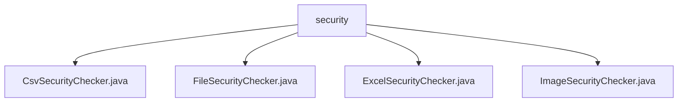

# Basic Information

|      |      |
|------|------|
| Name | security |
| Language | .java |
| Code Path | WeFe/board/board-service/src/main/java/com/welab/wefe/board/service/api/file/security |
| Package Name | docs.board.board-service.src.main.java.com.welab.wefe.board.service.api.file.security |
| Brief Description | The CsvSecurityChecker examines the security of CSV file contents by scanning for keywords line by line. The FileSecurityChecker serves as an abstract base class, defining permitted file types and inspection procedures. The ExcelSecurityChecker verifies the content of Excel files, validating worksheet data. The ImageSecurityChecker checks image formats and removes potentially malicious content. |

# Description

## Overview  
The core responsibility of this module is to provide multi-format file security inspection capabilities by inheriting the abstract class `FileSecurityChecker` to implement security validation for specific file types. The interface specification uniformly adopts the `doCheck` method to receive file parameters and may throw `IOException`. Subclasses must implement this method to complete format-specific checks. Key data structures include `CsvParser`, `ExcelReader`, and image processing buffers. External dependencies involve Apache POI (Excel processing), OpenCSV, and Java Image IO libraries. For example, `CsvSecurityChecker` uses UTF-8 encoding to parse CSV files, while `ExcelSecurityChecker` traverses worksheet cells.  

## Key Business Scenarios  
The module supports inspecting 10 file types, including CSV, Excel, and images, following a "format validation first, content scanning second" workflow. The interaction mode resembles a security filter chain, where failed checks trigger file deletion and process termination. Typical applications include automatic security scanning during user file uploads—for instance, Excel files undergo row-by-row keyword detection, while images undergo redrawing purification. API integration examples include the `checkIsAllowFileType` static method for suffix validation and the `doCheck` core logic implemented by each subclass. Keyword matching employs a string containment strategy, similar to basic content filtering mechanisms.

### Package Internal Structure View

This flowchart illustrates the four file checker classes under the security directory: CSV, File, Excel, and Image Security Checkers. All checker classes are directly subordinate to the security directory with no deeper nesting, presenting a concise and clear structure.

# File List

| Name   | Type  | Description |
|-------|------|-------------|
| [CsvSecurityChecker.java](CsvSecurityChecker.md) | file | The CsvSecurityChecker class checks the content of CSV files and throws an exception if any keywords from the keywords list are detected. |
| [FileSecurityChecker.java](FileSecurityChecker.md) | file | The abstract class FileSecurityChecker is used to check file security, supporting formats such as xls and csv. If the check fails, the file will be deleted and an exception will be thrown. |
| [ExcelSecurityChecker.java](ExcelSecurityChecker.md) | file | Excel Security Check Class, inherits from File Security Checker, checks whether an Excel file contains unsafe keywords, and throws an exception if found. |
| [ImageSecurityChecker.java](ImageSecurityChecker.md) | file | The ImageSecurityChecker class examines image files, verifies their format, deletes the original files, and eliminates potential trojan content by rescaling and redrawing. Error messages are displayed in case of exceptions. |

