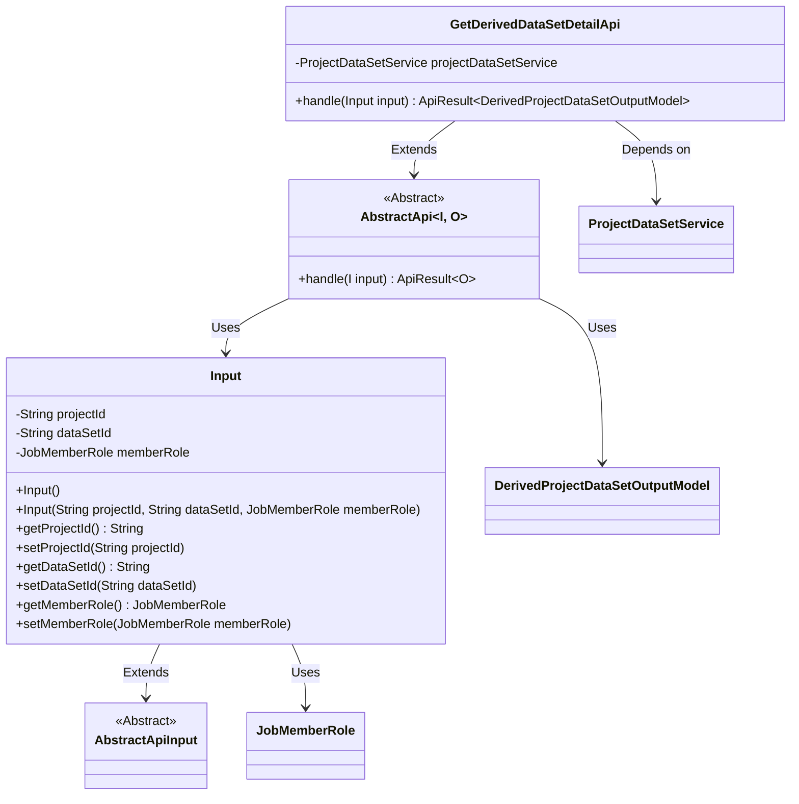

# Basic Information

|      |      |
|------|------|
| Name | GetDerivedDataSetDetailApi |
| Language | .java |
| Code Path | WeFe/board/board-service/src/main/java/com/welab/wefe/board/service/api/gateway/GetDerivedDataSetDetailApi.java |
| Package Name | com.welab.wefe.board.service.api.gateway |
| Dependencies | ['com.welab.wefe.board.service.dto.entity.project.data_set.DerivedProjectDataSetOutputModel', 'com.welab.wefe.board.service.service.ProjectDataSetService', 'com.welab.wefe.common.exception.StatusCodeWithException', 'com.welab.wefe.common.fieldvalidate.annotation.Check', 'com.welab.wefe.common.web.api.base.AbstractApi', 'com.welab.wefe.common.web.api.base.Api', 'com.welab.wefe.common.web.dto.AbstractApiInput', 'com.welab.wefe.common.web.dto.ApiResult', 'com.welab.wefe.common.wefe.enums.JobMemberRole', 'org.springframework.beans.factory.annotation.Autowired'] |
| Brief Description | API to retrieve details of project-derived datasets, requiring project ID, dataset ID, and member role parameters, returns dataset details. |

# Description

The code defines an API class named `GetDerivedDataSetDetailApi`, which is used to retrieve detailed information about derived datasets in a project. The API path is `gateway/derived_data_set/detail` and supports signed access. The input parameter `Input` includes the project ID, dataset ID, and member role ID, all of which are mandatory. The processing logic retrieves the derived dataset details via `ProjectDataSetService` and returns a result of type `DerivedProjectDataSetOutputModel`. The class contains complete getter and setter methods, as well as a parameterized constructor.

# Class Summary

| Name   | Type  | Description |
|-------|------|-------------|
| GetDerivedDataSetDetailApi | class | The API class GetDerivedDataSetDetailApi is used to retrieve the details of derived datasets in a project. It requires project ID, dataset ID, and member role parameters, and returns the derived dataset output model. |

## Class GetDerivedDataSetDetailApi

|      |      |
|------|------|
| Access Modifier | @Api(path = "gateway/derived_data_set/detail", name = "get a list of derived data sets in the project", allowAccessWithSign = true);public |
| Type | class |
| Name | GetDerivedDataSetDetailApi |
| Description | The API class GetDerivedDataSetDetailApi is used to retrieve the details of derived datasets in a project. It requires project ID, dataset ID, and member role parameters, and returns the derived dataset output model. |

### UML Class Diagram

This code illustrates the structure of an API class `GetDerivedDataSetDetailApi`, which inherits from the generic abstract class `AbstractApi` and is designed to handle requests for retrieving derived dataset details. The class diagram depicts core classes and their relationships: the API class depends on the `ProjectDataSetService` service, utilizes the nested `Input` class as a parameter, where `Input` extends `AbstractApiInput` and contains three fields. The abstract class `AbstractApi` defines a template method for request handling, with the output type being `DerivedProjectDataSetOutputModel`. The overall structure demonstrates clear hierarchical relationships and dependencies.

### Internal Method Call Graph

```mermaid
graph TD
    A["Class GetDerivedDataSetDetailApi"]
    B["Annotation: @Api"]
    C["Inheritance: AbstractApi<Input, DerivedProjectDataSetOutputModel>"]
    D["Dependency Injection: @Autowired ProjectDataSetService"]
    E["Overridden Method: handle(Input input)"]
    F["Inner Class: Input"]
    G["Field: String projectId"]
    H["Field: String dataSetId"]
    I["Field: JobMemberRole memberRole"]
    J["Constructor: Input()"]
    K["Constructor: Input(String, String, JobMemberRole)"]
    L["getter/setter methods"]
    M["Invocation: projectDataSetService.getDerivedDataSetDetail"]
    N["Return: success(output)"]

    A --> B
    A --> C
    A --> D
    A --> E
    A --> F
    F --> G
    F --> H
    F --> I
    F --> J
    F --> K
    F --> L
    E --> M
    E --> N
```

This code defines an API class named GetDerivedDataSetDetailApi, which is used to retrieve detailed information of derived datasets in a project. The class inherits from AbstractApi, fetches data through ProjectDataSetService, and defines an inner Input class as parameters. The Input class includes required fields such as project ID, dataset ID, and member role, along with corresponding constructors and getter/setter methods. The handle method processes input parameters and returns a successful result.

### Field List

| Name  | Type  | Description |
|-------|-------|------|
| projectDataSetService | ProjectDataSetService | Automatically inject the ProjectDataSetService instance. |

### Method List

| Name  | Type  | Description |
|-------|-------|------|
| handle | ApiResult<DerivedProjectDataSetOutputModel> | Process the input and return details of the derived item dataset, outputting the result upon success. |

