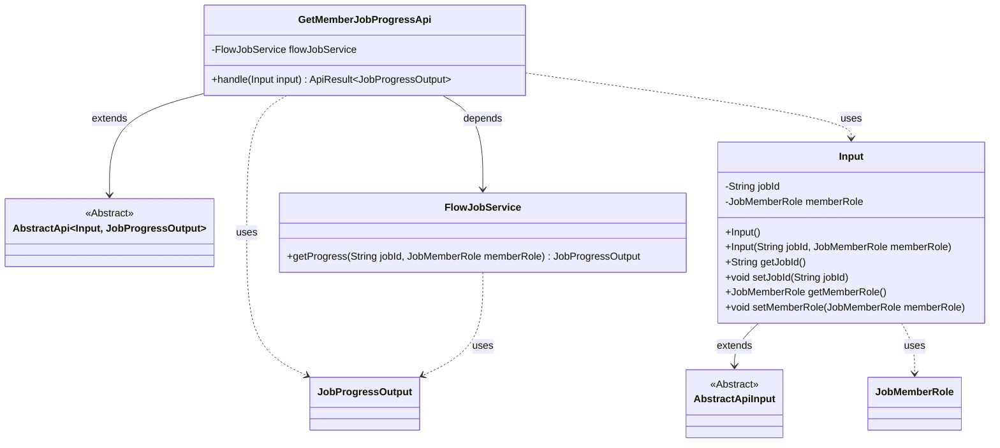
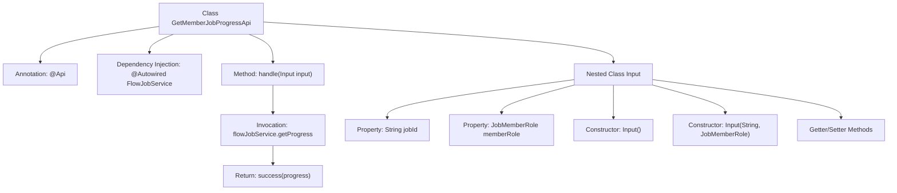

# Basic Information

|      |      |
|------|------|
| Name | GetMemberJobProgressApi |
| Language | .java |
| Code Path | WeFe/board/board-service/src/main/java/com/welab/wefe/board/service/api/gateway/GetMemberJobProgressApi.java |
| Package Name | com.welab.wefe.board.service.api.gateway |
| Dependencies | ['com.welab.wefe.board.service.dto.vo.JobProgressOutput', 'com.welab.wefe.board.service.service.FlowJobService', 'com.welab.wefe.common.exception.StatusCodeWithException', 'com.welab.wefe.common.fieldvalidate.annotation.Check', 'com.welab.wefe.common.web.api.base.AbstractApi', 'com.welab.wefe.common.web.api.base.Api', 'com.welab.wefe.common.web.dto.AbstractApiInput', 'com.welab.wefe.common.web.dto.ApiResult', 'com.welab.wefe.common.wefe.enums.JobMemberRole', 'org.springframework.beans.factory.annotation.Autowired'] |
| Brief Description | Get task progress API, path gateway/get_job_progress, requires task ID and role parameters, returns task progress information. |

# Description

This is an API class named GetMemberJobProgressApi, designed to retrieve task progress. The API endpoint is gateway/get_job_progress and allows signed access. It inherits from AbstractApi, with Input as its inner class for input type and JobProgressOutput for output type. The Input class contains two mandatory fields: jobId (task ID) and memberRole (role). The processing logic retrieves task progress through the injected FlowJobService and returns a successful result. The class provides constructor methods and getter/setter methods for Input.

# Class Summary

| Name   | Type  | Description |
|-------|------|-------------|
| GetMemberJobProgressApi | class | Get task progress API, path gateway/get_job_progress, requires task ID and role parameters, returns task progress information. |

## Class GetMemberJobProgressApi

|      |      |
|------|------|
| Access Modifier | @Api(path = "gateway/get_job_progress", name = "get job progress", allowAccessWithSign = true);public |
| Type | class |
| Name | GetMemberJobProgressApi |
| Description | Get task progress API, path gateway/get_job_progress, requires task ID and role parameters, returns task progress information. |

### UML Class Diagram

Class Diagram Description: The diagram illustrates that the GetMemberJobProgressApi class inherits from the generic AbstractApi class and contains a dependency on FlowJobService. The Input class inherits from AbstractApiInput and includes jobId and memberRole fields along with their accessor methods. FlowJobService provides a getProgress method that returns JobProgressOutput. The classes are organized through inheritance and dependency relationships, forming an API structure for handling job progress queries.

### Internal Method Call Graph

This code defines an API class named GetMemberJobProgressApi, which extends AbstractApi and is used to retrieve task progress. The class configures API paths and permissions via the @Api annotation, utilizing FlowJobService to obtain task progress information. It includes a nested static Input class as input parameters, defining two mandatory fields (jobId and memberRole) along with constructors and Getter/Setter methods. The main handle method invokes the service layer to fetch data and returns a success result.

### Field List

| Name  | Type  | Description |
|-------|-------|------|
| flowJobService | FlowJobService | Automatically inject the FlowJobService service instance. |

### Method List

| Name  | Type  | Description |
|-------|-------|------|
| handle | ApiResult<JobProgressOutput> | Java method override, retrieves task progress and returns results. Input includes task ID and member role, output provides task progress information. |

