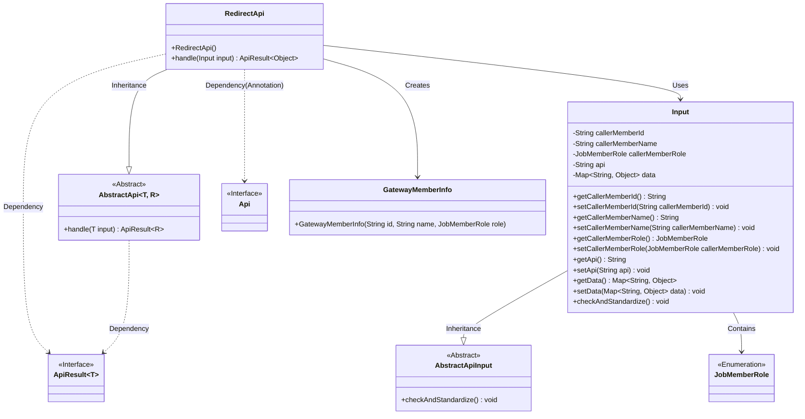

# Basic Information

|      |      |
|------|------|
| Name | RedirectApi |
| Language | .java |
| Code Path | WeFe/board/board-service/src/main/java/com/welab/wefe/board/service/api/gateway/RedirectApi.java |
| Package Name | com.welab.wefe.board.service.api.gateway |
| Dependencies | ['com.welab.wefe.common.exception.StatusCodeWithException', 'com.welab.wefe.common.util.JObject', 'com.welab.wefe.common.web.ApiExecutor', 'com.welab.wefe.common.web.Launcher', 'com.welab.wefe.common.web.api.base.AbstractApi', 'com.welab.wefe.common.web.api.base.Api', 'com.welab.wefe.common.web.dto.AbstractApiInput', 'com.welab.wefe.common.web.dto.ApiResult', 'com.welab.wefe.common.web.dto.GatewayMemberInfo', 'com.welab.wefe.common.wefe.enums.JobMemberRole', 'java.util.Map', 'java.util.TreeMap'] |
| Brief Description | The `RedirectApi` class is used to redirect gateway requests to internal APIs, process input parameters, and complete caller information. After executing the target API, it logs the response. The input class includes caller information and API data. |

# Description

The RedirectApi class is an interface designed to redirect gateway requests to internal APIs, allowing access with signatures. It inherits from AbstractApi, processes input of type Input, and outputs type Object. Its primary functions include: obtaining the target API instance through input parameters, adding caller member information to the input data, executing the target API, and returning the result. Since directly calling the target API skips response logging, this class supplements logging functionality. The Input class contains fields such as caller ID, name, role, target API name, and data mapping, providing validation and standardization methods to ensure non-null data, along with complete getter and setter methods.

# Class Summary

| Name   | Type  | Description |
|-------|------|-------------|
| RedirectApi | class | The RedirectApi class is used to redirect gateway requests to internal APIs, processing input parameters and logging response details. The input includes caller information and target API data. |

## Class RedirectApi

|      |      |
|------|------|
| Access Modifier | @Api(path = "gateway/redirect", name = "Redirect requests from gateway to internal api", allowAccessWithSign = true);public |
| Type | class |
| Name | RedirectApi |
| Description | The RedirectApi class is used to redirect gateway requests to internal APIs, processing input parameters and logging response details. The input includes caller information and target API data. |

### UML Class Diagram

This code demonstrates the implementation structure of a gateway redirection API. The RedirectApi inherits from the generic abstract class AbstractApi, specifically designed to handle request forwarding from the gateway to internal APIs. Core classes include the input parameter processing class Input (inherited from AbstractApiInput), the user information encapsulation class GatewayMemberInfo, and the role enumeration JobMemberRole. It retrieves target API instances through the Spring context, adds caller information before executing requests, and includes response logging functionality. The overall design reflects a clear hierarchical structure and separation of responsibilities. The Input class provides standardized parameter access via getters/setters and incorporates data validation logic.

### Internal Method Call Graph

```mermaid
graph TD
    A["Class RedirectApi"]
    B["Parent Class: AbstractApi<Input, Object>"]
    C["Method: handle(Input input)"]
    D["Get API instance: Launcher.CONTEXT.getBean"]
    E["Construct GatewayMemberInfo"]
    F["Invoke API: api.execute"]
    G["Get annotation: api.getClass().getAnnotation"]
    H["Log response: ApiExecutor.logResponse"]
    I["Return result: return result"]
    J["Nested Class Input"]
    K["Method: checkAndStandardize"]
    L["Validate data: super.checkAndStandardize"]
    M["Initialize data: new TreeMap"]
    N["Getter/Setter methods"]

    A --> B
    A --> C
    C --> D
    C --> E
    C --> F
    C --> G
    G --> H
    C --> I
    A --> J
    J --> K
    K --> L
    K --> M
    J --> N
```

Flowchart description: This flowchart illustrates the core structure and processing flow of the RedirectApi class. The class inherits from AbstractApi, with its primary method being handle(). This method first retrieves the target API instance via Spring context, then constructs caller information and executes the target API, finally supplementing response logs. The nested Input class handles standardized validation of request parameters, including data initialization and standard getter/setter methods. The entire flow implements transparent forwarding of gateway requests to internal APIs with complete logging functionality.

### Field List

| Name  | Type  | Description |
|-------|-------|------|

### Method List

| Name  | Type  | Description |
|-------|-------|------|
| handle | ApiResult<Object> | Handling API Requests: Retrieve the specified API instance, inject caller member information, execute and log response details, then return the result. |

