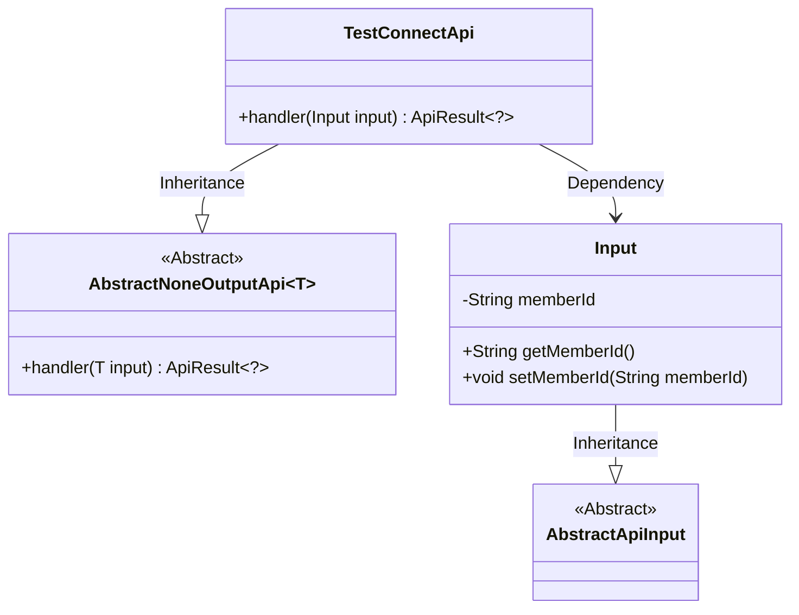

# Basic Information

|      |      |
|------|------|
| Name | TestConnectApi |
| Language | .java |
| Code Path | WeFe/board/board-service/src/main/java/com/welab/wefe/board/service/api/gateway/TestConnectApi.java |
| Package Name | com.welab.wefe.board.service.api.gateway |
| Dependencies | ['com.welab.wefe.common.exception.StatusCodeWithException', 'com.welab.wefe.common.fieldvalidate.annotation.Check', 'com.welab.wefe.common.web.api.base.AbstractNoneOutputApi', 'com.welab.wefe.common.web.api.base.Api', 'com.welab.wefe.common.web.dto.AbstractApiInput', 'com.welab.wefe.common.web.dto.ApiResult'] |
| Brief Description | Gateway connectivity test interface, takes member ID as input with no output, used to check the connection status between the gateway and the board. |

# Description

The code defines an API class named TestConnectApi, which is used to check the connectivity between the gateway and the circuit board. The API path is gateway/test_route_connect, with a clear functional description. This class inherits from AbstractNoneOutputApi, takes an Input class as a parameter containing a memberId field with validation annotations, and features straightforward processing logic that directly returns a successful result. The overall design is concise, focusing solely on the connectivity check functionality.

# Class Summary

| Name   | Type  | Description |
|-------|------|-------------|
| TestConnectApi | class | The interface class TestConnectApi is used to test the connectivity between the gateway and the board. The input parameter is memberId, and there is no output. |

## Class TestConnectApi

|      |      |
|------|------|
| Access Modifier | @Api(path = "gateway/test_route_connect", name = "Check the connectivity interface between the gateway and the board", desc = "Check the connectivity interface between the gateway and the board");public |
| Type | class |
| Name | TestConnectApi |
| Description | The interface class TestConnectApi is used to test the connectivity between the gateway and the board. The input parameter is memberId, and there is no output. |

### UML Class Diagram

This code demonstrates the implementation structure of a gateway connection test API. TestConnectApi inherits from the generic class AbstractNoneOutputApi, specifying Input as the generic parameter, and overrides the handler method. The Input class inherits from AbstractApiInput and contains the memberId field along with its getter/setter methods. The class diagram clearly reflects the inheritance relationships and dependencies between classes, where TestConnectApi depends on the Input class as its input parameter type. The overall design follows the Template Method pattern, standardizing API behavior through an abstract base class.

### Internal Method Call Graph

```mermaid
graph TD
    A["Class TestConnectApi"]
    B["Parent Class: AbstractNoneOutputApi<Input>"]
    C["Annotation: @Api"]
    D["Method: handler(Input input)"]
    E["Nested Class: Input"]
    F["Parent Class: AbstractApiInput"]
    G["Field: String memberId"]
    H["Annotation: @Check"]
    I["Method: getMemberId()"]
    J["Method: setMemberId(String memberId)"]
    K["Return: ApiResult<?>"]

    A --> B
    A --> C
    A --> D
    A --> E
    E --> F
    E --> G
    E --> H
    E --> I
    E --> J
    D --> K
```

This flowchart illustrates the structure and internal relationships of the TestConnectApi class. TestConnectApi inherits from the AbstractNoneOutputApi<Input> class and includes a handler method and a nested Input class. The Input class extends AbstractApiInput, featuring a memberId field with corresponding getter/setter methods, where memberId is annotated with @Check. The handler method processes input parameters and returns an ApiResult object. The entire class is annotated with @Api to define the interface path, name, and description.

### Field List

| Name  | Type  | Description |
|-------|-------|------|

### Method List

| Name  | Type  | Description |
|-------|-------|------|
| handler | ApiResult<?> | Java method overriding, processing input and returning successful results, may throw status code exceptions. |

