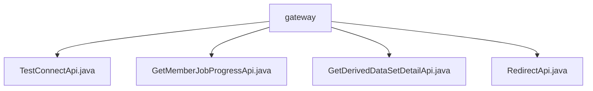

# Basic Information

|      |      |
|------|------|
| Name | gateway |
| Language | .java |
| Code Path | WeFe/board/board-service/src/main/java/com/welab/wefe/board/service/api/gateway |
| Package Name | docs.board.board-service.src.main.java.com.welab.wefe.board.service.api.gateway |
| Brief Description | TestConnectApi checks the connectivity between the gateway and the circuit board. GetMemberJobProgressApi retrieves task progress. GetDerivedDataSetDetailApi obtains derived dataset details. RedirectApi redirects gateway requests to internal APIs and supplements logs. |

# Description

## Overview  
This module is a collection of gateway service APIs, with its core responsibilities including connectivity checks between the gateway and circuit boards, task progress queries, derived dataset detail retrieval, and request redirection. The interface specifications uniformly inherit from the AbstractApi base class, support signed access, and all paths start with `gateway` (e.g., `gateway/test_route_connect`). Key data structures include the Input class with validation annotations (containing fields such as `memberId` and `jobId`) and various Output models (e.g., `JobProgressOutput`). External dependencies involve internal services like `FlowJobService` and `ProjectDataSetService`. For example, `TestConnectApi` directly returns a success result, while `RedirectApi` functions similarly to a proxy pattern with added logging capabilities.  

## Key Business Scenarios  
The module supports four types of interactions: connectivity tests (no output), task progress tracking (e.g., querying via `jobId`), derived dataset queries (requiring project and dataset IDs), and API routing (similar to gateway passthrough). Business processes follow the "parameter validation → service invocation → result encapsulation" pattern. For instance, `GetDerivedDataSetDetailApi` retrieves data via `ProjectDataSetService`. Integration use cases cover status checks (`TestConnectApi`), asynchronous task monitoring (`GetMemberJobProgressApi`), and data services (`GetDerivedDataSetDetailApi`), while `RedirectApi` serves as a unified entry point for request distribution.

### Package Internal Structure View

This flowchart illustrates the API file structure under the gateway directory in the WeFe project. The root node is the gateway folder, which contains four Java interface files: TestConnectApi, GetMemberJobProgressApi, GetDerivedDataSetDetailApi, and RedirectApi. These files belong to the gateway API layer of the board-service module and are used to handle interface requests for different business scenarios.

# File List

| Name   | Type  | Description |
|-------|------|-------------|
| [TestConnectApi.java](TestConnectApi.md) | file | Gateway connectivity test interface, which takes a member ID as input and has no output, is used to check the connection status between the gateway and the board. |
| [GetMemberJobProgressApi.java](GetMemberJobProgressApi.md) | file | Get task progress API, path gateway/get_job_progress, requires task ID and role parameters, returns task progress information. |
| [GetDerivedDataSetDetailApi.java](GetDerivedDataSetDetailApi.md) | file | API for retrieving derivative dataset details of a project requires project ID, dataset ID, and member role parameters, and returns dataset details. |
| [RedirectApi.java](RedirectApi.md) | file | The RedirectApi class is used to redirect gateway requests to internal APIs, process input parameters, and complete caller information. After executing the target API, it logs the response. The input class includes caller information and API data. |

