# Basic Information

|      |      |
|------|------|
| Name | GetGlobalConfigApi |
| Language | .java |
| Code Path | WeFe/board/board-service/src/main/java/com/welab/wefe/board/service/api/global_config/GetGlobalConfigApi.java |
| Package Name | com.welab.wefe.board.service.api.global_config |
| Dependencies | ['com.welab.wefe.board.service.service.globalconfig.GlobalConfigService', 'com.welab.wefe.common.exception.StatusCodeWithException', 'com.welab.wefe.common.fieldvalidate.annotation.Check', 'com.welab.wefe.common.web.api.base.AbstractApi', 'com.welab.wefe.common.web.api.base.Api', 'com.welab.wefe.common.web.dto.AbstractApiInput', 'com.welab.wefe.common.web.dto.ApiResult', 'com.welab.wefe.common.wefe.dto.global_config.base.AbstractConfigModel', 'org.springframework.beans.factory.annotation.Autowired', 'java.util.HashMap', 'java.util.List', 'java.util.Map'] |
| Brief Description | API class for retrieving system-wide configurations, which returns corresponding configuration models based on input group name lists. It uses GlobalConfigService to process requests and returns results in Map format. The input must include a non-empty list of group names. |

# Description

This is a Java class named GetGlobalConfigApi, designed to retrieve system global configurations. It extends the AbstractApi class, accepts input parameters of type Input, and returns a Map containing configuration data. The class is annotated with @Api, specifying the path as global_config/get and the name as "get system global configs." It injects GlobalConfigService to fetch configuration data. The handle method processes the request by iterating through the groups list in the input, retrieving the configuration model for each group via the service, and storing it in a Map to return. The Input inner class extends AbstractApiInput and includes a mandatory groups field for receiving a list of configuration group names. The entire class implements the functionality of batch-retrieving system configurations by group names.

# Class Summary

| Name   | Type  | Description |
|-------|------|-------------|
| GetGlobalConfigApi | class | This is an API class for retrieving system-wide configurations, with the path "global_config/get". It accepts a list of group names as input and returns a mapping of configuration models corresponding to the specified groups. The processing logic involves fetching configurations via GlobalConfigService and encapsulating the results. The input parameter `groups` is mandatory. |


## Class GetGlobalConfigApi

|      |      |
|------|------|
| Access Modifier | @Api(path = "global_config/get", name = "get system global configs");public |
| Type | class |
| Name | GetGlobalConfigApi |
| Description | This is an API class for retrieving system-wide configurations, with the path "global_config/get". It accepts a list of group names as input and returns a mapping of configuration models corresponding to the specified groups. The processing logic involves fetching configurations via GlobalConfigService and encapsulating the results. The input parameter `groups` is mandatory. |


### UML Class Diagram

```mermaid
classDiagram
    class GetGlobalConfigApi {
        -GlobalConfigService globalConfigService
        +handle(Input input) ApiResult~Map~String,AbstractConfigModel~~
    }
    <<interface>> GetGlobalConfigApi {
        <<Api>>
    }
    class AbstractApi~Input, Map~String, AbstractConfigModel~~ {
        <<abstract>>
    }
    class Input {
        +List~String~ groups
    }
    class AbstractApiInput {
        <<abstract>>
    }
    class GlobalConfigService {
        +getModel(String group) AbstractConfigModel
    }
    class AbstractConfigModel {
        <<abstract>>
    }
    class ApiResult~T~ {
    }

    GetGlobalConfigApi --|> AbstractApi : Extends
    Input --|> AbstractApiInput : Extends
    GetGlobalConfigApi --> GlobalConfigService : Depends on
    GetGlobalConfigApi --> Input : Uses
    AbstractApi --> ApiResult : Returns
    GlobalConfigService --> AbstractConfigModel : Returns
```

Class Diagram Description: This diagram illustrates the structure of the GetGlobalConfigApi class and its associated relationships. GetGlobalConfigApi inherits from the generic class AbstractApi, processes Input parameters, and returns an ApiResult containing configuration models. It depends on GlobalConfigService to retrieve configuration data. The Input class inherits from AbstractApiInput and contains a list of configuration groups. GlobalConfigService returns the abstract configuration model AbstractConfigModel. The overall structure reflects the hierarchical relationships and dependency flow of configuration retrieval.


### Internal Method Call Graph

```mermaid
graph TD
    A["Class GetGlobalConfigApi"]
    B["Annotation: @Api(path='global_config/get', name='get system global configs')"]
    C["Inheritance: AbstractApi<Input, Map<String, AbstractConfigModel>>"]
    D["Dependency Injection: @Autowired GlobalConfigService globalConfigService"]
    E["Overridden Method: handle(Input input)"]
    F["Inner Class: Input extends AbstractApiInput"]
    G["Validation Annotation: @Check(name='Configuration group name', require=true)"]
    H["Field: List<String> groups"]
    I["Method Logic: Iterate groups to fetch config models"]
    J["Return Result: success(output)"]

    A --> B
    A --> C
    A --> D
    A --> E
    E --> I
    I --> J
    A --> F
    F --> G
    F --> H
```



This code flowchart illustrates the core structure of the GetGlobalConfigApi class, which is a REST interface class annotated with @Api and inherits from the AbstractApi template class. Its primary function is to process the input parameter Input (containing a list of configuration group names called groups) via the handle method, using the globalConfigService to retrieve configuration models by group names, and ultimately return a Map containing configuration data. The inner class Input extends AbstractApiInput and includes the groups field validated by @Check to ensure parameter validity. The overall flow clearly demonstrates the complete call chain from parameter validation to business processing.

### Field List

| Name  | Type  | Description |
|-------|-------|------|
| globalConfigService | GlobalConfigService | Use @Autowired to automatically inject an instance of GlobalConfigService. |

### Method List

| Name  | Type  | Description |
|-------|-------|------|
| handle | ApiResult<Map<String, AbstractConfigModel>> | Rewrite the method to process input, iterate through groups to retrieve configuration models and store them in a Map, then return a successful result. |


