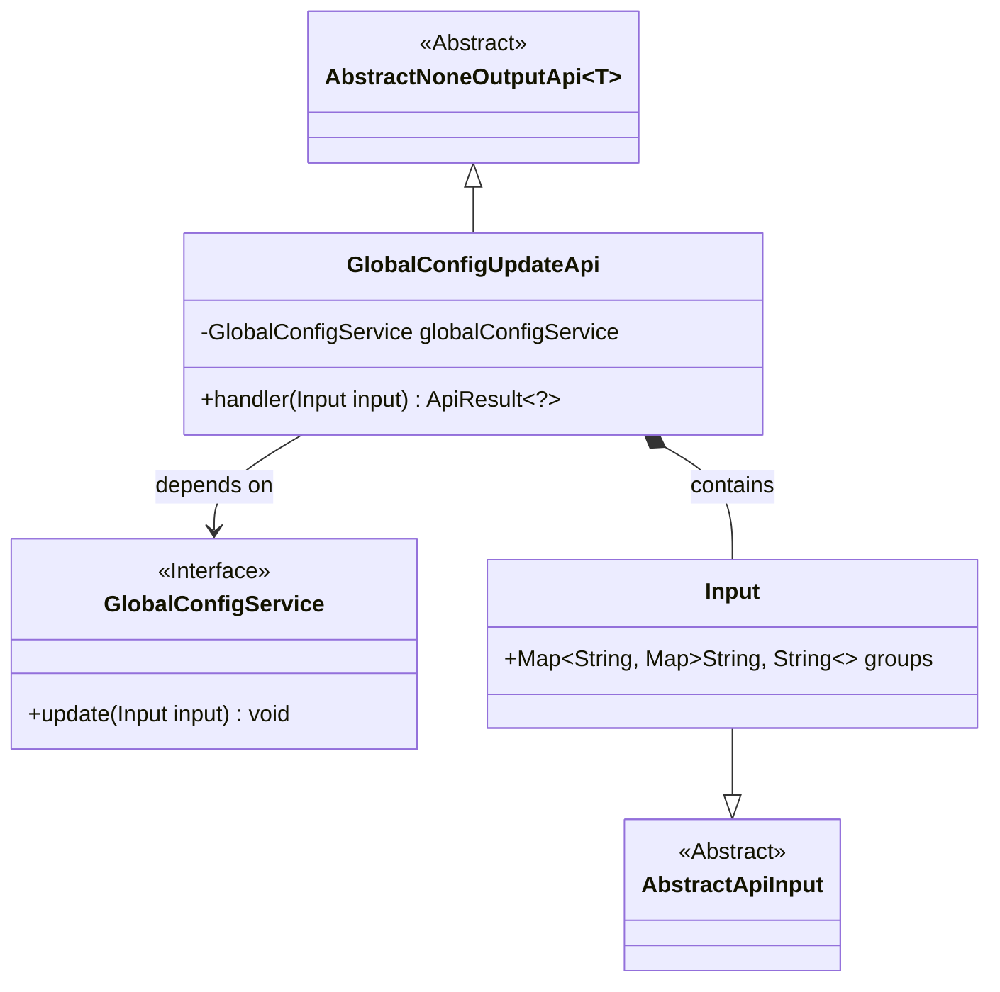

# Basic Information

|      |      |
|------|------|
| Name | GlobalConfigUpdateApi |
| Language | .java |
| Code Path | WeFe/board/board-service/src/main/java/com/welab/wefe/board/service/api/global_config/GlobalConfigUpdateApi.java |
| Package Name | com.welab.wefe.board.service.api.global_config |
| Dependencies | ['com.welab.wefe.board.service.service.globalconfig.GlobalConfigService', 'com.welab.wefe.common.fieldvalidate.annotation.Check', 'com.welab.wefe.common.web.api.base.AbstractNoneOutputApi', 'com.welab.wefe.common.web.api.base.Api', 'com.welab.wefe.common.web.dto.AbstractApiInput', 'com.welab.wefe.common.web.dto.ApiResult', 'org.springframework.beans.factory.annotation.Autowired', 'java.util.Map'] |
| Brief Description | API class for updating global system configurations, which processes input configuration item groups through GlobalConfigService and returns successful results. |

# Description

This is an API class for updating global system configurations, with the path `global_config/update`. The class inherits from `AbstractNoneOutputApi`, with the generic parameter set as the inner class `Input`. The `GlobalConfigService` is injected via `Autowired`, and the `update` method is called within the `handler` method to complete the configuration update and return a successful result.  

The `Input` class inherits from `AbstractApiInput` and includes a required `Map`-type field `groups`, which is used to receive configuration group data. This field is annotated with `@Check` to mark it as mandatory and labeled as "Configuration Groups" for validation purposes. The entire API implements the core functionality for configuration updates.

# Class Summary

| Name   | Type  | Description |
|-------|------|-------------|
| GlobalConfigUpdateApi | class | Java class GlobalConfigUpdateApi is used to update system global configurations. It processes the input parameter groups through GlobalConfigService and returns a successful result. The input parameter is a mandatory configuration item group Map. |

## Class GlobalConfigUpdateApi

|      |      |
|------|------|
| Access Modifier | @Api(path = "global_config/update", name = "update system global configs");public |
| Type | class |
| Name | GlobalConfigUpdateApi |
| Description | Java class GlobalConfigUpdateApi is used to update system global configurations. It processes the input parameter groups through GlobalConfigService and returns a successful result. The input parameter is a mandatory configuration item group Map. |

### UML Class Diagram

This code illustrates the class structure of an API for updating global configurations. The GlobalConfigUpdateApi inherits from the generic abstract class AbstractNoneOutputApi and implements the handler method to process input parameters. The input parameter Input is a nested class containing a grouped mapping of configuration items and inherits from AbstractApiInput. The GlobalConfigUpdateApi utilizes the dependency-injected GlobalConfigService interface to perform the actual configuration update operations. The overall design employs layered abstraction and dependency injection patterns to encapsulate the configuration update functionality.

### Internal Method Call Graph

```mermaid
graph TD
    A["GlobalConfigUpdateApi Class"]
    B["Inheritance: AbstractNoneOutputApi<Input>"]
    C["Dependency Injection: @Autowired GlobalConfigService"]
    D["Overridden Method: handler(Input input)"]
    E["Inner Class: Input extends AbstractApiInput"]
    F["Validation Annotation: @Check groups attribute"]
    G["Business Operation: globalConfigService.update(input)"]
    H["Return Result: success()"]

    A --> B
    A --> C
    A --> D
    D --> G
    D --> H
    A --> E
    E --> F
```

This code demonstrates a Spring-style API controller class for updating global configurations. The flowchart clearly illustrates the class inheritance structure, key method invocations, and input parameter validation relationships. GlobalConfigUpdateApi processes requests through the handler method, invoking GlobalConfigService to perform updates. Its Input inner class enforces validation of configuration item group parameters using the @Check annotation. The entire flow presents a complete chain from request processing to service invocation while maintaining a robust input parameter validation mechanism.

### Field List

| Name  | Type  | Description |
|-------|-------|------|
| globalConfigService | GlobalConfigService | Use @Autowired to automatically inject an instance of GlobalConfigService. |

### Method List

| Name  | Type  | Description |
|-------|-------|------|
| handler | ApiResult<?> | Java method override, call globalConfigService to update the input configuration, and return ApiResult upon success. |

