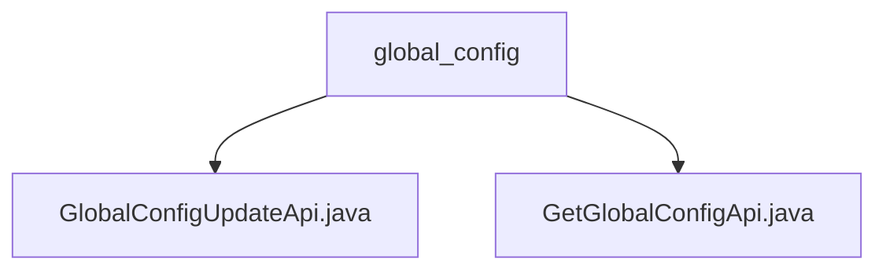

# Basic Information

|      |      |
|------|------|
| Name | global_config |
| Language | .java |
| Code Path | WeFe/board/board-service/src/main/java/com/welab/wefe/board/service/api/global_config |
| Package Name | docs.board.board-service.src.main.java.com.welab.wefe.board.service.api.global_config |
| Brief Description | The GlobalConfigUpdateApi is used to update system configurations, with the endpoint `global_config/update`, accepting a required Map-type `groups` field. The GetGlobalConfigApi is used to retrieve configurations, with the endpoint `global_config/get`, accepting a required `groups` list and returning a Map of configuration data. Both rely on the GlobalConfigService to implement their functionalities. |

# Description

## Overview  
The core responsibility of this module is to manage system-wide configurations, providing functionalities for configuration updates and queries. The interface specification includes two APIs: `global_config/update` for updating configurations (similar to a configuration center's write mode) and `global_config/get` for batch querying configurations. Key data structures consist of the Map-type `groups` field annotated with `@Check` and a list of configuration group names. The only external dependency is the `GlobalConfigService` service. For example, the update API receives configuration group data through the generic `Input` class, while the query API returns a Map containing configuration models.  

## Primary Business Scenarios  
Typical scenarios include system initialization configuration updates and runtime dynamic configuration retrieval. The interaction model adheres to standard API specifications, where mandatory parameters are validated via the `Input` inner class before invoking service-layer operations. Functional completeness is demonstrated by supporting batch group operations, such as updating multiple configuration groups simultaneously or querying by a list of group names. The API types encompass update operations with no return value and query operations that return a Map, with integration cases resembling the bidirectional interaction mode of a configuration center.

### Package Internal Structure View

This flowchart illustrates two Java files under the global_config directory: GlobalConfigUpdateApi.java and GetGlobalConfigApi.java. Both files are directly subordinate to the global_config directory without any deeper nesting structure. The diagram clearly shows the dependency relationship between the files and their parent directory, adhering to Mermaid syntax conventions with concise node naming.

# File List

| Name   | Type  | Description |
|-------|------|-------------|
| [GlobalConfigUpdateApi.java](GlobalConfigUpdateApi.md) | file | API class for updating system global configurations, which processes input configuration item groups through GlobalConfigService and returns successful results. |
| [GetGlobalConfigApi.java](GetGlobalConfigApi.md) | file | API class for retrieving system-wide configurations, which returns corresponding configuration models by inputting a list of group names. It uses GlobalConfigService to process the request and returns results in Map format. The input must include a non-empty list of group names. |

