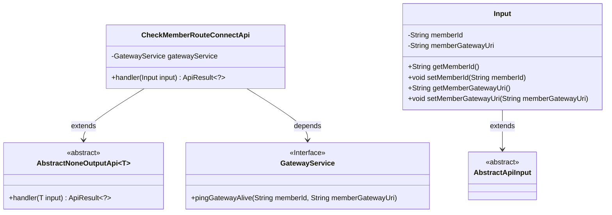

# Basic Information

|      |      |
|------|------|
| Name | CheckMemberRouteConnectApi |
| Language | .java |
| Code Path | WeFe/board/board-service/src/main/java/com/welab/wefe/board/service/api/member/CheckMemberRouteConnectApi.java |
| Package Name | com.welab.wefe.board.service.api.member |
| Dependencies | ['com.welab.wefe.board.service.service.GatewayService', 'com.welab.wefe.common.exception.StatusCodeWithException', 'com.welab.wefe.common.fieldvalidate.annotation.Check', 'com.welab.wefe.common.web.api.base.AbstractNoneOutputApi', 'com.welab.wefe.common.web.api.base.Api', 'com.welab.wefe.common.web.dto.AbstractApiInput', 'com.welab.wefe.common.web.dto.ApiResult', 'org.springframework.beans.factory.annotation.Autowired'] |
| Brief Description | Check the API for member gateway route connections, requiring the member ID and gateway address, and call the ping method of GatewayService to verify connectivity. |

# Description

The code defines an API class named `CheckMemberRouteConnectApi`, which is used to check the route connection of a member gateway. The API path is `member/check_route_connect`, and its functional description is to verify the route connection of the member gateway. This class inherits from `AbstractNoneOutputApi` and uses the `pingGatewayAlive` method of `GatewayService` to validate the connection status of the specified member ID and gateway URI. The input parameter `Input` includes two mandatory fields: `memberId` and `memberGatewayUri`, where the latter is used to directly test the liveliness of its own gateway. An empty result is returned upon successful processing.

# Class Summary

| Name   | Type  | Description |
|-------|------|-------------|
| CheckMemberRouteConnectApi | class | Check the API for member gateway route connections, requiring member ID and gateway address, and return a successful result after calling the service to verify connectivity. |

## Class CheckMemberRouteConnectApi

|      |      |
|------|------|
| Access Modifier | @Api(path = "member/check_route_connect", name = "Check route connect of member gateway", desc = "Check route connect of member gateway");public |
| Type | class |
| Name | CheckMemberRouteConnectApi |
| Description | Check the API for member gateway route connections, requiring member ID and gateway address, and return a successful result after calling the service to verify connectivity. |

### UML Class Diagram

This code demonstrates an API implementation for checking member gateway route connectivity. The core class CheckMemberRouteConnectApi inherits from the generic abstract class AbstractNoneOutputApi and relies on the GatewayService interface for gateway liveliness detection. The Input class, as an inner class, extends AbstractApiInput and contains two mandatory fields: memberId and memberGatewayUri. The overall design follows layered abstraction principles, achieving functional decoupling through inheritance and dependency relationships.

### Internal Method Call Graph

```mermaid
graph TD
    A["Class CheckMemberRouteConnectApi"]
    B["Annotation: @Api"]
    C["Inheritance: AbstractNoneOutputApi<Input>"]
    D["Dependency Injection: @Autowired GatewayService"]
    E["Overridden Method: handler(Input input)"]
    F["Invocation: gatewayService.pingGatewayAlive"]
    G["Return: success()"]
    H["Nested Class Input"]
    I["Inheritance: AbstractApiInput"]
    J["Field: @Check String memberId"]
    K["Field: @Check String memberGatewayUri"]
    L["Getter/Setter Methods"]

    A --> B
    A --> C
    A --> D
    A --> E
    E --> F
    E --> G
    A --> H
    H --> I
    H --> J
    H --> K
    H --> L
```

This code defines an API class named CheckMemberRouteConnectApi, which is used to check the routing connection of a member gateway. The class inherits from AbstractNoneOutputApi, injects GatewayService via @Autowired, and overrides the handler method to process input parameters. The input parameters are defined through a nested class Input, containing two mandatory fields memberId and memberGatewayUri, along with corresponding Getter/Setter methods. The handler method invokes the pingGatewayAlive method of gatewayService to check the gateway's liveliness status and finally returns a success result. The entire flow clearly illustrates the data transfer and dependency relationships in the API request handling process.

### Field List

| Name  | Type  | Description |
|-------|-------|------|
| gatewayService | GatewayService | Using @Autowired to automatically inject an instance of GatewayService. |

### Method List

| Name  | Type  | Description |
|-------|-------|------|
| handler | ApiResult<?> | The method processes the input, invokes the gateway service to check the liveliness status of member gateways, and returns a successful result upon success. |

