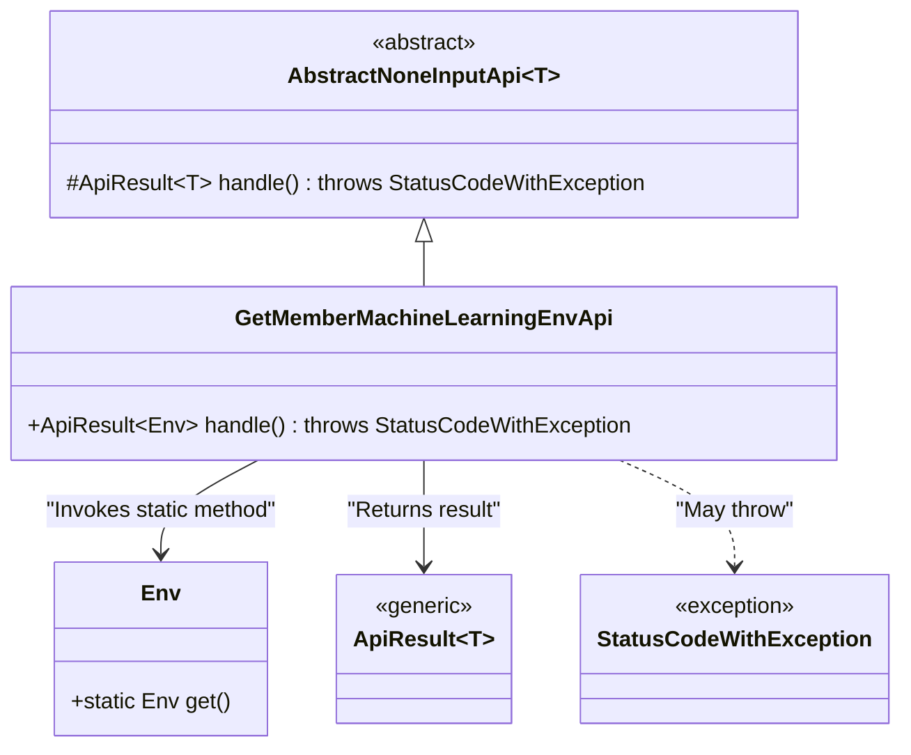
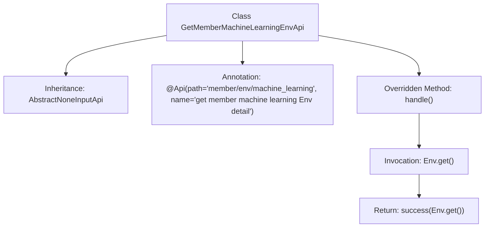

# Basic Information

|      |      |
|------|------|
| Name | GetMemberMachineLearningEnvApi |
| Language | .java |
| Code Path | WeFe/board/board-service/src/main/java/com/welab/wefe/board/service/api/member/GetMemberMachineLearningEnvApi.java |
| Package Name | com.welab.wefe.board.service.api.member |
| Dependencies | ['com.welab.wefe.board.service.dto.kernel.machine_learning.Env', 'com.welab.wefe.common.exception.StatusCodeWithException', 'com.welab.wefe.common.web.api.base.AbstractNoneInputApi', 'com.welab.wefe.common.web.api.base.Api', 'com.welab.wefe.common.web.dto.ApiResult'] |
| Brief Description | API class for retrieving member machine learning environment details, inherits from the no-input abstract class, returns an Env object. |

# Description

This is an API class named GetMemberMachineLearningEnvApi, with the path member/env/machine_learning, used to retrieve details of a member's machine learning environment. It inherits from the AbstractNoneInputApi class, with the generic type specifying the return type as Env. This API requires no input parameters and directly calls Env.get() through the handle method to obtain environment information, which is then encapsulated in ApiResult for return. The entire implementation is concise and clear, containing only the core business logic.

# Class Summary

| Name   | Type  | Description |
|-------|------|-------------|
| GetMemberMachineLearningEnvApi | class | API class for retrieving detailed information about a member's machine learning environment, inherits from a no-input abstract class and directly returns an Env object. |

## Class GetMemberMachineLearningEnvApi

|      |      |
|------|------|
| Access Modifier | @Api(path = "member/env/machine_learning", name = "get member machine learning Env detail");public |
| Type | class |
| Name | GetMemberMachineLearningEnvApi |
| Description | API class for retrieving detailed information about a member's machine learning environment, inherits from a no-input abstract class and directly returns an Env object. |

### UML Class Diagram

This class diagram illustrates that GetMemberMachineLearningEnvApi inherits from the generic abstract class AbstractNoneInputApi and implements its handle method. The API retrieves environment information by invoking the static method of the Env class, returns the result encapsulated in ApiResult, and may throw a StatusCodeWithException. The diagram clearly depicts class inheritance relationships, method invocations, and exception handling mechanisms, demonstrating the application of the Template Method pattern. Env serves as an independent class providing environment data, while ApiResult acts as a generic container for return values.

### Internal Method Call Graph

This flowchart illustrates the structure of the GetMemberMachineLearningEnvApi class, which inherits from the AbstractNoneInputApi<Env> class and carries a specific API annotation. The class overrides the handle() method, which invokes Env.get() to retrieve environment information and returns the result via the success() method. The entire process clearly outlines the steps from method invocation to result return, demonstrating the core logic of API request handling.

### Field List

| Name  | Type  | Description |
|-------|-------|------|

### Method List

| Name  | Type  | Description |
|-------|-------|------|
| handle | ApiResult<Env> | This method overrides the parent class logic and directly returns the successful result of the Env object without handling exceptions. |

