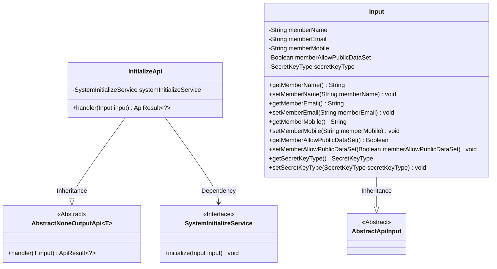

# Basic Information

|      |      |
|------|------|
| Name | InitializeApi |
| Language | .java |
| Code Path | WeFe/board/board-service/src/main/java/com/welab/wefe/board/service/api/member/InitializeApi.java |
| Package Name | com.welab.wefe.board.service.api.member |
| Dependencies | ['com.welab.wefe.board.service.service.SystemInitializeService', 'com.welab.wefe.common.constant.SecretKeyType', 'com.welab.wefe.common.exception.StatusCodeWithException', 'com.welab.wefe.common.fieldvalidate.StandardFieldType', 'com.welab.wefe.common.fieldvalidate.annotation.Check', 'com.welab.wefe.common.web.api.base.AbstractNoneOutputApi', 'com.welab.wefe.common.web.api.base.Api', 'com.welab.wefe.common.web.dto.AbstractApiInput', 'com.welab.wefe.common.web.dto.ApiResult', 'org.springframework.beans.factory.annotation.Autowired'] |
| Brief Description | Initialize the system API with the path "member/initialize". The input parameters include member name (3-12 characters in Chinese, English, or numbers), email, phone number, whether to make the dataset public, and key type (default: rsa). Call SystemInitializeService to perform the initialization. |

# Description

The code defines an API class named `InitializeApi`, which is used for system initialization. The API path is `member/initialize`, inheriting from `AbstractNoneOutputApi`, with the input parameter being the inner class `Input`. `Input` contains five fields: `memberName` (required, supports Chinese, English, and numbers, length 3-12), `memberEmail` (email format), `memberMobile` (phone number format), `memberAllowPublicDataSet` (required boolean), and `secretKeyType` (defaults to `rsa`). The initialization operation is executed via `SystemInitializeService`, returning an empty result upon success. All fields have validation rules and getter/setter methods.

# Class Summary

| Name   | Type  | Description |
|-------|------|-------------|
| InitializeApi | class | Initialize the system API with the path `member/initialize`. The input includes member name (3-12 characters, supporting Chinese, English, and numbers), email, phone number, whether to make the dataset public, and key type (default: RSA). |

## Class InitializeApi

|      |      |
|------|------|
| Access Modifier | @Api(path = "member/initialize", name = "initialize system");public |
| Type | class |
| Name | InitializeApi |
| Description | Initialize the system API with the path `member/initialize`. The input includes member name (3-12 characters, supporting Chinese, English, and numbers), email, phone number, whether to make the dataset public, and key type (default: RSA). |

### UML Class Diagram

This code demonstrates the implementation structure of a federated member initialization API. The InitializeApi inherits from AbstractNoneOutputApi, processes Input parameters containing validation fields such as member name, email, and phone number, and completes the initialization operation through the SystemInitializeService interface. The class diagram clearly shows the inheritance relationships (InitializeApi→AbstractNoneOutputApi, Input→AbstractApiInput) and the dependency relationship (InitializeApi→SystemInitializeService). The input parameter class Input includes multiple fields with regex validation rules and exposes properties via getter/setter methods. The overall design reflects the principles of layered architecture and dependency injection.

### Internal Method Call Graph

```mermaid
graph TD
    A["Class InitializeApi"]
    B["Annotation: @Api(path='member/initialize', name='initialize system')"]
    C["Inheritance: AbstractNoneOutputApi<Input>"]
    D["Dependency Injection: @Autowired SystemInitializeService"]
    E["Overridden Method: handler(Input input)"]
    F["Inner Class: Input"]
    G["Validation Annotation: @Check memberName"]
    H["Validation Annotation: @Check memberEmail"]
    I["Validation Annotation: @Check memberMobile"]
    J["Validation Annotation: @Check memberAllowPublicDataSet"]
    K["Validation Annotation: @Check secretKeyType"]
    L["Getter/Setter Method Group"]
    M["Invocation: systemInitializeService.initialize(input)"]
    N["Return: success()"]

    A --> B
    A --> C
    A --> D
    A --> E
    E --> M
    E --> N
    A --> F
    F --> G
    F --> H
    F --> I
    F --> J
    F --> K
    F --> L
```

This flowchart illustrates the complete structure of the InitializeApi class, including API annotations, service injection, input parameter validation, and core processing logic. The class inherits from AbstractNoneOutputApi and implements the handler method, executing initialization operations through SystemInitializeService. The Input inner class contains five fields with validation rules, each requiring strict format verification. The process clearly presents the complete chain from request handling to service invocation, particularly highlighting the importance of parameter validation.

### Field List

| Name  | Type  | Description |
|-------|-------|------|
| systemInitializeService | SystemInitializeService | Using @Autowired to automatically inject an instance of SystemInitializeService. |

### Method List

| Name  | Type  | Description |
|-------|-------|------|
| handler | ApiResult<?> | This method overrides the parent class handler, accepts an Input parameter, invokes systemInitializeService to initialize the input, and returns ApiResult upon success. It throws StatusCodeWithException in case of exceptions. |

