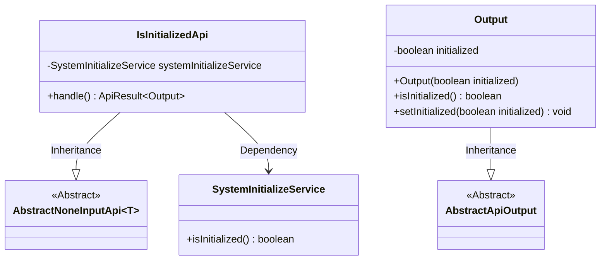
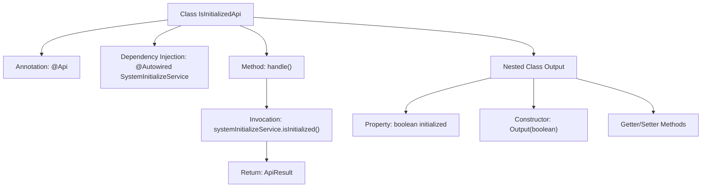

# Basic Information

|      |      |
|------|------|
| Name | IsInitializedApi |
| Language | .java |
| Code Path | WeFe/board/board-service/src/main/java/com/welab/wefe/board/service/api/member/IsInitializedApi.java |
| Package Name | com.welab.wefe.board.service.api.member |
| Dependencies | ['com.welab.wefe.board.service.service.SystemInitializeService', 'com.welab.wefe.common.exception.StatusCodeWithException', 'com.welab.wefe.common.web.api.base.AbstractNoneInputApi', 'com.welab.wefe.common.web.api.base.Api', 'com.welab.wefe.common.web.dto.AbstractApiOutput', 'com.welab.wefe.common.web.dto.ApiResult', 'org.springframework.beans.factory.annotation.Autowired'] |
| Brief Description | This is an API for checking whether the system is initialized, with the path "member/is_initialized". If not initialized, the system cannot access functional modules. The response includes a boolean value indicating the initialization status. |

# Description

This is an API class named IsInitializedApi, used to check whether the system has completed initialization. The API path is member/is_initialized, and the functional description indicates that no feature modules can be accessed before system initialization. This class inherits from AbstractNoneInputApi, utilizes SystemInitializeService to retrieve the initialization status, and returns an Output object containing a boolean-type initialized field. The Output class provides getter and setter methods for the initialized field.

# Class Summary

| Name   | Type  | Description |
|-------|------|-------------|
| IsInitializedApi | class | This is an API class that checks whether the system is initialized. It determines the status by calling the SystemInitializeService and returns a boolean result. |

## Class IsInitializedApi

|      |      |
|------|------|
| Access Modifier | @Api(;        path = "member/is_initialized",;        name = "is the system initialized",;        desc = "The system cannot access any functional modules before initialization";);public |
| Type | class |
| Name | IsInitializedApi |
| Description | This is an API class that checks whether the system is initialized. It determines the status by calling the SystemInitializeService and returns a boolean result. |

### UML Class Diagram

This code describes a class structure for an API that checks whether a system is initialized. The IsInitializedApi inherits from the generic class AbstractNoneInputApi, with its generic parameter being the inner class Output. This class retrieves the initialization status via SystemInitializeService and returns an Output object containing a boolean result. Output inherits from AbstractApiOutput, encapsulating the initialized state field and its access methods. The overall structure reflects the dependency relationship between the API layer and the service layer, as well as the encapsulation logic for output data.

### Internal Method Call Graph

This code defines an API class IsInitializedApi that checks whether the system is initialized, inheriting from AbstractNoneInputApi. The core flow involves the handle method invoking SystemInitializeService's isInitialized method, returning an ApiResult containing the initialization status. The nested class Output encapsulates the initialization state and provides standard getter/setter methods. The entire class defines API paths and descriptive information through the @Api annotation, embodying a typical Spring Boot controller design pattern.

### Field List

| Name  | Type  | Description |
|-------|-------|------|
| systemInitializeService | SystemInitializeService | Initializing service instance for automatic injection system. |

### Method List

| Name  | Type  | Description |
|-------|-------|------|
| handle | ApiResult<Output> | Rewrite the handle method to return an ApiResult indicating the system initialization status. |

