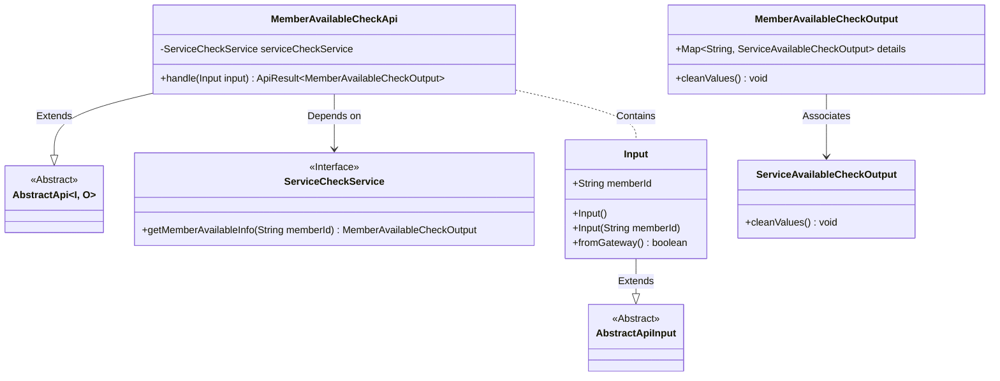

# Basic Information

|      |      |
|------|------|
| Name | MemberAvailableCheckApi |
| Language | .java |
| Code Path | WeFe/board/board-service/src/main/java/com/welab/wefe/board/service/api/member/MemberAvailableCheckApi.java |
| Package Name | com.welab.wefe.board.service.api.member |
| Dependencies | ['com.welab.wefe.board.service.service.ServiceCheckService', 'com.welab.wefe.common.exception.StatusCodeWithException', 'com.welab.wefe.common.fieldvalidate.annotation.Check', 'com.welab.wefe.common.web.api.base.AbstractApi', 'com.welab.wefe.common.web.api.base.Api', 'com.welab.wefe.common.web.dto.AbstractApiInput', 'com.welab.wefe.common.web.dto.ApiResult', 'com.welab.wefe.common.wefe.checkpoint.dto.MemberAvailableCheckOutput', 'com.welab.wefe.common.wefe.checkpoint.dto.ServiceAvailableCheckOutput', 'org.springframework.beans.factory.annotation.Autowired'] |
| Brief Description | API for checking member system service availability, which receives a member ID and returns service status information, with gateway requests clearing detail values. |

# Description

The code defines an API class named `MemberAvailableCheckApi`, designed to check the availability of the member system service. The API path is `"member/available"`, which inherits from `AbstractApi`, with the input type as `MemberAvailableCheckApi.Input` and the output type as `MemberAvailableCheckOutput`. The class injects `ServiceCheckService` to retrieve member availability information. The `handle` method processes input parameters, invokes the service to obtain output results, and determines whether to clean up output details based on whether the request originates from a gateway. The `Input` inner class extends `AbstractApiInput`, containing a mandatory `memberId` field, and provides both no-argument and parameterized constructors. The entire API focuses on validating the member service status and returns processed availability information.

# Class Summary

| Name   | Type  | Description |
|-------|------|-------------|
| MemberAvailableCheckApi | class | Member service availability check API, which verifies system service status via memberId and supports gateway filtering of sensitive information. |

## Class MemberAvailableCheckApi

|      |      |
|------|------|
| Access Modifier | @Api(path = "member/available", name = "Check whether the member’s system services are available");public |
| Type | class |
| Name | MemberAvailableCheckApi |
| Description | Member service availability check API, which verifies system service status via memberId and supports gateway filtering of sensitive information. |

### UML Class Diagram

The class diagram illustrates the structure of the Member Availability Check API. MemberAvailableCheckApi inherits from the generic abstract class AbstractApi, depends on the ServiceCheckService interface for service checks, and contains the nested Input class. Input extends AbstractApiInput and includes a memberId field. The MemberAvailableCheckOutput class associates with ServiceAvailableCheckOutput via a Map, providing methods to clean detail data. The overall design reflects layered and compositional relationships, supporting special handling logic for gateway invocation.

### Internal Method Call Graph

```mermaid
graph TD
    A["Class MemberAvailableCheckApi"]
    B["Inheritance: AbstractApi<Input, MemberAvailableCheckOutput>"]
    C["Annotation: @Api(path='member/available', name='Check whether the member’s system services are available')"]
    D["Dependency Injection: @Autowired ServiceCheckService"]
    E["Overridden Method: handle(Input input)"]
    F["Invocation: serviceCheckService.getMemberAvailableInfo(input.memberId)"]
    G["Condition Check: input.fromGateway()"]
    H["Operation: output.details.values().forEach(ServiceAvailableCheckOutput::cleanValues)"]
    I["Return: success(output)"]
    J["Nested Class Input"]
    K["Inheritance: AbstractApiInput"]
    L["Annotation: @Check(name='Member ID', require=true)"]
    M["Field: String memberId"]
    N["Constructor: Input()"]
    O["Constructor: Input(String memberId)"]

    A --> B
    A --> C
    A --> D
    A --> E
    E --> F
    E --> G
    G -->|Yes| H
    H --> I
    G -->|No| I
    A --> J
    J --> K
    J --> L
    J --> M
    J --> N
    J --> O
```

This code describes an API class MemberAvailableCheckApi that checks the availability of a member's system services. It inherits from AbstractApi and handles input/output processing. The main workflow includes: retrieving member availability information via serviceCheckService, determining whether to clean output details based on the input source, and finally returning a success result. The nested Input class defines the member ID field with validation rules and contains two constructors. The entire process demonstrates a complete logic chain from request handling to result return.

### Field List

| Name  | Type  | Description |
|-------|-------|------|
| serviceCheckService | ServiceCheckService | Automatically inject the ServiceCheckService service instance. |

### Method List

| Name  | Type  | Description |
|-------|-------|------|
| handle | ApiResult<MemberAvailableCheckOutput> | This method processes member availability check requests, calls the service to retrieve information, cleanses sensitive data if the request originates from the gateway, and finally returns the result. |

