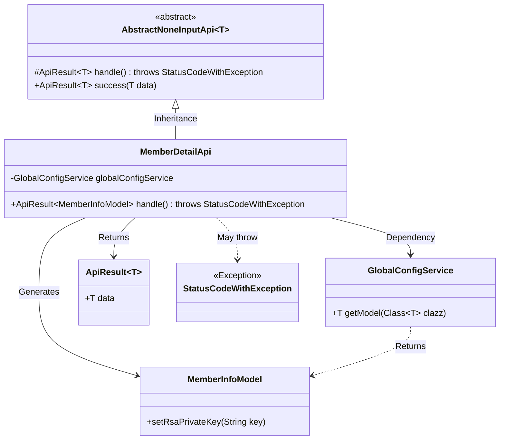
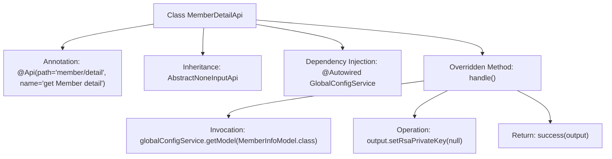

# Basic Information

|      |      |
|------|------|
| Name | MemberDetailApi |
| Language | .java |
| Code Path | WeFe/board/board-service/src/main/java/com/welab/wefe/board/service/api/member/MemberDetailApi.java |
| Package Name | com.welab.wefe.board.service.api.member |
| Dependencies | ['com.welab.wefe.board.service.service.globalconfig.GlobalConfigService', 'com.welab.wefe.common.exception.StatusCodeWithException', 'com.welab.wefe.common.web.api.base.AbstractNoneInputApi', 'com.welab.wefe.common.web.api.base.Api', 'com.welab.wefe.common.web.dto.ApiResult', 'com.welab.wefe.common.wefe.dto.global_config.MemberInfoModel', 'org.springframework.beans.factory.annotation.Autowired'] |
| Brief Description | Member Details API class, inherits from the abstract No-Input API, retrieves the MemberInfoModel through the global configuration service, and returns the result after clearing the private key. |

# Description

This is a Java class named MemberDetailApi, designed to retrieve member details. The class extends AbstractNoneInputApi, with the generic type specified as MemberInfoModel. The @Api annotation defines the API path as "member/detail" and the name as "get Member detail". The class injects the GlobalConfigService, and within the handle method, it calls this service to obtain an instance of MemberInfoModel. The rsaPrivateKey field is set to null before returning the model. The API does not accept any input parameters and directly returns the processed member information model.

# Class Summary

| Name   | Type  | Description |
|-------|------|-------------|
| MemberDetailApi | class | Member Details API class, path "member/detail", no input parameters, returns MemberInfoModel data. Processing logic: retrieves the model via globalConfigService and returns it after clearing the private key. |

## Class MemberDetailApi

|      |      |
|------|------|
| Access Modifier | @Api(path = "member/detail", name = "get Member detail");public |
| Type | class |
| Name | MemberDetailApi |
| Description | Member Details API class, path "member/detail", no input parameters, returns MemberInfoModel data. Processing logic: retrieves the model via globalConfigService and returns it after clearing the private key. |

### UML Class Diagram

Class Diagram Description: This diagram illustrates the implementation structure of a Member Detail API. MemberDetailApi inherits from the generic abstract class AbstractNoneInputApi, retrieves the MemberInfoModel data model through GlobalConfigService, and returns an ApiResult object containing the processing result. It involves exception handling with StatusCodeWithException, and MemberInfoModel clears RSA private key information. The components are organized through dependency and inheritance relationships, forming a clear business logic chain.

### Internal Method Call Graph

This flowchart illustrates the core structure and workflow of the MemberDetailApi class. The class defines an API endpoint through the @Api annotation and inherits from an abstract template class to handle requests without input parameters. The main logic is implemented in the handle() method: it retrieves the member information model via a global configuration service, clears sensitive fields, and returns a successful response. The process clearly demonstrates the complete call chain from dependency injection to business processing, highlighting the annotation-driven features of the Spring framework and the application of the template method pattern.

### Field List

| Name  | Type  | Description |
|-------|-------|------|
| globalConfigService | GlobalConfigService | Using @Autowired to automatically inject an instance of GlobalConfigService. |

### Method List

| Name  | Type  | Description |
|-------|-------|------|
| handle | ApiResult<MemberInfoModel> | This method overrides the parent class logic, retrieves a MemberInfoModel instance, clears its RSA private key, and returns a successful result. |

