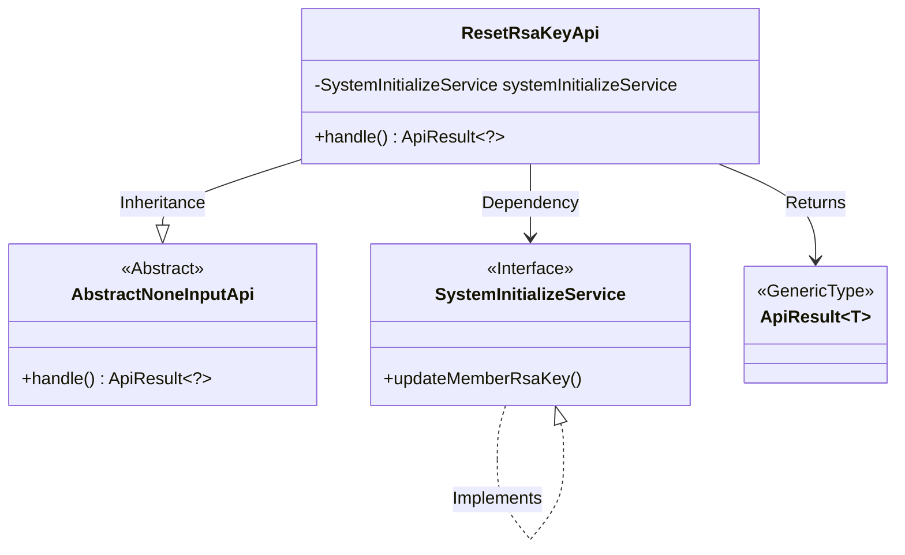
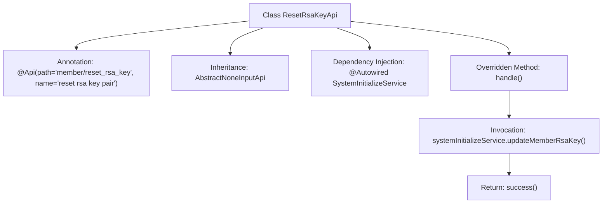

# Basic Information

|      |      |
|------|------|
| Name | ResetRsaKeyApi |
| Language | .java |
| Code Path | WeFe/board/board-service/src/main/java/com/welab/wefe/board/service/api/member/ResetRsaKeyApi.java |
| Package Name | com.welab.wefe.board.service.api.member |
| Dependencies | ['com.welab.wefe.board.service.service.SystemInitializeService', 'com.welab.wefe.common.exception.StatusCodeWithException', 'com.welab.wefe.common.web.api.base.AbstractNoneInputApi', 'com.welab.wefe.common.web.api.base.Api', 'com.welab.wefe.common.web.dto.ApiResult', 'org.springframework.beans.factory.annotation.Autowired'] |
| Brief Description | The code defines an API class named ResetRsaKeyApi, which is used to reset a member's RSA key pair. It achieves this functionality by calling the updateMemberRsaKey method of systemInitializeService and returns an ApiResult upon successful execution. |

# Description

The code defines an API class named `ResetRsaKeyApi`, which is used to reset RSA key pairs. It inherits from `AbstractNoneInputApi`, indicating that this interface requires no input parameters. The `@Api` annotation specifies the path as `member/reset_rsa_key` and names it "reset rsa key pair". The class injects the `SystemInitializeService` service and calls its `updateMemberRsaKey` method in the `handle` method to update member RSA keys, finally returning a successful result. The entire API has clear functionality, a concise structure, and focuses solely on performing RSA key reset operations.

# Class Summary

| Name   | Type  | Description |
|-------|------|-------------|
| ResetRsaKeyApi | class | API class for resetting member RSA key, which calls SystemInitializeService to update the key. It takes no input parameters and returns a success result. |

## Class ResetRsaKeyApi

|      |      |
|------|------|
| Access Modifier | @Api(path = "member/reset_rsa_key", name = "reset rsa key pair");public |
| Type | class |
| Name | ResetRsaKeyApi |
| Description | API class for resetting member RSA key, which calls SystemInitializeService to update the key. It takes no input parameters and returns a success result. |

### UML Class Diagram

Class diagram description: ResetRsaKeyApi inherits from the AbstractNoneInputApi abstract class and depends on the SystemInitializeService interface to implement key update functionality. It returns a generic ApiResult through the handle() method, showcasing a typical Spring Boot controller layer implementation with dependency injection, abstract method overriding, and interface invocation relationships.

### Internal Method Call Graph

This code demonstrates a class named ResetRsaKeyApi, which inherits from AbstractNoneInputApi and defines the API path and name through annotations. The class injects SystemInitializeService via @Autowired and overrides the handle method. Within this method, it calls updateMemberRsaKey() to update the member's RSA key pair, ultimately returning a successful ApiResult. The flowchart clearly illustrates the class structure, dependency relationships, and method invocation flow.

### Field List

| Name  | Type  | Description |
|-------|-------|------|
| systemInitializeService | SystemInitializeService | Automatic injection system initializes service instances. |

### Method List

| Name  | Type  | Description |
|-------|-------|------|
| handle | ApiResult<?> | This method overrides the parent class logic, invokes the service to update the member's RSA key, and returns an empty result upon success. It throws a status code exception in case of errors. |

