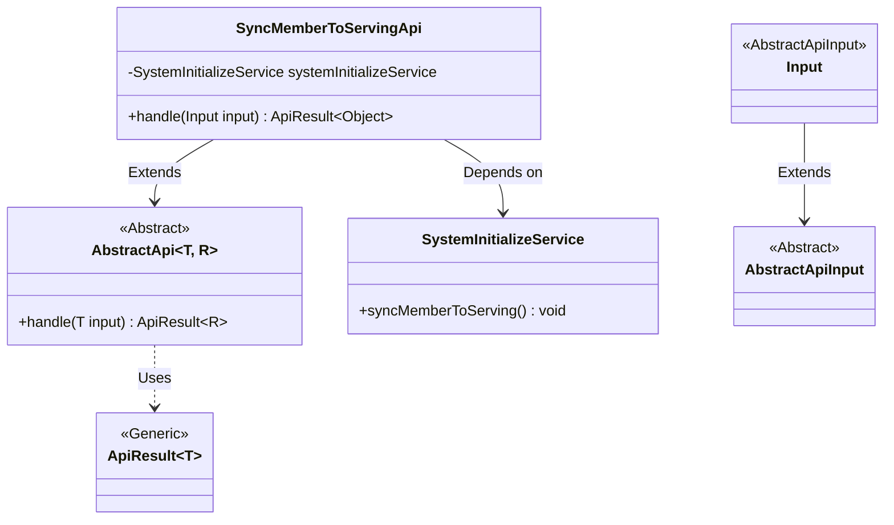
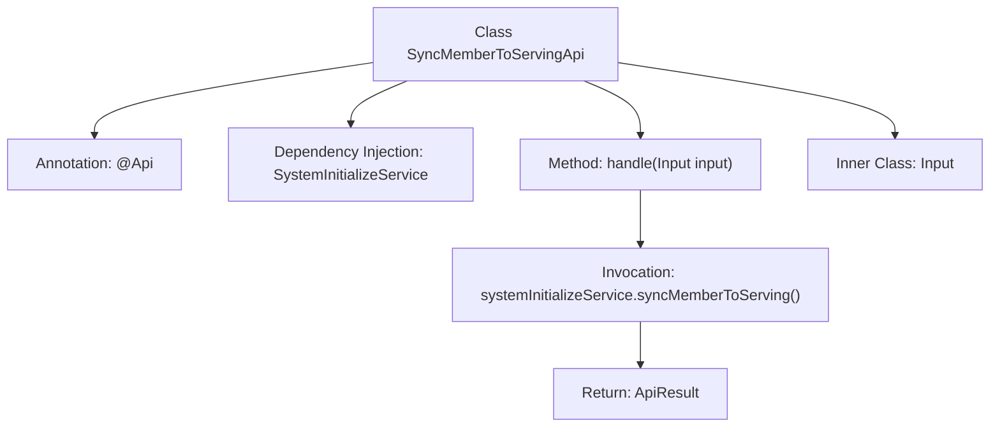

# Basic Information

|      |      |
|------|------|
| Name | SyncMemberToServingApi |
| Language | .java |
| Code Path | WeFe/board/board-service/src/main/java/com/welab/wefe/board/service/api/member/SyncMemberToServingApi.java |
| Package Name | com.welab.wefe.board.service.api.member |
| Dependencies | ['com.welab.wefe.board.service.service.SystemInitializeService', 'com.welab.wefe.common.web.api.base.AbstractApi', 'com.welab.wefe.common.web.api.base.Api', 'com.welab.wefe.common.web.dto.AbstractApiInput', 'com.welab.wefe.common.web.dto.ApiResult', 'org.springframework.beans.factory.annotation.Autowired'] |
| Brief Description | Synchronize member information to the server for member recovery in case of alliance data loss. |

# Description

The code defines an API class named `SyncMemberToServingApi`, which is used to synchronize member information to the server, primarily addressing the issue of member recovery after alliance data loss. The API path is `member/sync_to_serving`, and it inherits from the `AbstractApi` class, using generics to specify the input type as the inner class `Input` and the return type as `Object`. The `SystemInitializeService` is injected via `Autowired`, and within the `handle` method, the `syncMemberToServing` method is called to complete the synchronization operation, returning a success result. The `Input` class inherits from `AbstractApiInput` and does not define any additional fields.

# Class Summary

| Name   | Type  | Description |
|-------|------|-------------|
| SyncMemberToServingApi | class | Synchronize member information to the server for member recovery in case of alliance data loss. |

## Class SyncMemberToServingApi

|      |      |
|------|------|
| Access Modifier | @Api(;        path = "member/sync_to_serving",;        name = "Synchronize member information to union",;        desc = "Used for membership recovery after union data loss";);public |
| Type | class |
| Name | SyncMemberToServingApi |
| Description | Synchronize member information to the server for member recovery in case of alliance data loss. |

### UML Class Diagram

This code demonstrates the implementation structure of a member information synchronization API. SyncMemberToServingApi inherits from the generic abstract class AbstractApi and executes core synchronization logic through SystemInitializeService. Input, as an inner class inheriting AbstractApiInput, processes request parameters. The overall design adopts a layered architecture, where abstract classes define template methods and concrete APIs implement business logic, adhering to object-oriented design principles.

### Internal Method Call Graph

This flowchart illustrates the core structure of the SyncMemberToServingApi class, including class annotations, dependency-injected services, main processing methods, and inner input class. The handle method completes member synchronization by invoking systemInitializeService, ultimately returning encapsulated results. The process clearly demonstrates the complete chain from request processing to service invocation, conforming to typical API class design patterns.

### Field List

| Name  | Type  | Description |
|-------|-------|------|
| systemInitializeService | SystemInitializeService | Using @Autowired to automatically inject an instance of SystemInitializeService. |

### Method List

| Name  | Type  | Description |
|-------|-------|------|
| handle | ApiResult<Object> | Method overrides the input, calls the service to synchronize member data, and returns a successful result. |

